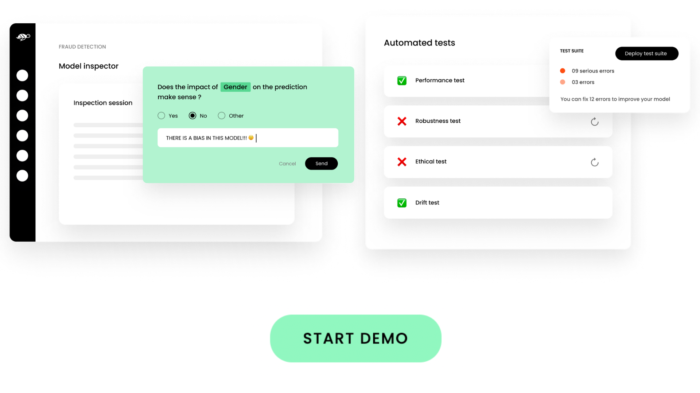
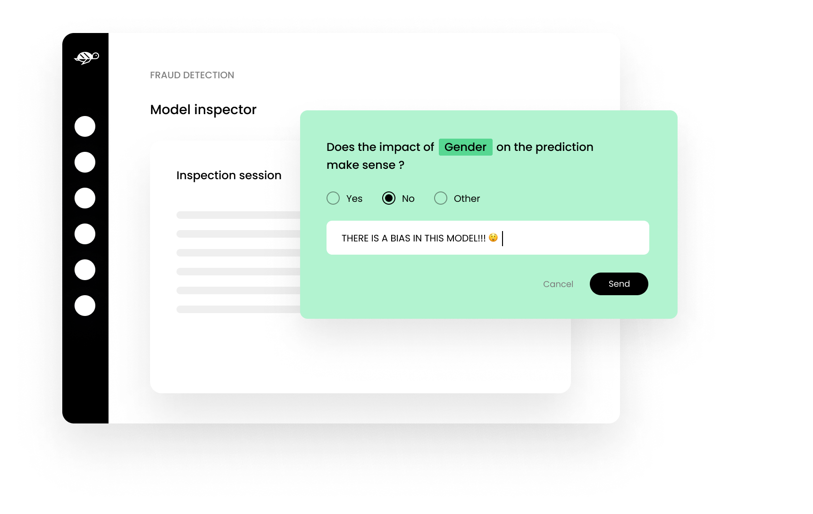
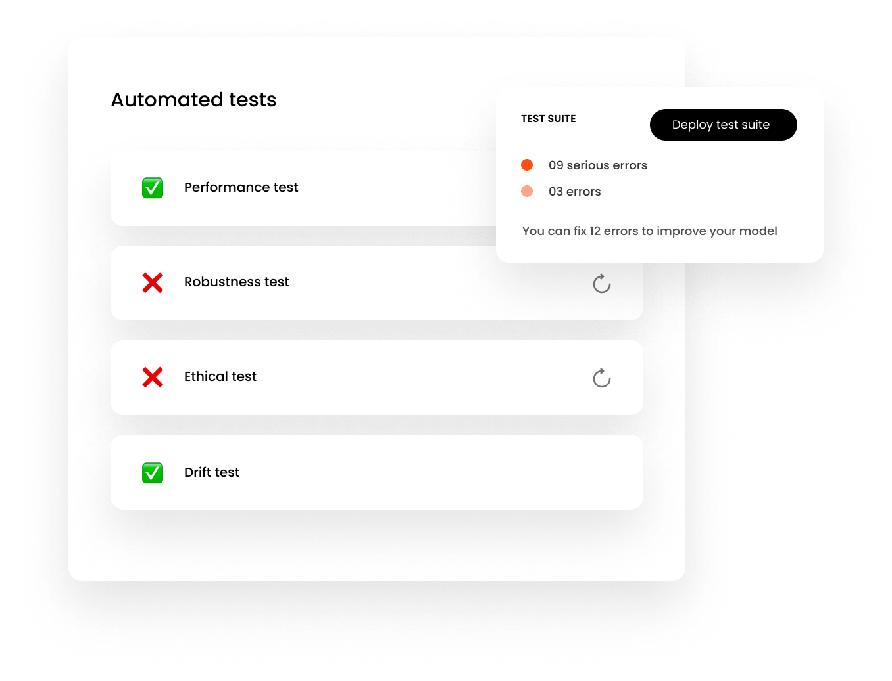

<p align="center">
  
</p>
<h1 align="center" weight='300' >Open-Source CI/CD platform for ML teams. Deliver ML products, better & faster. </h1>
<br />

**Collaborate faster** with **feedback** from business stakeholders.<br/>
**Deploy automated tests** to eliminate regressions, errors & biases.

<br />

<a align='center' href="https://app.arcade.software/share/zPfpXFt8lRm5XDkaWM85">
         
      </a>
<br/>
<h3 >Installation</h3>

```shell
git clone https://github.com/Giskard-AI/giskard.git
cd giskard
docker-compose up -d
```

After the application is started you can access at:

http://localhost:19000

> login / password: **admin** / **admin**

<h3>Collect feedback on your model<h3>
  
  <a align='center' href="https://app.arcade.software/share/zPfpXFt8lRm5XDkaWM85">
         
      </a>
<br/>
  
 <h3>Create Tests from the feedback<h3>
  
  <a href="https://app.arcade.software/share/zPfpXFt8lRm5XDkaWM85">
         
      </a>
<br/>
  
  
 

<h3>Requirements</h3>

- [docker](https://docs.docker.com/get-docker/) 
- [docker-compose](https://docs.docker.com/compose/install/) 

<h3>Quick Start</h3>

You can upload models to Giskard from Jupyter notebooks or any other python environment. 
it can be done using [Giskard client library](https://docs.giskard.ai/start/guides/upload-your-model#1.-load-ai-inspector)

There's a demo python notebook available at http://localhost:18888 that can be used to upload a first model. 

<h3>Documentation</h3>

Find out more about Giskard by reading [our docs](https://docs.giskard.ai/)

<h3>Community</h3>

Join [our community](https://discord.com/invite/ABvfpbu69R) on Discord to get support and leave feedback <br/>
<a href="https://discord.com/invite/ABvfpbu69R">
         
      </a>
<br/>
