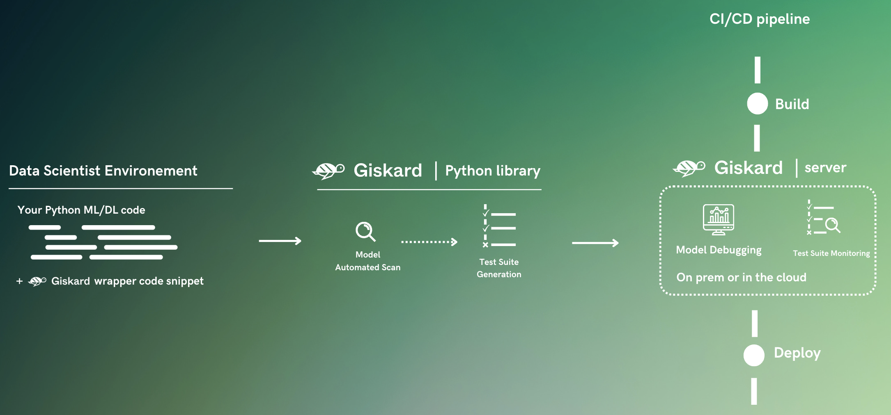
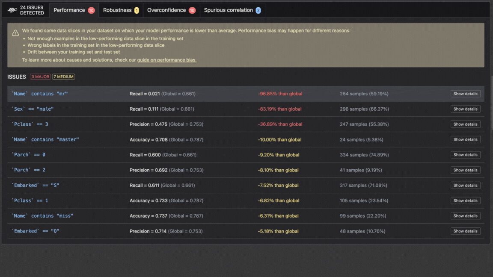
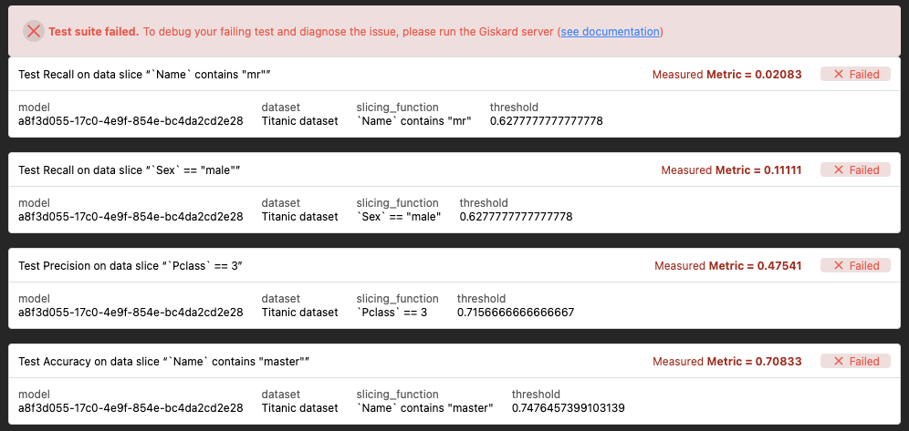
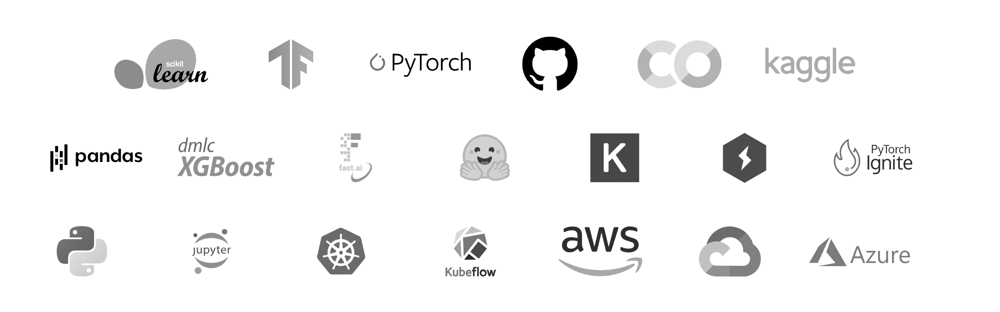

<p align="center">
  
  
</p>
<h1 align="center" weight='300' >The testing framework dedicated to ML models, from tabular to LLMs</h1>
<h3 align="center" weight='300' >Scan AI models to detect risks of biases, performance issues and errors. In 4 lines of code. </h3>
<div align="center">

  [](https://github.com/Giskard-AI/giskard/releases)
  [](https://github.com/Giskard-AI/giskard/blob/main/LICENSE)
  [](https://github.com/Giskard-AI/giskard/actions/workflows/build-python.yml?query=branch%3Amain)
  [](https://sonarcloud.io/summary/new_code?id=giskard)
  [](https://gisk.ar/discord)

  <a rel="me" href="https://fosstodon.org/@Giskard"></a>

</div>
<h3 align="center">
   <a href="https://docs.giskard.ai/en/latest/index.html"><b>Documentation</b></a> &bull;
   <a href="https://www.giskard.ai/knowledge-categories/blog/?utm_source=github&utm_medium=github&utm_campaign=github_readme&utm_id=readmeblog"><b>Blog</b></a> &bull;
  <a href="https://www.giskard.ai/?utm_source=github&utm_medium=github&utm_campaign=github_readme&utm_id=readmeblog"><b>Website</b></a> &bull;
  <a href="https://gisk.ar/discord"><b>Discord Community</b></a> &bull;
  <a href="https://www.giskard.ai/about?utm_source=github&utm_medium=github&utm_campaign=github_readme&utm_id=readmeblog#advisors"><b>Advisors</b></a>
 </h3>
<br />

## Install Giskard 🐢
You can install the latest version of Giskard from PyPi using pip :
```sh
pip install giskard -U
```
We officially support Python 3.9, 3.10 and 3.11.
## Try in Colab 📙
[Open Colab notebook](https://colab.research.google.com/github/giskard-ai/giskard/blob/main/docs/getting_started/quickstart/quickstart_llm.ipynb)

______________________________________________________________________

<p align="center">
  
</p>

Giskard is a Python library that automatically **detects vulnerabilities** in AI models, from tabular models to LLM, including performance biases, data leakage, spurious correlation, hallucination, toxicity, security issues and many more.

It's a powerful tool that helps data scientists **save time and effort** drilling down on model issues, and produce more **reliable and trustworthy models**.

<p align="center">
  
</p>

Instantaneously generate test suites for your models ⤵️

<p align="center">
  
</p>


Giskard works with any model, in any environment and integrates seamlessly with your favorite tools ⤵️ <br/>

<p align="center">
  
</p>
<br/>


# Contents

1. 🤸‍♀️ **[Quickstart](#%EF%B8%8F-quickstart)**
2. ⭐️ **[Premium features](#%EF%B8%8F-premium-features)**
3. ❓ **[FAQ](#-faq)**
4. 👋 **[Community](#-community)**


# 🤸‍♀️ Quickstart

## 1. 🔎 Scan your model
Here's an example of a Giskard scan on the famous Titanic survival prediction dataset:

```python
import giskard

# Replace this with your own data & model creation.
df = giskard.demo.titanic_df()
demo_data_processing_function, demo_sklearn_model = giskard.demo.titanic_pipeline()

# Wrap your Pandas DataFrame with Giskard.Dataset (test set, a golden dataset, etc.).
giskard_dataset = giskard.Dataset(
    df=df,  # A pandas.DataFrame that contains the raw data (before all the pre-processing steps) and the actual ground truth variable (target).
    target="Survived",  # Ground truth variable
    name="Titanic dataset", # Optional
    cat_columns=['Pclass', 'Sex', "SibSp", "Parch", "Embarked"]  # List of categorical columns. Optional, but is a MUST if available. Inferred automatically if not.
)

# Wrap your model with Giskard.Model. Check the dedicated doc page: https://docs.giskard.ai/en/latest/guides/wrap_model/index.html
# you can use any tabular, text or LLM models (PyTorch, HuggingFace, LangChain, etc.),
# for classification, regression & text generation.
def prediction_function(df):
    # The pre-processor can be a pipeline of one-hot encoding, imputer, scaler, etc.
    preprocessed_df = demo_data_processing_function(df)
    return demo_sklearn_model.predict_proba(preprocessed_df)

giskard_model = giskard.Model(
    model=prediction_function,  # A prediction function that encapsulates all the data pre-processing steps and that could be executed with the dataset used by the scan.
    model_type="classification",  # Either regression, classification or text_generation.
    name="Titanic model",  # Optional
    classification_labels=demo_sklearn_model.classes_,  # Their order MUST be identical to the prediction_function's output order
    feature_names=['PassengerId', 'Pclass', 'Name', 'Sex', 'Age', 'SibSp', 'Parch', 'Fare', 'Embarked'],  # Default: all columns of your dataset
)
```

✨✨✨Then run Giskard's magical scan✨✨✨
```python
scan_results = giskard.scan(giskard_model, giskard_dataset)
```
Once the scan completes, you can display the results directly in your notebook:

```python
display(scan_results)
```
*If you're facing issues, check out our wrapping [model](https://docs.giskard.ai/en/latest/open_source/scan/scan_tabular/index.html) & [dataset](https://docs.giskard.ai/en/latest/open_source/scan/scan_tabular/index.html) docs for more information.*
## 2. 🪄 Automatically generate a test suite

If the scan found potential issues in your model, you can automatically generate a **test suite** based on the vulnerabilities found:

```python
test_suite = scan_results.generate_test_suite("My first test suite")
```
You can then run the test suite locally to verify that it reproduces the issues:
```python
test_suite.run()
```

Test suites are reusable objects that provide a way to apply consistent checks on your models. To drill down on failing tests and get even more out of the Giskard library, we recommend heading over to the Giskard hub ⤵️

# ⭐️ Premium Features

The Giskard hub is Giskard's premium offering. It provides a number of additional capabilities that are not available in the open-source version of Giskard, including:

- **Advanced test generation**: This includes the ability to diagnose failing tests, debug your models and create more domain-specific tests.
- **Model comparison**: This includes the ability to compare models to decide which one to promote.
- **Test hub**: This includes a place to gather all of your team's tests in one place to collaborate more efficiently.
- **Business feedback**: This includes the ability to share your results and collect business feedback from your team.

If you are interested in learning more about Giskard's premium offering, please [contact us](https://www.giskard.ai/contact).

<p align="center">
  
</p>

## 1. Start the Giskard hub

To start the **Giskard hub**, run the following command:
```sh
pip install giskard[hub] -U
giskard hub start
```

🚀 That's it! Access it at http://localhost:19000

## 2. Upload your test suite to the Giskard hub

You can then **upload the test suite** created using the `giskard` Python library to the Giskard hub. This will enable you to:
- Compare the quality of different models to decide which one to promote
- Debug your tests to diagnose identified vulnerabilities
- Create more domain-specific tests relevant to your use case
- Share results, and collaborate with your team to integrate business feedback

1. First, make sure the Giskard hub is installed
    <details>
      <summary>How to check if the Giskard hub is running</summary>

      - check if http://localhost:19000 is running
      - or use `giskard hub status`
    </details>

2. Then, execute the ML worker in your notebook:
    ```python
    !giskard worker start -d -k YOUR_KEY
    ```

3. Finally, upload your test suite to the Giskard hub using the following code:
    ```python
    key = "API_KEY"  # Find it in Settings in the Giskard hub
    client = giskard.GiskardClient(
        url="http://localhost:19000", key=key  # URL of your Giskard instance
    )

    my_project = client.create_project("my_project", "PROJECT_NAME", "DESCRIPTION")

    # Upload to the current project
    test_suite.upload(client, "my_project")
    ```

> **The Giskard hub is installed on your infrastructure.**
>
> Giskard as a company does not have access to your datasets and models, so you can keep everything private.

# ❓ Where can I get more help?


<details>
  <summary>What is a ML worker?</summary>

  Giskard executes your model using a worker that runs the model directly in your Python environment containing all the dependencies required by your model. You can execute the ML worker either from a local notebook, a Colab notebook or a terminal.
  </details>

<details>
  <summary>How to get the API key</summary>

  Access the API key in the Settings tab of the Giskard hub.
</details>

<details>
  <summary>If Giskard hub/ML worker is not installed</summary>

  Go to the [Install the Giskard Hub](https://docs.giskard.ai/en/latest/giskard_hub/installation_hub/index.html) page.
</details>

<details>
  <summary>If Giskard hub is installed on an external server</summary>

  ```python
    !giskard worker start -d -k YOUR_KEY -u http://ec2-13-50-XXXX.compute.amazonaws.com:19000/
  ```
</details>

<details>
  <summary>For more information on uploading to your local Giskard hub</summary>

  Go to the [Upload an object to the Giskard hub](https://docs.giskard.ai/en/latest/giskard_hub/upload/index.html) page.
</details>

For any other questions and doubts, head over to our [Discord](https://gisk.ar/discord).

# 👋 Community
We welcome contributions from the Machine Learning community! Read this [guide](CONTRIBUTING.md) to get started.

Join our thriving community on our Discord server: [join Discord server](https://gisk.ar/discord)

🌟 [Leave us a star](https://github.com/Giskard-AI/giskard), it helps the project to get discovered by others and keeps us motivated to build awesome open-source tools! 🌟

❤️ You can also [sponsor us](https://github.com/sponsors/Giskard-AI) on GitHub. With a monthly sponsor subscription, you can get a sponsor badge and get your bug reports prioritized. We also offer one-time sponsoring if you want us to get involved in a consulting project, run a workshop, or give a talk at your company.

