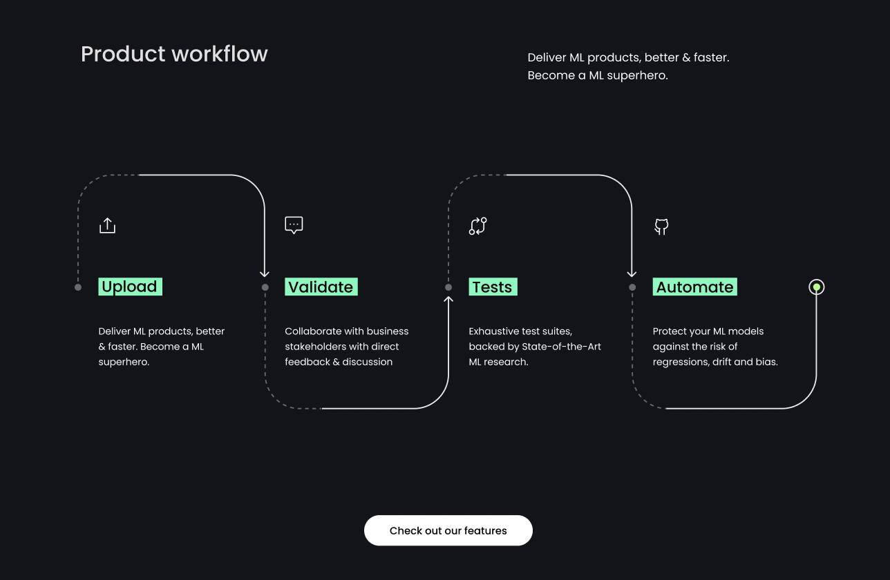

<p align="center">
  
</p>
<h1 align="center" weight='300' >Open-Source CI/CD platform for ML teams</h1>
<h2 align="center" weight='300' >Deliver ML products, better & faster. </h2>
<br />

⚡ **Collaborate faster** with **feedback** from business stakeholders.<br/>
🧑‍🔧 **Deploy automated tests** to eliminate regressions, errors & biases.

<br />

<a align='center' href="https://app.arcade.software/share/zPfpXFt8lRm5XDkaWM85">
         
      </a>
<br/>
<h3 >Installation</h3>

```shell
git clone https://github.com/Giskard-AI/giskard.git
cd giskard
docker-compose up -d
```

After the application is started you can access at:

http://localhost:19000

> login / password: **admin** / **admin**

<h3>Upload your model</h3>

<h4>Prerequisites</h4>
To upload the model you want to inspect, you need: </br>
* A model. For example, a scikit-learn, Tensorflow, HuggingFace, catboost, PyTorch, ... Python functions</br>
* A pandas dataframe composed of the examples you want to inspect. For example, it could be your test dataset or a dataset composed of some wrong predictions of your model</br>
* The Giskard's platform. To install it, check **Installation**

<h4>Steps to upload your model</h4>

<h5>1. Install Giskard library</h5>
</br>
In order to upload models and datasets to Giskard, you'll need to install the library giskard:

```shell
pip install giskard
```

<h5>2. Create new project or load an existing project</h5>
</br>
To create a new project or load an existing one, run the code below in your Python environment:

```shell
from giskard.giskard_client import GiskardClient

url = "http://localhost:19000" #if Giskard is installed locally (for installation, see: https://docs.giskard.ai/start/guides/installation) 
token = "YOUR GENERATED TOKEN" #you can generate your API token in the Admin tab of the Giskard application (for installation, see: https://docs.giskard.ai/start/guides/installation) 
client = GiskardClient(url, token)

project = client.create_project("project_key", "PROJECT_NAME", "DESCRIPTION") #Choose the arguments you want. But "project_key" should be unique and in lower case
#If your project is already created use project = client.get_project("existing_project_key")
```
<p class="callout info"> If you want to use an existing project, use project=client.get_project("EXISTING_PROJECT_KEY")to load the existing project, then use:
upload_model to upload a new version of the model you want to inspect/test
upload_dataset to upload a new dataset that you want to apply to your existing model
For more details about the arguments of these functions, see our Github repo. </p>

<h5>3. Upload a model and a dataset</h5>
</br>
Apply the upload_model_and_df to the project using the following arguments:

| Argument | Description | Type |
| --- | --- | --- |
| prediction_function | The model you want to predict. It could be any Python function with the signature of</br> predict_proba for classification. It returns the classification probabilities for all the classification labels</br> predict for regression.  </br>If you have preprocessing steps, wrap the whole prediction pipeline: all the preprocessing steps (categorical encoding, scaling, etc.) + ML predict_proba function. | Callable[[pd.DataFrame], Iterable[Union[str, float, int]] |
| df | A Pandas dataframe that contains some data examples that might interest you to inspect (test set, train set, production data). Some important remarks:</br> df can contain more columns than the features of the model such as the actual ground truth variable, sample_id, metadata, etc. </br> df should be raw data that comes before all the preprocessing steps | Pandas dataframe
| model_type | **Classification** for classification model </br> **Regression** for regression model | str
| model_type | **Classification** for classification model </br> **Regression** for regression model | str
| model_type | **Classification** for classification model </br> **Regression** for regression model | str
| model_type | **Classification** for classification model </br> **Regression** for regression model | str
| model_type | **Classification** for classification model </br> **Regression** for regression model | str
| model_type | **Classification** for classification model </br> **Regression** for regression model | str
| model_type | **Classification** for classification model </br> **Regression** for regression model | str


<h3>Collect feedback on your model</h3>
  
  <a align='center' href="https://app.arcade.software/share/zPfpXFt8lRm5XDkaWM85">
         
      </a>
<br/>
  <br/>
  <br/>
  
  * Collaborate with instant feedback.<br/>
  * Improve ML models with business stakeholders in no time.
  
 <h3>Create Tests from the feedback</h3>
  
  <a href="https://app.arcade.software/share/zPfpXFt8lRm5XDkaWM85">
         
      </a>
<br/>
   <br/>
   <br/>
  

  * Get automated test suites in seconds.</br>
  * Exhaustive test suites, backed by 
State-of-the-Art ML research.
  
  
 <h3>Workflow</h3>
  
  <a align='center' href="https://giskard.ai/product">
         
      </a>
<br/>
  <br/>
  <br/>
  
  * **Upload** - Easy upload for any Python model: PyTorch, TensorFlow, Transformers, sklearn, etc.
  * **Validate** - Collaborate with business stakeholders with direct feedback & discussion
  * **Test** - Exhaustive test suites, backed by 
State-of-the-Art ML research.
  * **Automate** - Protect your ML models against the risk of regressions, drift and bias.

<br/>
<h3>Requirements</h3>

- [docker](https://docs.docker.com/get-docker/) 
- [docker-compose](https://docs.docker.com/compose/install/) 

<h3>Quick Start</h3>

You can upload models to Giskard from Jupyter notebooks or any other python environment. 
it can be done using [Giskard client library](https://docs.giskard.ai/start/guides/upload-your-model#1.-load-ai-inspector)

There's a demo python notebook available at http://localhost:18888 that can be used to upload a first model. 

<h3>Documentation</h3>

Find out more about Giskard by reading [our docs](https://docs.giskard.ai/)

<h3>Community</h3>

Join [our community](https://discord.com/invite/ABvfpbu69R) on Discord to get support and leave feedback <br/>
<a href="https://discord.com/invite/ABvfpbu69R">
         
      </a>
<br/>
