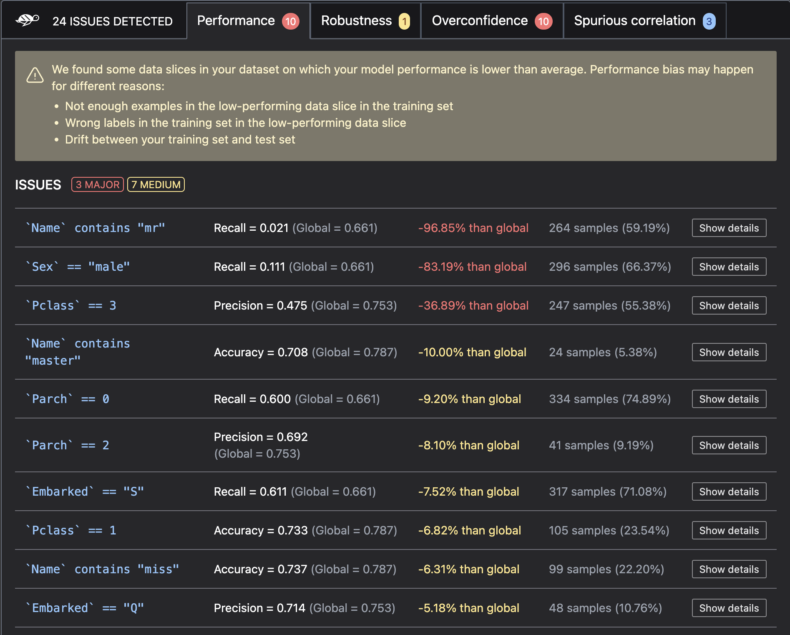
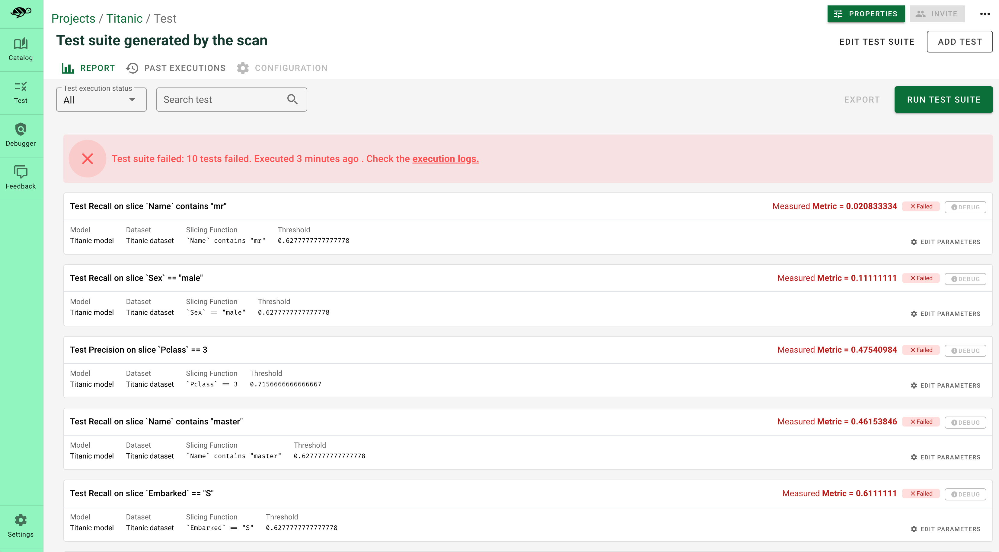

<p align="center">
  
  
</p>
<h1 align="center" weight='300' >The testing framework dedicated to ML models, from tabular to LLMs</h1>
<h3 align="center" weight='300' >Scan AI models to detect risks of biases, performance issues and errors. In 4 lines of code. </h3>
<p align="center">
   <a href="https://github.com/Giskard-AI/giskard/releases">
      
  </a>
 <a href="https://github.com/Giskard-AI/giskard/blob/main/LICENSE">
     
 </a>
  <a href="https://github.com/Giskard-AI/giskard/actions/workflows/build.yml?query=branch%3Amain">
    
 </a>
  <a href="https://sonarcloud.io/summary/new_code?id=giskard">
    
 </a>
  <a href="https://gisk.ar/discord">
    
  </a>
  <a rel="me" href="https://fosstodon.org/@Giskard"></a>
</p>
<h3 align="center">
   <a href="https://docs.giskard.ai/en/latest/getting-started/quickstart.html"><b>Documentation</b></a> &bull;
   <a href="https://www.giskard.ai/knowledge-categories/blog/?utm_source=github&utm_medium=github&utm_campaign=github_readme&utm_id=readmeblog"><b>Blog</b></a> &bull;  
  <a href="https://www.giskard.ai/?utm_source=github&utm_medium=github&utm_campaign=github_readme&utm_id=readmeblog"><b>Website</b></a> &bull;
  <a href="https://gisk.ar/discord"><b>Discord Community</b></a> &bull;
  <a href="https://www.giskard.ai/about?utm_source=github&utm_medium=github&utm_campaign=github_readme&utm_id=readmeblog#advisors"><b>Advisors</b></a>
 </h3>
<br />

# Table of contents
<ol>
    <li><a href="#why-giskard">🐢 Why Giskard?</a></li>
    <li>
      <a href="#getting-started">📗 Quickstart</a>
      <ul>
        <li><a href="#installation">Install our Python library and testing server</a></li>
        <li><a href="#scan-your-model-to-detect-vulnerabilities">Scan your model to detect vulnerabilities</a></li>
        <li><a href="#automatically-generate-a-test-suite-based-on-the-scan-results">Automatically generate a test suite</a></li>
        <li><a href="#upload-your-test-suite-to-the-giskard-server">Upload your test suite to the Giskard server</a></li>
      </ul>
    </li>
    <li><a href="#how-to-contribute">👋 How to contribute</a></li>
    <li><a href="#like-what-were-doing">💖 Like what we're doing?</a></li>
  </ol>

# 🐢 Why Giskard?
> Giskard is an open-source testing framework dedicated to ML models, from tabular models to LLMs.

Testing Machine Learning applications can be tedious. Since ML models depend on data, testing scenarios depend on the domain specificities and are often infinite. 

<p align="center">
<strong>Where to start testing? Which tests to implement? What issues to cover? How to implement the tests?</strong>
</p>

<p align="center">
  
</p>

At Giskard, we believe that Machine Learning needs its own testing framework. Created by ML engineers for ML engineers, Giskard enables you to:

- **Scan your model to find dozens of hidden vulnerabilities**: The Giskard scan automatically detects vulnerability issues such as performance bias, data leakage, unrobustness, spurious correlation, overconfidence, underconfidence, unethical issue, etc.

<p align="center">
  
</p>

- **Instantaneously generate domain-specific tests**: Giskard automatically generates relevant tests based on the vulnerabilities detected by the scan. You can easily customize the tests depending on your use case by defining domain-specific data slicers and transformers as fixtures of your test suites.

<p align="center">
  
</p>

- **Leverage the Quality Assurance best practices of the open-source community**: The Giskard catalog enables you to easily contribute and load data slicing & transformation functions such as AI-based detectors (toxicity, hate, etc.), generators (typos, paraphraser, etc.), or evaluators. Inspired by the Hugging Face philosophy, the aim of Giskard is to become the open-source hub of ML Quality Assurance.

<p align="center">
  
</p>

And of course, Giskard works with any model, any environment and integrates seamlessly with your favorite tools ⤵️ <br/>
<p align="center">
  
</p>
<br/>


# 📗 Getting started

## 1. 📥 Installation
Install Giskard via PyPI:
```sh
pip install "giskard[server]>=2.0.0b" -U
```
For full functionality start Giskard server with: 
```sh
giskard server start
```

🚀 That's it! Access at http://localhost:19000

## 2. 🔎 Scan your model to detect vulnerabilities
Here's an example of a hello world Giskard scan in code:

```python
import giskard

# Replace this with your own data & model creation.
df = giskard.demo.titanic_df()
data_preprocessor, clf = giskard.demo.titanic_pipeline()

# Wrap your model with Giskard.Model. Check the dedicated doc page: https://docs.giskard.ai/en/latest/guides/wrap_model/index.html
# you can use any tabular, text or LLM models (PyTorch, HuggingFace, LangChain, etc.),
# for classification, regression & text generation.
def prediction_function(df):
    # The pre-processor can be a pipeline of one-hot encoding, imputer, scaler, etc.
    preprocessed_df = data_preprocessor(df)
    return clf.predict_proba(preprocessed_df)

# Wrap your Pandas DataFrame with Giskard.Dataset (test set, a golden dataset, etc.). Check the dedicated doc page: https://docs.giskard.ai/en/latest/guides/wrap_dataset/index.html
giskard_dataset = giskard.Dataset(
    df=df,  # A pandas.DataFrame that contains the raw data (before all the pre-processing steps) and the actual ground truth variable (target).
    target="Survived",  # Ground truth variable
    name="Titanic dataset", # Optional
    cat_columns=['Pclass', 'Sex', "SibSp", "Parch", "Embarked"]  # Optional, but is a MUST if available. Inferred automatically if not.
)

giskard_model = giskard.Model(
    model=prediction_function,  # A prediction function that encapsulates all the data pre-processing steps and that could be executed with the dataset used by the scan.
    model_type="classification",  # Either regression, classification or text_generation.
    name="Titanic model",  # Optional
    classification_labels=clf.classes_,  # Their order MUST be identical to the prediction_function's output order
    feature_names=['PassengerId', 'Pclass', 'Name', 'Sex', 'Age', 'SibSp', 'Parch', 'Fare', 'Embarked'],  # Default: all columns of your dataset
    # classification_threshold=0.5,  # Default: 0.5
)

# Then apply the scan
results = giskard.scan(giskard_model, giskard_dataset)
```

*(Check our wrapping [model](https://docs.giskard.ai/en/latest/guides/wrap_model/index.html) & [dataset](https://docs.giskard.ai/en/latest/guides/wrap_dataset/index.html) docs for more information.)*

Once the scan completes, you can display the results directly in your notebook:

```python
display(scan_results)  # in your notebook
```

## 3. 🪄 Automatically generate a test suite based on the scan results

If the scan found potential issues in your model, you can automatically generate a test suite.

Generating a test suite from your scan results will enable you to:
1. Turn the issues you found into actionable tests that you can directly integrate in your CI/CD pipeline
2. Diagnose your vulnerabilities and debug the issues you found in the scan

```python
test_suite = scan_results.generate_test_suite("My first test suite")

# You can run the test suite locally to verify that it reproduces the issues
test_suite.run()
```
You can run the test suite locally to verify that it reproduces the issues
```python
test_suite.run()
```

## 4. ⌛️ Upload your test suite to the Giskard server

You can then **upload the test suite** to the local Giskard server. This will enable you to:
- Compare the quality of different models to decide which one to promote
- Debug your tests to diagnose the identified issues
- Create more domain-specific tests relevant to your use case
- Share results, and collaborate with your team to integrate business feedback

First, make sure Giskard server is installed ( check if http://localhost:19000 is up or use `giskard server status` if needed)

Then execute the ML worker:
```python
 !giskard worker start -d -k YOUR_TOKEN
```


Follow [this documentation](https://docs.giskard.ai/en/latest/guides/installation_app/index.html) if you have any trouble

Fianlly upload test suite to the giskard server using the following code:
```python
token = "API_TOKEN"  # Find it in Settings in the Giskard server
client = GiskardClient(
    url="http://localhost:19000", token=token  # URL of your Giskard instance
)

my_project = client.create_project("my_project", "PROJECT_NAME", "DESCRIPTION")

# Upload to the current project
test_suite.upload(client, "my_project")

```
### Help
<details>
  <summary>About the ML worker</summary>
  Giskard executes your model using an worker that runs directly the model in your Python environment containing all the dependencies required by your model. You can either execute the ML worker from local notebook, Colab notebook or a terminal. 
  </details>
  
<details>
  <summary>How to get the API key</summary>
  
  Access the API key here in the Settings tab of the Giskard server http://localhost:8080/main/admin/general
</details>

<details>
  <summary>If Giskard server is installed on an external server</summary>

  ```python
    !giskard worker start -d -k YOUR_TOKEN -u http://ec2-13-50-XXXX.compute.amazonaws.com:19000/
  ```
</details>
    
For more information on uploading to your local Giskard server, go to the [Upload an object to the Giskard server](https://docs.giskard.ai/en/latest/guides/upload/index.html) page.

# 👋 How to contribute
We welcome contributions from the Machine Learning community!

Read this [guide](CONTRIBUTING.md) to get started.

<br />

# 💖 Like what we're doing?

🌟 [Leave us a star](https://github.com/Giskard-AI/giskard), it helps the project to get discovered by others and keeps us motivated to build awesome open-source tools! 🌟

❤️ You can also [sponsor us](https://github.com/sponsors/Giskard-AI) on GitHub. With a monthly sponsor subscription, you can get a sponsor badge and get your bug reports prioritized. We also offer one-time sponsoring if you want us to get involved in a consulting project, run a workshop, or give a talk at your company.
