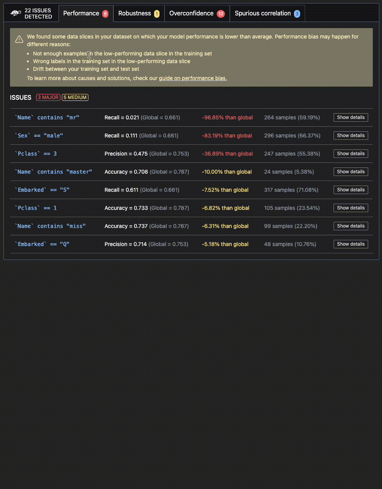

<p align="center">
  
  
</p>
<h1 align="center" weight='300' >The testing framework dedicated to ML models, from tabular to LLMs</h1>
<h3 align="center" weight='300' >Scan AI models to detect risks of biases, performance issues and errors. In 4 lines of code. </h3>
<p align="center">
   <a href="https://github.com/Giskard-AI/giskard/releases">
      
  </a>
 <a href="https://github.com/Giskard-AI/giskard/blob/main/LICENSE">
     
 </a>
  <a href="https://github.com/Giskard-AI/giskard/actions/workflows/build.yml?query=branch%3Amain">
    
 </a>
  <a href="https://sonarcloud.io/summary/new_code?id=giskard">
    
 </a>
  <a href="https://gisk.ar/discord">
    
  </a>
  <a rel="me" href="https://fosstodon.org/@Giskard"></a>
</p>
<h3 align="center">
   <a href="https://docs.giskard.ai/en/latest/getting-started/quickstart.html"><b>Documentation</b></a> &bull;
   <a href="https://www.giskard.ai/knowledge-categories/blog/?utm_source=github&utm_medium=github&utm_campaign=github_readme&utm_id=readmeblog"><b>Blog</b></a> &bull;  
  <a href="https://www.giskard.ai/?utm_source=github&utm_medium=github&utm_campaign=github_readme&utm_id=readmeblog"><b>Website</b></a> &bull;
  <a href="https://gisk.ar/discord"><b>Discord Community</b></a> &bull;
  <a href="https://www.giskard.ai/about?utm_source=github&utm_medium=github&utm_campaign=github_readme&utm_id=readmeblog#advisors"><b>Advisors</b></a>
 </h3>
<br />

## Install Giskard
You can install the latest version of Giskard from PyPi using pip :
```sh
pip install "giskard[server]>=2.0.0b" -U
```
We officially support Python 3.9 and 3.10.
## Try in Colab
[Open Colab notebook](https://colab.research.google.com/github/giskard-ai/giskard/blob/main/python-client/docs/getting-started/quickstart.ipynb)

______________________________________________________________________
Giskard is an open-source testing framework dedicated to ML models, covering any Python model, from tabular to LLMs. Giskard uses a variety of techniques to detect vulnerabilities, including:

- Data slicing and transformation: Giskard can automatically generate different data slices and transformations to test the robustness of your model.
- Statistical analysis: Giskard can use statistical analysis to identify patterns and relationships in your data that could indicate a vulnerability.
- Machine learning: Giskard can use machine learning to learn from your data and identify patterns that are indicative of vulnerabilities.

Giskard is a powerful tool that can help you to improve the quality and robustness of your ML models. It is easy to use and can be integrated with any Python ML framework.

It can help you to find vulnerabilities in your models that you might not otherwise be aware of, to understand the root cause of the vulnerabilities, to take steps to mitigate the vulnerabilities, to produce more reliable and trustworthy models.

If you are an ML engineer who is looking for a way to improve the quality and robustness of your models, then Giskard's vulnerabilities detection feature is a great option. It is a powerful tool that can help you to save time and effort, and it can help you to produce more reliable and trustworthy models.

<p align="center">
  
</p>

Giskard works with any model, any environment and integrates seamlessly with your favorite tools ⤵️ <br/>

<p align="center">
  
</p>
<br/>


# Contents

1. 🤸‍♀️ **[Quickstart](#%EF%B8%8F-quickstart)**
2. ⭐️ **[Premium features](#%EF%B8%8F-premium-features)**
3. ❓ **[FAQ](#-faq)**
4. 👋 **[Community](#-community)**


# 🤸‍♀️ Quickstart

## 1. 🔎 Scan your model
Here's an example of Giskard scan on the famous titanic survival prediction dataset:

```python
import giskard

# Replace this with your own data & model creation.
df = giskard.demo.titanic_df()
data_preprocessor, clf = giskard.demo.titanic_pipeline()
def demo_model(df):
    # The pre-processor can be a pipeline of one-hot encoding, imputer, scaler, etc.
    preprocessed_df = data_preprocessor(df)
    return clf.predict_proba(preprocessed_df)

# Wrap your Pandas DataFrame with Giskard.Dataset (test set, a golden dataset, etc.).
giskard_dataset = giskard.Dataset(
    df=df,  # A pandas.DataFrame that contains the raw data (before all the pre-processing steps) and the actual ground truth variable (target).
    target="Survived",  # Ground truth variable
    name="Titanic dataset", # Optional
    cat_columns=['Pclass', 'Sex', "SibSp", "Parch", "Embarked"]  # Optional, but is a MUST if available. Inferred automatically if not.
)

# Wrap your model with Giskard.Model.
giskard_model = giskard.Model(
    model=demo_model,  # A prediction function that encapsulates all the data pre-processing steps and that could be executed with the dataset used by the scan.
    model_type="classification",  # Either regression, classification or text_generation.
    name="Titanic model",  # Optional
    classification_labels=clf.classes_,  # Their order MUST be identical to the prediction_function's output order
    feature_names=['PassengerId', 'Pclass', 'Name', 'Sex', 'Age', 'SibSp', 'Parch', 'Fare', 'Embarked'],  # Default: all columns of your dataset
)

```

✨✨✨Then run the scan✨✨✨
```python
results = giskard.scan(giskard_model, giskard_dataset)
```
Once the scan completes, you can display the results directly in your notebook:

```python
display(scan_results)
```
*If you're facing issues, check out our wrapping [model](https://docs.giskard.ai/en/latest/guides/wrap_model/index.html) & [dataset](https://docs.giskard.ai/en/latest/guides/wrap_dataset/index.html) docs for more information.*
## 2. 🪄 Automatically generate a test suite

If the scan found potential issues in your model, you can automatically generate a **test suite**.

```python
test_suite = scan_results.generate_test_suite("My first test suite")
```
You can run the test suite locally to verify that it reproduces the issues
```python
test_suite.run()
```

# ⭐️ Premium Features

**Leverage the Quality Assurance best practices**: The Giskard catalog enables you to easily contribute and load data slicing & transformation functions such as AI-based detectors (toxicity, hate, etc.), generators (typos, paraphraser, etc.), or evaluators.

<p align="center">
  
</p>

## Start the Giskard server

For full functionality start **Giskard server** with: 
```sh
giskard server start
```

🚀 That's it! Access at http://localhost:19000

## Upload your test suite to the Giskard server

You can then **upload the test suite** to the local Giskard server. This will enable you to:
- Compare the quality of different models to decide which one to promote
- Debug your tests to diagnose the identified issues
- Create more domain-specific tests relevant to your use case
- Share results, and collaborate with your team to integrate business feedback

1. First, make sure Giskard server is installed 
    <details>
      <summary>How to check if the Giskard server is running</summary>
      
      - check if http://localhost:19000 is running
      - or use `giskard server status`
    </details>

2. Then execute the ML worker in your notebook:
    ```python
       !giskard worker start -d -k YOUR_TOKEN
    ```


3. Finally upload test suite to the giskard server using the following code:
    ```python
    token = "API_TOKEN"  # Find it in Settings in the Giskard server
    client = GiskardClient(
        url="http://localhost:19000", token=token  # URL of your Giskard instance
    )
    
    my_project = client.create_project("my_project", "PROJECT_NAME", "DESCRIPTION")
    
    # Upload to the current project
    test_suite.upload(client, "my_project")
    
    ```

# ❓ Where can I get more help?


<details>
  <summary>What is a ML worker?</summary>
  Giskard executes your model using an worker that runs directly the model in your Python environment containing all the dependencies required by your model. You can either execute the ML worker from a local notebook, a Colab notebook or a terminal. 
  </details>
  
<details>
  <summary>How to get the API key</summary>
  
  Access the API key here in the Settings tab of the Giskard server http://localhost:8080/main/admin/general
</details>

<details>
  <summary>If Giskard server/ML worker is not installed</summary>

  Go to the [Run the Giskard Server](https://docs.giskard.ai/en/latest/guides/installation_app/index.html) page.
</details>

<details>
  <summary>If Giskard server is installed on an external server</summary>

  ```python
    !giskard worker start -d -k YOUR_TOKEN -u http://ec2-13-50-XXXX.compute.amazonaws.com:19000/
  ```
</details>

<details>
  <summary>For more information on uploading to your local Giskard server</summary>

  Go to the [Upload an object to the Giskard server](https://docs.giskard.ai/en/latest/guides/upload/index.html) page.
</details>

Go to our [Discord](https://gisk.ar/discord) to get more help.

# 👋 Community
We welcome contributions from the Machine Learning community! Read this [guide](CONTRIBUTING.md) to get started.

Join our thriving community on our Discord server : [join Discord server](https://gisk.ar/discord)

🌟 [Leave us a star](https://github.com/Giskard-AI/giskard), it helps the project to get discovered by others and keeps us motivated to build awesome open-source tools! 🌟

❤️ You can also [sponsor us](https://github.com/sponsors/Giskard-AI) on GitHub. With a monthly sponsor subscription, you can get a sponsor badge and get your bug reports prioritized. We also offer one-time sponsoring if you want us to get involved in a consulting project, run a workshop, or give a talk at your company.


