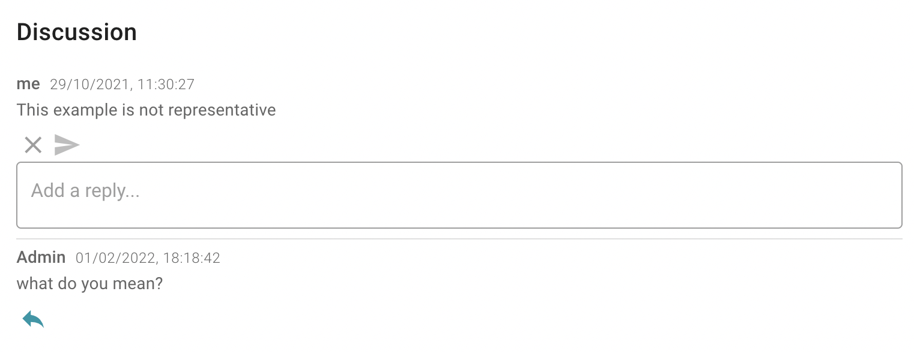

<p align="center">
  
</p>
<h1 align="center" weight='300' >Quality Testing for AI models</h1>
<h3 align="center" weight='300' >Eliminate AI bias in production. Deliver ML products, better & faster</h3>
<p align="center">
   <a href="https://github.com/Giskard-AI/giskard/releases">
      
  </a>
 <a href="https://github.com/Giskard-AI/giskard/blob/main/LICENSE">
     
 </a>
  <a href="https://github.com/Giskard-AI/giskard/actions/workflows/build.yml">
    
 </a>
   <a href="https://sonarcloud.io/summary/overall?id=giskard">
      
  </a>
  <a href="https://gisk.ar/discord">
    
  </a>
</p>
<h3 align="center">
   <a href="https://docs.giskard.ai/"><b>Documentation</b></a> &bull;
   <a href="https://www.giskard.ai/knowledge-categories/blog/?utm_source=github&utm_medium=github&utm_campaign=github_readme&utm_id=readmeblog"><b>Blog</b></a> &bull;  
  <a href="https://www.giskard.ai/?utm_source=github&utm_medium=github&utm_campaign=github_readme&utm_id=readmeblog"><b>Website</b></a> &bull;
  <a href="https://gisk.ar/discord"><b>Discord Community</b></a> &bull;
  <a href="https://www.giskard.ai/about?utm_source=github&utm_medium=github&utm_campaign=github_readme&utm_id=readmeblog#advisors"><b>Advisors</b></a>
 </h3>
<br />

# About Giskard
**Giskard creates interfaces for humans to inspect & test AI models. It is  open-source and self-hosted.**

Giskard lets you instantly see your model's prediction for a given set of feature values. You can set the values directly in Giskard and see the prediction change.

Saw anything strange? Leave a feedback directly within Giskard, so that your team can explore the query that generated the faulty result. Designed for both tech and business users, Giskard is super intuitive to use! 👌

And of course, Giskard works with any model, any environment and integrates seemlessly with your favorite tools ⤵️ <br/>
<p>
  
</p>
<br/>

# Why use Giskard
### Inspect the model's performance
- instantly see the model's prediction for a given set of feature values
- change the values directly in Giskard and see the prediction change
- works with any type of models, datasets and environments 

### Collaborate with business stakeholders
- leave notes and tag teammates directly within the Giskard interface
- use discussion threads to have all information centralized for easier follow-up and decision making
-  enjoy Giskard's super-intuitive design, made with both tech and business users in mind


### Automatically test & monitor
- turn the collected feedback into executable tests for safe deployment. Giskard provides presets of tests so that you design and execute your tests in no time
- receive actionable alerts on AI model bugs in production
- protect your ML models against the risk of regressions, drift and bias<br/>

<!--- <p>
  
</p> --->
<br />

# 🏄🏽‍♂️ Workflow
1. **Explore your ML model:** Easily upload any Python model: PyTorch, TensorFlow, 🤗 Transformers, Scikit-learn, etc. Play with the model to test its performance. 

<p align="center">
  
</p>

2. **Discuss and analyze feedback:** Enter feedback directly within Giskard and discuss it with your team. 

<p align="center">
  
</p>

3. **Turn feedback into tests:** Use Giskard test presets to design and execute your tests in no time.

<p align="center">
  
</p>

Giskard lets you automate tests in any of the categories below:
<details>
  <summary><b>Metamorphic testing</b></summary>
Test if your model outputs behave as expected before and after input perturbation
</details>
<details>
  <summary><b>Statistical testing</b></summary>
Test if your model output respects some business rules
</details>
<details>
  <summary><b>Performance testing</b></summary>
Test if your model performance is sufficiently high within some particular data slices</details>
<details>
  <summary><b>Data drift testing</b></summary>
Test if your features don't drift between the reference and actual dataset</details>
<details>
  <summary><b>Prediction drift testing</b></summary>
Test the absence of concept drift inside your model</details>

<br />

# Interactive demo
Play with Giskard before installing! Click the image below to start the demo:

<a align='center' href="https://app.arcade.software/share/DicI8Axi0Wb53vz4QXi3" target="_blank">
         
      </a>

<br/>

<!--- You can also check out the [product tour video](https://www.youtube.com/watch?v=D4p69FpxslI&ab_channel=Giskard) for a deep dive into features and use-cases. --->


<br/>

> Are you a developer? Check our [developer's readme](./README.dev.md)

# Getting Started with Giskard
## 🚀 Installation
**Requirements:** `git`, `docker` and `docker-compose`
```sh
git clone https://github.com/Giskard-AI/giskard.git
cd giskard
docker-compose up -d
```

That's it. Access at http://localhost:19000 with login/password: admin/admin.

## 🥋 Guides: Jump right in
Follow our handy guides to get started on the basics as quickly as possible:

1. <a href="https://docs.giskard.ai/start/guides/installation"><b>Installation</b></a>
2. <a href="https://docs.giskard.ai/start/guides/configuration"><b>Configuration</b></a>
3. <a href="https://docs.giskard.ai/start/guides/upload-your-model"><b>Upload your ML model & data</b></a>
4. <a href="https://docs.giskard.ai/start/guides/review-your-model"><b>Evaluate your ML model</b></a>
5. <a href="https://docs.giskard.ai/start/guides/create-tests-from-your-review"><b>Test your ML model</b></a>
<br />

# 🪄Become a Giskard Design Partner
As our product is young, working in close collaboration with our first users is very important to identify what to improve, and how we can deliver value. It needs to be a Win-Win scenario!
<p>
  
</p>

If you are interested in joining our Design Partner program, drop us a line at hello@giskard.ai.

❗️ The final entry date is September 2022 ❗️

<br />

# How to contribute
We welcome contributions from the Machine Learning community!

Read this [guide](CONTRIBUTING.md) to get started.

<br />

# Like what we're doing?
🌟 [Leave us a star](https://github.com/Giskard-AI/giskard), it helps the project to get discovered by others and keeps us motivated to build awesome open-source tools! 🌟
