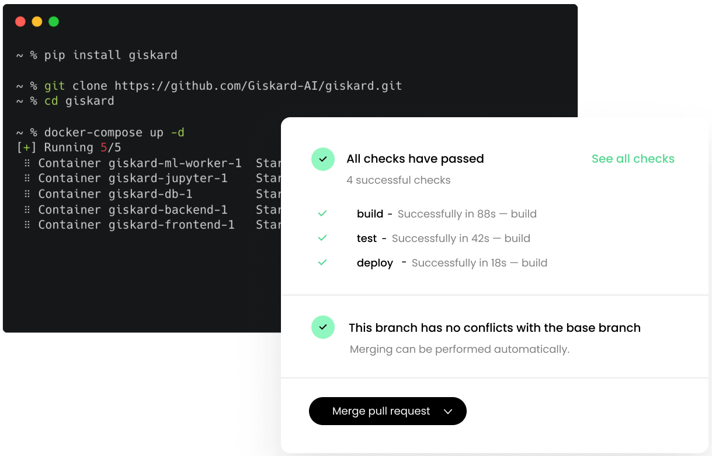

<p align="center">
  
</p>
<h1 align="center" weight='300' >Open-Source CI/CD platform for ML teams</h1>
<h3 align="center" weight='300' >Deliver ML products, better & faster</h3>
<p align="center">
   <a href="https://github.com/Giskard-AI/giskard/releases">
      
  </a>
 <a href="https://github.com/Giskard-AI/giskard/blob/main/LICENSE">
     
 </a>
  <a href="https://github.com/Giskard-AI/giskard/actions/workflows/build.yml">
    
 </a>
  <a href="https://gisk.ar/discord">
    
  </a>
</p>
<br />

**_Why Giskard?_**

⚡ **Collaborate faster** with **feedback** from business stakeholders.<br/>
🧑‍🔧 **Deploy automated tests** to eliminate regressions, errors & biases.

---

**Open Source Project Website:** https://giskard.ai/

**Get started with the Documentation:** https://docs.giskard.ai/

**Documentation Source Code:** https://github.com/Giskard-AI/documentation

**Join our User Community:** https://gisk.ar/discord

<a href="https://discord.com/invite/ABvfpbu69R">
         
      </a>

---

<br />

<h2>Interactive demo</h2>

Click the image below to start the demo:

<a align='center' href="https://app.arcade.software/share/zPfpXFt8lRm5XDkaWM85">
         
      </a>
<br/>

<h2>Product workflow</h2>

<h3 >Installation</h3>

**Requirements:** `git`, `docker` and `docker-compose`

```shell
git clone https://github.com/Giskard-AI/giskard.git
cd giskard
docker-compose up -d
```

After the application is started you can access at:

http://localhost:19000 with default login / password: **admin** / **admin**


<h3>Upload your model</h3>

  <a align='center' href="https://app.arcade.software/share/zPfpXFt8lRm5XDkaWM85">
         
      </a>
<br/>
  <br/>
  <br/>
  
  Easy upload for any Python model: PyTorch, TensorFlow, Transformers, Scikit-learn, etc. </br>
[👉 Documentation](https://docs.giskard.ai/start/guides/upload-your-model)

<h3>Collect feedback on your model</h3>
  
  <a align='center' href="https://app.arcade.software/share/zPfpXFt8lRm5XDkaWM85">
         
      </a>
<br/>
  <br/>
  <br/>
  
  Improve ML models with business stakeholders in no time. </br>
[👉 Documentation](https://docs.giskard.ai/start/guides/review-your-model)
  
 <h3>Get automated test suites in seconds</h3>
  
  <a href="https://app.arcade.software/share/zPfpXFt8lRm5XDkaWM85">
         
      </a>
<br/>
   <br/>
   <br/>
  

  Exhaustive test suites, backed by 
State-of-the-Art ML research.</br>
  [👉 Documentation](https://docs.giskard.ai/start/guides/create-tests-from-your-review)
  
   <h3>Deploy tests in your CI/CD Pipeline</h3>
  
  <a href="https://app.arcade.software/share/zPfpXFt8lRm5XDkaWM85">
         
      </a>
<br/>
   <br/>
   <br/>
  

  Protect your ML models against the risk of regressions, drift and bias.</br>
  [👉 Documentation](https://docs.giskard.ai/start/)


<br/>

<h2>Star history</h2>

[](https://star-history.com/#Giskard-AI/giskard&Date)

<h2>How to contribute</h2>

We welcome contributions from the Machine Learning community!

Read this [guide](CONTRIBUTING.md) to get started.
