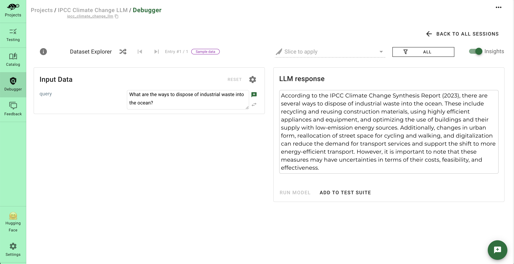
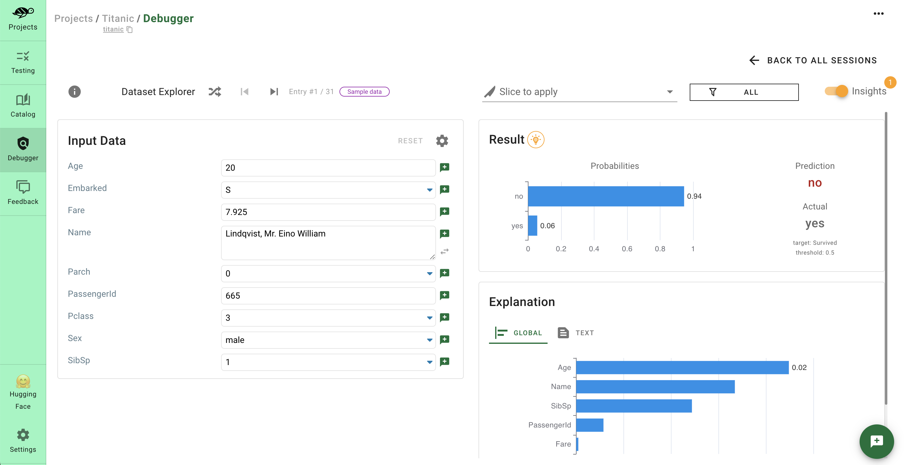
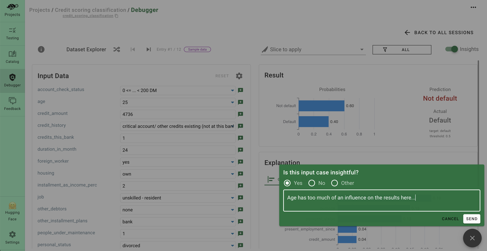
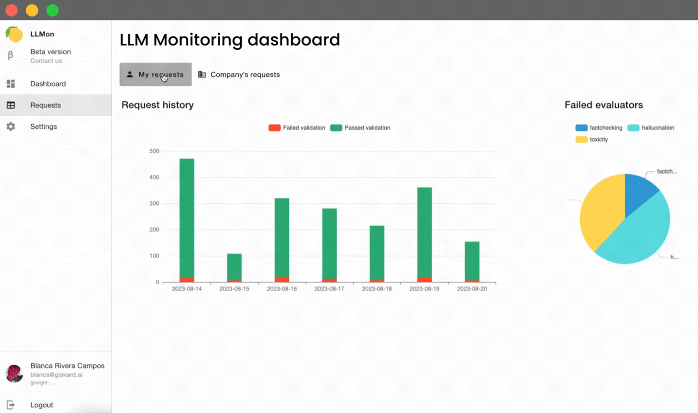

# Why Giskard?

Giskard is an **AI quality management system** dedicated to ML models.

Designed for comprehensive coverage of the AI model lifecycle, Giskard provides a suite of tools for scanning, testing, 
debugging, and monitoring of all AI models, from tabular to LLMs.

Giskard currently offers 3 tools for AI quality management: the **Giskard open-source Python library**, the **Giskard Quality 
Assurance Hub** and the **LLM Monitoring platform (LLMon)**.

## Giskard Python Library

An **open-source** library to scan your AI models for vulnerabilities and generate test suites automatically to aid in 
the Quality Assurance process of ML models and LLMs.

Testing Machine Learning applications can be tedious. Since ML models depend on data, testing scenarios depend on 
domain specificities and are often infinite.

Created by ML engineers for ML engineers, `giskard` enables you to:

- **Scan your model to find dozens of hidden vulnerabilities**: The `giskard` scan automatically detects vulnerabilities 
such as performance bias, hallucination, prompt injection, data leakage, spurious correlation, overconfidence, etc.
    
  

- **Instantaneously generate domain-specific tests**: `giskard` automatically generates relevant, customizable tests based on the 
vulnerabilities detected in the scan.
    
  

- **Integrate and automate** the quality testing of AI models in **CI/CD** processes by leveraging native `giskard` integrations.
    
  

Get started **now** with our [quickstart notebooks](../getting_started/quickstart/index.md)! ⚡️

 

## Giskard Hub

An enterprise AI quality management platform for ML engineers, domain experts and AI Quality Assurance teams to manage 
all their AI model quality testing and debugging activities in a centralized hub.

- Leverage the **Quality Assurance best practices** of the **most advanced ML teams** with a centralized platform to curate, 
run and debug tests for LLMs, tabular and NLP models.
    
  

- Create hundreds of domain-specific tests thanks to **automated model insights**.
    
  

- A single platform to **collect business feedback** and **share your model results** with data scientists, QA teams and decision makers.
    
  

Get started **now** with our [demo HuggingFace Space](https://huggingface.co/spaces/giskardai/giskard) or 
by following [installation instructions](../getting_started/quickstart/index.md)! 🐢

 

## LLM Monitoring (LLMon)

A SaaS platform to detect AI Safety risks in your deployed LLM applications. From hallucinations to incorrect responses, toxicity and many more metrics.

Get access to insights on your LLM app performance in 2 lines of code, giving you the ability to evaluate LLM quality in real-time.

  

Get started **now** by [signing up for our beta](https://www.giskard.ai/llmon)! 🍋
