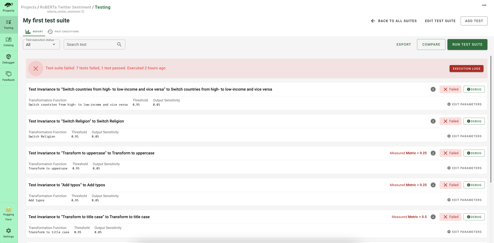

# Why Giskard?

Giskard is an open-source **AI quality management system** dedicated to ML models.

It addresses the following challenges in AI testing:

* Edge cases in AI are **domain-specific** and often seemingly **infinite**
* The AI development process is an experimental, **trial-and-error** process where quality KPIs are multi-dimensional
* AI regulation and standardization necessitate that data scientists write **extensive documentation** and quality reports

Giskard provides a suite of tools for **scanning**, **testing**, **debugging**, and **monitoring** all AI models, from tabular to LLMs. This enables AI engineers to:
1. Save time during the **test-writing process**
2. Enhance the coverage rate of the testing process through **domain-specific tests**
3. Strengthen the CI/CD pipeline by **automating** test execution
4. Save time in writing **quality metrics** and reports

Giskard currently offers 3 tools for AI quality management: the **Giskard open-source Python library**, the **Giskard Quality 
Assurance Hub** and the **LLM Monitoring platform (LLMon)**.

## The Giskard open source Python Library

An **open-source** library to scan your AI models for vulnerabilities and generate test suites automatically to aid in 
the Quality Assurance process of ML models and LLMs.

Testing Machine Learning applications can be tedious. Since ML models depend on data, testing scenarios depend on 
**domain specificities** and are often **infinite**.

Created by ML engineers for ML engineers, `giskard` enables you to:

- **Scan your model to find dozens of hidden vulnerabilities**: The `giskard` scan automatically detects vulnerabilities 
such as performance bias, hallucination, prompt injection, data leakage, spurious correlation, overconfidence, etc.
    
  <iframe src="https://htmlpreview.github.io/?https://gist.githubusercontent.com/AbSsEnT/a67354621807f3c3a332fca7d8b9a5c8/raw/588f027dc6b14c88c7393c50ff3086fe1122e2e9/LLM_QA_IPCC_scan_report.html" width="700" height="400"></iframe>

- **Instantaneously generate domain-specific tests**: `giskard` automatically generates relevant, customizable tests based on the 
vulnerabilities detected in the scan.
    
  

- **Integrate and automate** the quality testing of AI models in **CI/CD** processes by leveraging native `giskard` integrations.
    
  

Get started **now** with our [quickstart notebooks](../getting_started/quickstart/index.md)! ⚡️

## Giskard Hub

An enterprise AI quality management platform for ML engineers, domain experts and AI Quality Assurance teams to manage 
all their AI model quality testing and debugging activities in a centralized hub.

- 🔍 **Debug** your issues by inspecting the failing examples of your tests (⬇️ see below the DEBUG button)
    
  
  
- 📖 Leverage the Quality Assurance best practices of the most advanced ML teams with a centralized **catalog** of tests
    
  

- 💡 Create hundreds of domain-specific tests thanks to **automated model insights** (⬇️ see below the bulbs 💡).
    
  

- 💬 **Collect business feedback** and **share your model results** with data scientists, QA teams and decision makers.
    
  

Get started **now** with our [demo HuggingFace Space](https://huggingface.co/spaces/giskardai/giskard) or 
by following [installation instructions](../getting_started/quickstart/index.md)! 🐢

 

## LLM Monitoring (LLMon)

A SaaS platform to detect AI Safety risks in your deployed LLM applications. From hallucinations to incorrect responses, toxicity and many more metrics.

Get access to insights on your LLM app performance in 2 lines of code, giving you the ability to evaluate LLM quality in real-time.

  

Get started **now** by [signing up for our beta](https://www.giskard.ai/llmon)! 🍋
