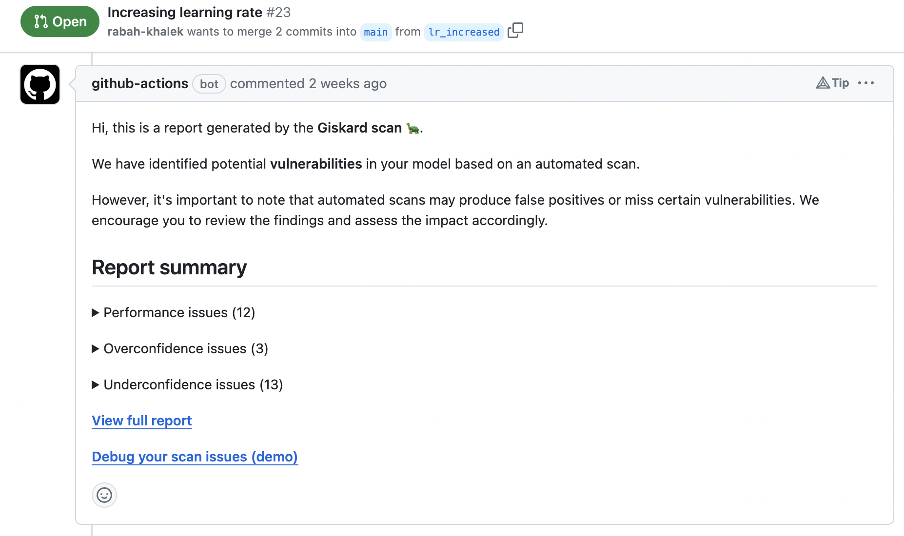

# Why Giskard?

Giskard is a **holistic Testing platform for AI models** to control all 3 types of AI risks: Quality, Security & Compliance.

It addresses the following challenges in AI testing:

- Edge cases in AI are **domain-specific** and often seemingly **infinite**.
- The AI development process is an experimental, **trial-and-error** process where quality KPIs are multi-dimensional.
- Generative AI introduces new **security vulnerabilities** which requires constant vigilance and adversarial red-teaming.
- AI compliance with new regulations necessitate that data scientists write **extensive documentation**.

Giskard provides a platform for testing all AI models, from tabular ML to LLMs. This enables AI teams to:

1. **Reduce AI risks** by enhancing the test coverage on quality & security dimensions.
2. **Save time** by automating testing, evaluation and debugging processes.
3. **Automate compliance** with the EU AI Act and upcoming AI regulations & standards.

## Giskard Library (open-source)

An **open-source** library to scan your AI models for vulnerabilities and generate test suites automatically to aid in the Quality & Security evaluation process of ML models and LLMs.

Testing Machine Learning applications can be tedious. Since AI models depend on data, quality testing scenarios depend on
**domain specificities** and are often **infinite**. Besides, detecting security vulnerabilities on LLM applications requires specialized knowledge that most AI teams don't possess.

To help you solve these challenges, Giskard library helps to:

- **Scan your model to find hidden vulnerabilities automatically**: The `giskard` scan automatically detects vulnerabilities
such as performance bias, hallucination, prompt injection, data leakage, spurious correlation, overconfidence, etc.
  
  <iframe src="https://htmlpreview.github.io/?https://gist.githubusercontent.com/AbSsEnT/a67354621807f3c3a332fca7d8b9a5c8/raw/588f027dc6b14c88c7393c50ff3086fe1122e2e9/LLM_QA_IPCC_scan_report.html" width="700" height="400"></iframe>

- **Instantaneously generate domain-specific tests**: `giskard` automatically generates relevant, customizable tests based on the
  vulnerabilities detected in the scan.
    
  

- **Integrate and automate** testing of AI models in **CI/CD** pipelines by leveraging native `giskard` integrations.
    
  

Get started **now** with our [quickstart notebooks](../getting_started/quickstart/index.md)! ⚡️
