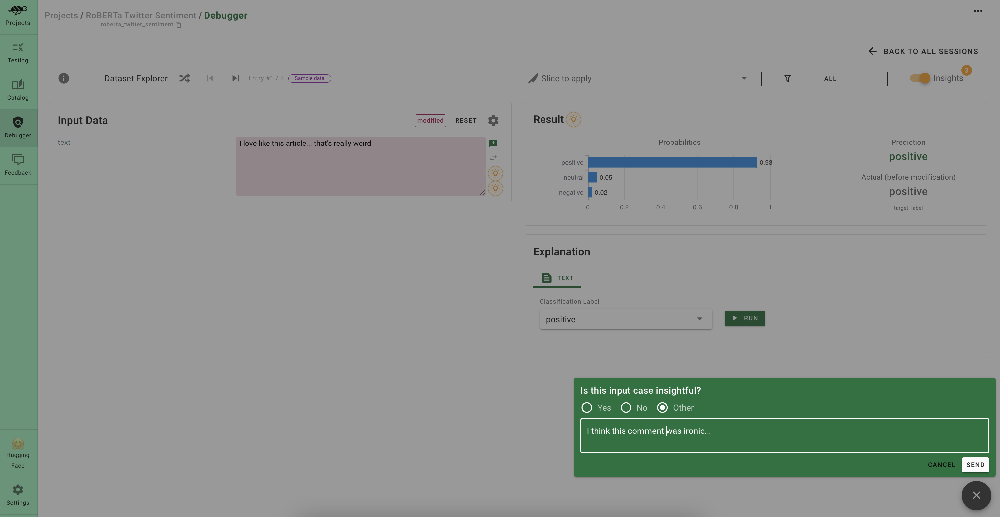
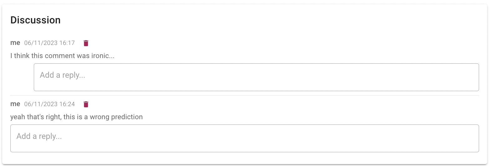

# 🤝 Collaborate to build better models

Collaboration is important in AI QA for different reasons:
* **Alignment between stakeholders**: If your quality criteria are very specific to your business, you will need some discussion before defining some tests, evaluation criteria or data slices.
* **Accountability between stakeholders**: Have your tests and issues reviewed by different stakeholders to share responsability amongst the team

With Giskard, you can:
* Easily **invite** business experts with domain knowledge to debug your issues
* **Collect feedback** from other people in your team on your issues
* **Discuss** with different shareholders about your quality issues
* **Integrate** your discussion in your favourite communication channel (Slack, email, etc.)

To invite users, you just need to create user tab in the Giskard Settings of the hub. Then you can share your project with the user you just invited.

> 💡 Try in live with our Hugging Face space: [here](https://giskardai-giskard.hf.space/main/projects)