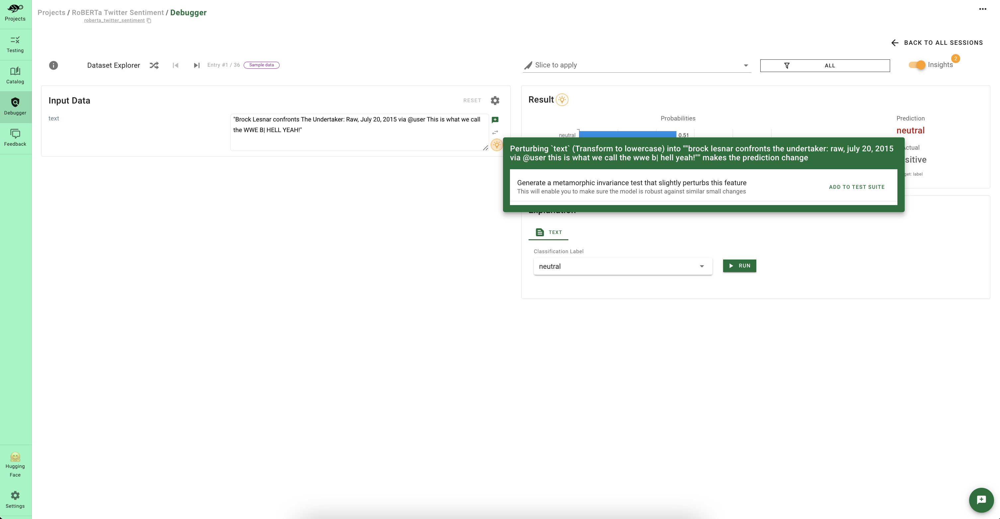
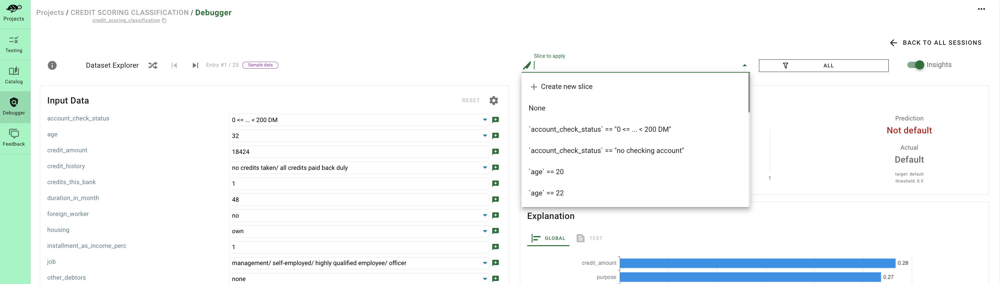
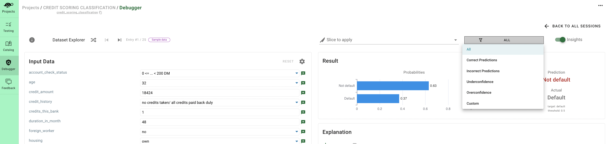

# 🧐 Debug your issues

To assess the quality of your model and diagnose your issues, you need to drill down and inspect each prediction individually. 
This process is what we call **debugging** at Giskard. Debugging is crucial if you want to:
* Inspect failing examples of your [tests](../write_and_debug_tests/index.md).
* Have [collaborative reviews](../collaborate/index.md) from your team members, especially business experts with domain knowledge.

> ➡️ To debug your issues, you have 2 options:
> 1. Click on the **debug button** of your failing tests (after executing the test suite).
> 2. Go to the **debug tab** and choose a model and a dataset to debug.

While the debugging process can be tedious if you have a large dataset, Giskard provides **semi-automatic features** to ease this process with 3 methods:

## 1. Automated Model Insights

Giskard provides helpful notifications while you're debugging, displaying a bulb 💡 at different spots in your debugging session. These model insights cover various issues such as:
* Words or features that **contribute** to the incorrect prediction.
* **Unrobust** predictions against small variations.
* **Overconfident** predictions.
* **Underconfident** predictions.

You'll be notified if you have specific issues and you even have the option to action your issues by:
* Adding new **tests** to your test suite: this allows you to add new tests with just 1 click.
* **Saving** the data slice: this enables you to add this slice as a parameter for your future tests.
* Directly **debugging** the data slice: this allows you to analyze if the model insight is general to the entire slice.

## 2. Filtering by Data Slices

You have the ability to filter different examples from your dataset by applying a slicing function to your dataset. To do this, you can choose the right slice from the dropdown menu at the top right of your debugging session. As you can see, the slices from the scan are automatically displayed here 🙂.

If you want to create a new slice, you can:
* Click on **create new slice** in the dropdown menu to create the slice with the UI in a few clicks.
* [Upload](../upload/index.md) slicing functions that you created from your **Python environment**. This enables you to create complex slices that can use AI models. See [here](../../open_source/customize_tests/data_slices/index.md) for examples.
* Directly upload the slicing functions generated by the [scan](../../open_source/scan/index.md) by uploading the test suite from the **scan**.
* Choose the pre-made slicing functions that Giskard displays in the *slicing functions* section of the **catalog** (Irony detectors, emotion detectors, etc.).

## 3. Filter by Prediction Types

Finally, the Giskard Hub enables you to filter predictions depending on the output of your model:
* **Correct predictions**: these are examples that are correctly predicted.
* **Incorrect predictions**: these are examples that are wrongly predicted.
* **Underconfidence**: these are examples whose predictions were made with low confidence (prediction probabilities between the first and second labels are very close).
* **Overconfidence**: these are wrongly predicted examples, but with high prediction probability.
* **Custom**: You also have the option to add your custom prediction filters.

> 💡 Try it live with our Hugging Face space: [here](https://giskardai-giskard.hf.space/main/projects)
