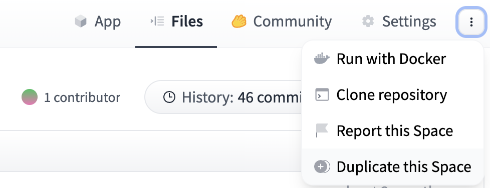
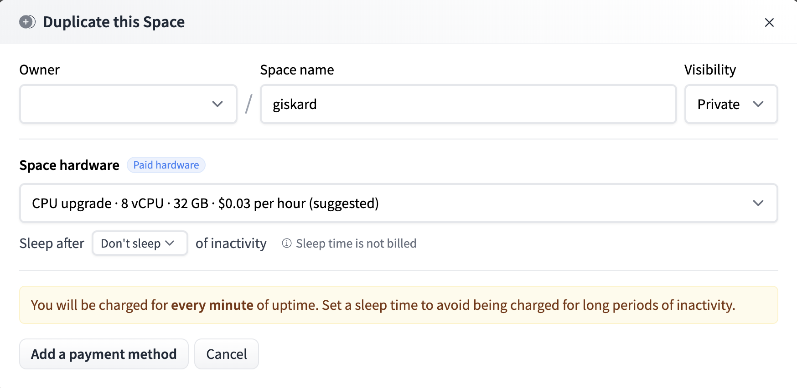
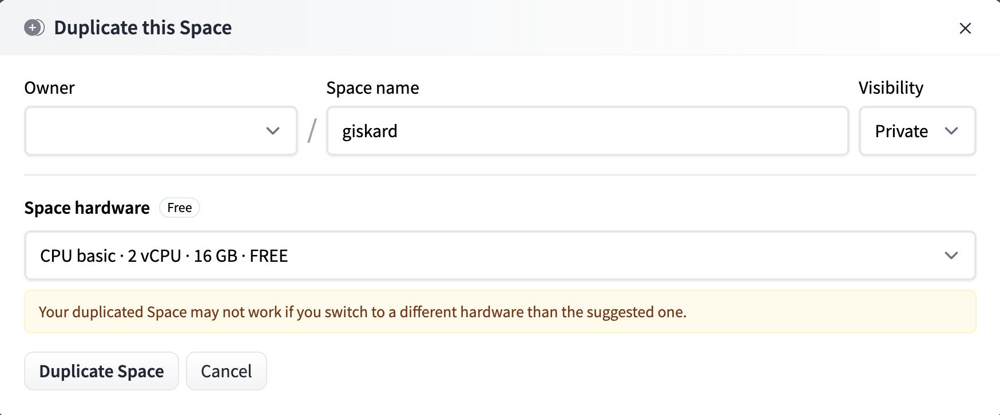
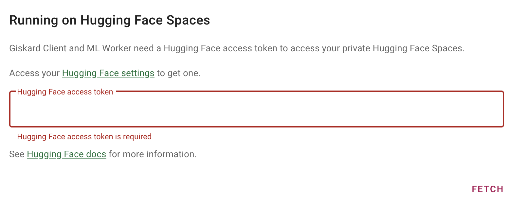
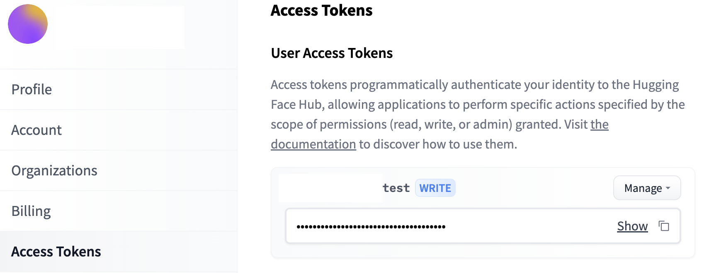
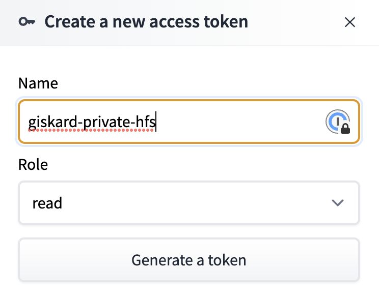
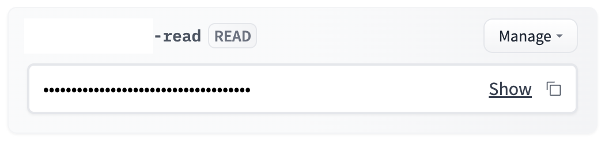
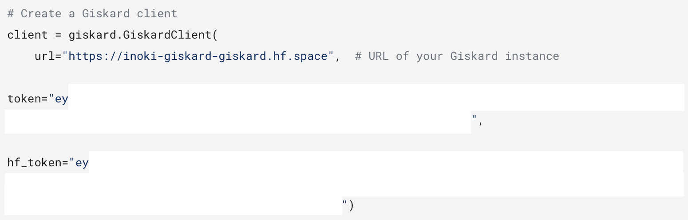
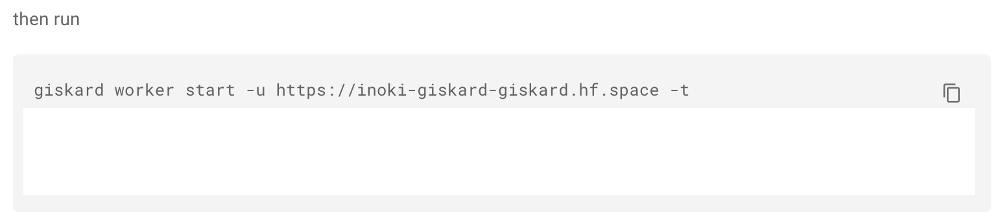

# 🤗 HuggingFace Spaces

Hugging Face Spaces is a great start and the easiest approach to explore Giskard's functionalities.

## Demo Space

We have a [demo Giskard Space](https://huggingface.co/spaces/giskardai/giskard) on Hugging Face Spaces.
Use this demo Space to discover the Giskard server and navigate through our demo projects.

:::{warning}
**The demo Giskard Space is read-only. To upload your own models, datasets and projects in the Giskard Space, we recommend that you duplicate the Space.**
:::

## Create your own Space

To upload and debug your own models, datasets and projects, you will need your own Giskard instance on Hugging Face Spaces.

To do so, you can duplicate our demo Space:

In the popup, you can change the **owner**, the **visibility** and the **hardware**:

:::{hint}
**Owner and visibility**:
- You can change the visibility of the Space to public, which makes it will be **accessible to everyone**. This is nice and recommended for demonstrating the performance of your models using Giskard.
- You can also keep the Space **private** and set the owner to **your organization**, which makes it accessible only by you and the people under your organization. This setup is ideal for internal collaboration, and ensures that your datasets and models remain private.
:::

:::{hint}
**Hardware**:

We recommend to use paid hardware to get the best out of Giskard's Hugging Face Space. You can also incorporate [persistent storage](https://huggingface.co/docs/hub/spaces-storage) to retain your data even after the Space reboots.

However, if you're on a budget, Hugging Face generously offers support for free hardware options.
:::

:::{warning}
With free hardware that lacks persistent storage, any inactivity beyond 48 hours will result in the space being shut down. This will lead to a loss of all data within your Giskard Space.
:::

Once you're ready, click on Duplicate Space. The building process will take several minutes.

Upon completion, you can access the public Giskard instance on Hugging Face Spaces. For guidance, refer to the [Upload an object to the Giskard server](../../../guides/upload/index.md) guide.

For those seeking to use a private Space, please be aware of the following additional measures in place to ensure your data's security and privacy.

## Special notice on Private Space

To connect your Giskard Client or ML worker to your private Space in Hugging Face Spaces, you'll need a **Giskard Space Token**. This token can be generated directly within your private Space and is valid for 24 hours.
Retrieve it either from the ML worker connection details under Giskard Settings or by using the instructions to upload a demo test suite from demo projects.

For first-timers, Giskard requires a Hugging Face access token to produce the Giskard Space Token. This token remains active until you choose to expire it and will only reside in your browser.

You can create and manage them at [Hugging Face settings](https://huggingface.co/settings/tokens).

If you haven't got one, simply click the New token button to generate a Hugging Face access token.

Giskard respects your privacy – we neither alter nor access content from your Hugging Face account. Assigning a 'read' role suffices.

Copy it and paste into the input field, and click on `Fetch`.

Giskard will generate the instructions with the generated token in Giskard Client connection:

and in ML worker connection:

Instructions and details for setting up a Giskard client can be found under the Giskard server's Settings tab.

Aside from the Giskard Space Token, for uploading objects to the Giskard instance on Hugging Face Spaces, consult the [Upload an object to the Giskard server](../../../guides/upload/index.md) guide.
