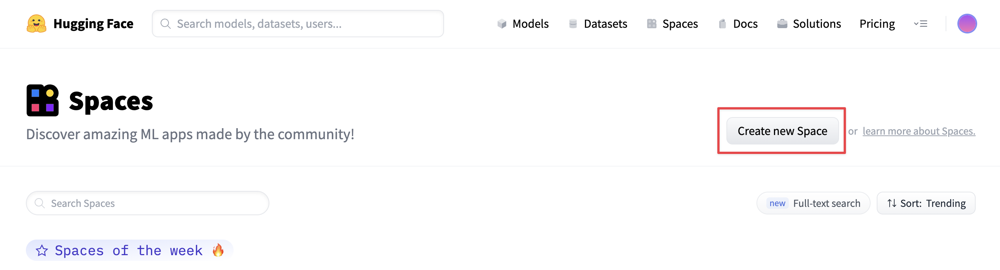
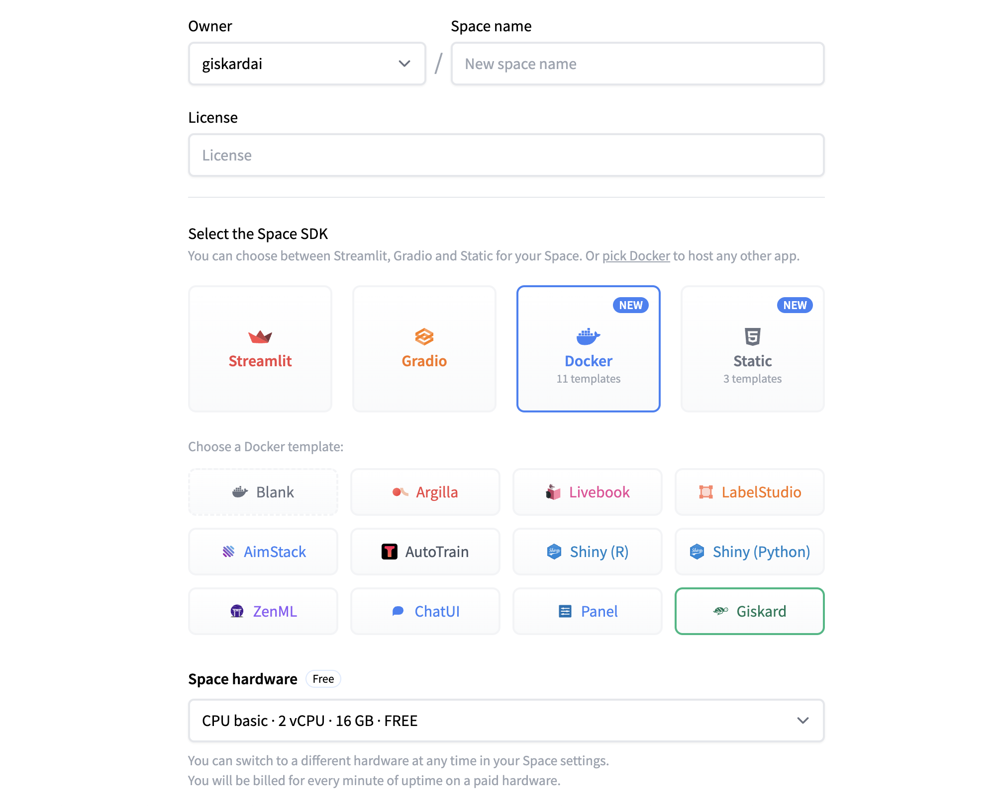

# 🤗 HuggingFace Spaces

For an **easy use** of the Giskard Hub, you can directly access the Hub online through Hugging Face with:
* The **public HF Space**: That's perfect if you don't want to upload your own model and just want to check some Giskard demo projects. 
* The **private HF Space**: That's perfect if you want to use Giskard with your own model without installing the Giskard Hub. You need to have an Hugging Face account.

> For other ways to install the Giskard Hub, the [On-premise](../install_on_prem/index.md) or [Private Cloud](../install_cloud/index.md) installation.

The Giskard Hub is the app adapted for an enterprise use of Giskard. Extending the features of the open-source library, it enables you to:

* Debug tests to diagnose your issues
* Create domain-specific tests thanks to automatic model insights
* Compare models to decide which model to promote
* Collect business feedback of your model results
* Share your results with your colleagues for alignment
* Store all your QA objects (tests, data slices, evaluation criteria, etc.) in one place to work more efficiently


## Public HF Space: Try the Hub on demo models in 1 click

If you want to try the Giskard Hub on some demo ML projects (not on your own ML models), navigate to our public demo Space:

<a  href="https://huggingface.co/spaces/giskardai/giskard">
    
</a>

:::{hint}
The demo Giskard Space is read-only. To upload your own models, datasets and projects in the Giskard Space, we recommend that you duplicate the Space. More on this in the following sections. 
:::

## Private HF Space: Test & debug your own ML model in the Hub

Leverage the Hugging Face (HF) Space to easily test & debug your own ML models. This implies that you deploy a private HF space containing the Giskard Hub and upload your Python objects (such as ML models, test suites, datasets, slicing functions, or transformation functions) to your HF Space. To do so, follow these steps:

### 1. Create a new Space using the Giskard Docker template
Begin by visiting [HuggingFace Spaces](https://huggingface.co/spaces) and click on "Create new Space" as depicted below. 
Alternatively, navigate directly [here](https://huggingface.co/new-space?template=giskardai%2Fgiskard) to create a new space
from the Giskard template.



You can then deploy Giskard on Spaces with just a few clicks. You need to define the **Owner** (your personal account or an organization), a **Space name**, and the **Visibility**.



:::{hint}
**Owner and visibility**:
If you don't want to publicly share your model, set your Space to **private** and assign the owner as **your organization**
**Hardware**:
We recommend to use paid hardware to get the best out of Giskard's HF Space. You can also incorporate [persistent storage](https://huggingface.co/docs/hub/spaces-storage) to retain your data even after the Space reboots. With free hardware that lacks persistent storage, any inactivity beyond 48 hours will result in the space being shut down. This will lead to a loss of all data within your Giskard Space.
:::

Once you're ready, click on "Create Space" to confirm the creation. The build process will take a few minutes.

### 2. Create a new Giskard project


### 3. Enter your HF Access token

On your first access on a private HF Space, Giskard needs a HF access token to generate the Giskard Space Token. To do so, follow the instructions in the pop-up that you encounter when creating your first project.


Alternatively, provide your HF access token through the Giskard Settings.

### 4. Start the ML worker

Giskard executes your model using a worker that runs the model directly in **your Python environment**, with all the dependencies required by your model. You can either execute the ML worker:

- From your **local notebook** within the kernel that contains all the dependencies of your model
- From **Google Colab** within the kernel that contains all the dependencies of your model
- Or from **your terminal** within the Python environment that contains all the dependencies of your model

:::{note}
If you plan to use LLM-assisted tests or transformations, don’t forget to set the ``OPENAI_API_KEY`` environment
variable before starting the Giskard worker.
:::

:::::::{tab-set}
::::::{tab-item} From your local notebook

To start the ML worker from your notebook, run the following code in your notebook:

```
!giskard worker start -d -k YOUR_KEY -u https://XXX.hf.space -t HF-TOKEN
```

To find the **exact** command with the right API Access Key (`YOUR_KEY`) and HuggingFace token (`HF-TOKEN`), go to the "Ml Worker" section in the Settings tab in the Giskard Hub that you install in HF Space.


> ### ⚠️ Warning
> To see the available commands of the worker, you can execute:
>```
>!giskard worker --help
>```

::::::
::::::{tab-item} From Colab notebook

To start the ML worker from your Colab notebook, run in your Colab cell:

```
!giskard worker start -d -k YOUR_KEY -u https://XXX.hf.space -t HF-TOKEN
```

To find the **exact** command with the right API Access Key (`YOUR_KEY`) and HuggingFace token (`HF-TOKEN`), go to the "Ml Worker" section in the Settings tab in the Giskard Hub that you install in HF Space.

> ### ⚠️ Warning
> To see the available commands of the worker, you can execute:
>```
>!giskard worker --help
>```

::::::
::::::{tab-item} From your terminal

* Run the following command **within the Python environment that contains all the dependencies of your model**:

```
giskard worker start -d -k YOUR_KEY -u https://XXX.hf.space -t HF-TOKEN
```

To find the **exact** command with the right API Access Key (`YOUR_KEY`) and HuggingFace token (`HF-TOKEN`), go to the "Ml Worker" section in the Settings tab in the Giskard Hub that you install in HF Space.

> ### ⚠️ Warning
> To see the available commands of the worker, you can execute:
>```
>!giskard worker --help
>```

::::::
:::::::

### 5. Upload your test suite by creating a Giskard Client for your HF Space

You can then upload the test suite generated by the Giskard scan from your Python notebook to your HF Space. Achieve this by initializing a Giskard Client: simply **copy the "Create a Giskard Client" snippet** from the Giskard Hub settings and run it within your Python notebook. For more details, have a look at our upload object documentation [page](../../upload/index.md)

You are now ready to debug the tests which you've just uploaded in the test tab of the Giskard Hub.

## Feedback and support

If you have suggestions or need specialized support, please join us on the [Giskard Discord community](https://discord.gg/ABvfpbu69R) or reach out on [Giskard's GitHub repository](https://github.com/Giskard-AI/giskard).
