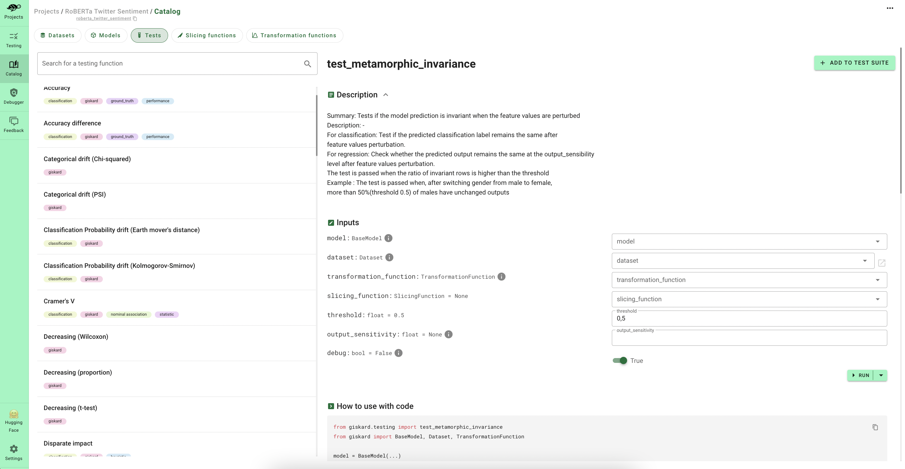

# 👨‍🔬 Add domain-specific tests

Now that you [scan](../../open_source/scan/index.md) your model, you've got a first test suite covering the biggest [vulnerabilities](../../knowledge/llm_vulnerabilities/index.rst). But, real models usually need **hundreds of business specific tests** to be ready for production. While the tests creation task can be fastidious, Giskard enables you to **semi-automate** this process.

In this section, we'll see how to enrich the tests you initially created from the [scan](../../open_source/scan/index.md) by:
* Adding tests from the automatic model insights
* Adding tests from the Giskard catalog

## Add tests from the automatic model insights

While you [debug](../inspect/index.md) your test suite, Giskard provides some magic notifications displaying a bulb 💡. These model insights covers various issues such as:
* Words or features that **contributes** to the incorrect prediction
* **Unrobust** predictions
* **Overconfident** predictions
* **Underconfident** predictions

By clicking on these small bulbs 💡, you have the possibility to:
* Add new **tests** to your test suite: this enables you add new tests in 1 click
* **Save** the data slice: this enables you to add this slice as a parameter of your future tests
* Directly **debug** the data slice: this enables you to analize if the model insight is general to the whole slice

## Add tests from the Giskard catalog

The Giskard catalog is an **open-source** catalog that is constantly updated by the community. It proposes some **pre-made tests** that you can easily configure depending on your business case by putting some domain specific slices & transformations or evalution criteria as **inputs** of your tests.

To add tests from the catalog, click on "add test" in your test suite tab. This will redirect you to the catalog showing all Giskard tests. You then have the possibility to run your test before adding it to your suite. 

> ⚠️ Warning
> * If you add a test **without** specifying the input of your test, you'll be asked to define the input at **suite execution time**. This input will become a *suite input*. For instance, model are great suite input if you can to [compare different model](../compare_models/index.md) with the same test suite.
> * If you add a test by **specifying the input** of your test, you won't be asked to define it at suite 
> execution time. This input becomes a *fixed value* of your suite. For instance, data slices or thresholds are 
> great fixed values because they are inherent to your suite.
>
> 💡 You can also define test input as *suite input* or *fixed value* by editing the parameters of your test 
> suite.

> 💡 Try in live with our Hugging Face space: [here](https://giskardai-giskard.hf.space/main/projects)