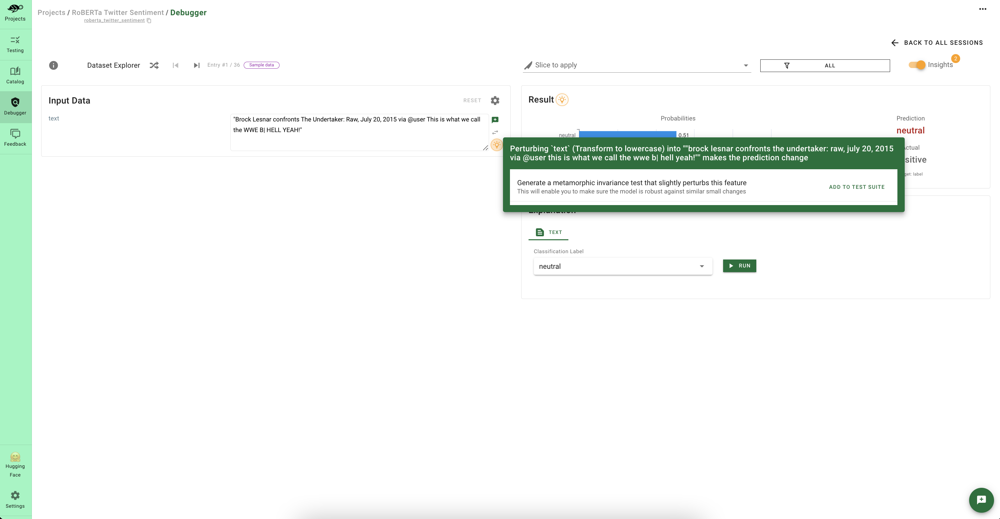

# 👨‍🔬 Add domain-specific tests

After [scanning](../../open_source/scan/index.md) your model, you've got a first test suite covering important [vulnerabilities](../../knowledge/llm_vulnerabilities/index.rst). However, 
real-world models usually need **hundreds of business-specific tests** to be production-ready. While the tests 
creation task can be fastidious, Giskard enables you to **semi-automate** this process.

In this section, we'll see how to enrich the tests you initially created from the [scan](../../open_source/scan/index.md) by:
* Adding tests from the automated model insights
* Adding tests from the Giskard catalog

## Add tests from the automated model insights

While [debugging](../inspect/index.md) your test suite, Giskard provides a magic notification displaying a bulb 💡. These model insights 
cover various issues such as:
* Words or features that **contribute** to the incorrect prediction
* **Unrobust** predictions
* **Overconfident** predictions
* **Underconfident** predictions

By clicking on these small bulbs 💡, you have the possibility to:
* Add new **tests** to your test suite: enabling you to add new tests in 1 click
* **Save** the data slice: this enables you to add the selected slice as a parameter for your future tests
* Directly **debug** the data slice: this enables you to analyze whether the model insight applies to the whole slice

## Add tests from the Giskard catalog

The Giskard catalog is an **open-source** catalog that is constantly updated by the community. 
It proposes **pre-made tests** that you can easily configure depending on your business use-case by adding 
domain-specific slices & transformations or evaluation criteria as **inputs** of your tests.

To add tests from the catalog, click on "add test" in your test suite tab. This will redirect you to the 
catalog showing all Giskard tests. You then have the possibility to run your test before adding it to your suite. 

> ⚠️ Warning
> * If you add a test **without** specifying the input of your test, you'll be asked to define the input at **suite execution time**. This input will become a *suite input*. Models are a great suite input to [compare different model](../compare_models/index.md) with the same test suite.
> * If you add a test by **specifying the input** of your test, you won't be asked to define it at suite 
> execution time. This input becomes a *fixed value* of your suite. Data slices or thresholds are 
> great fixed values because they are inherent to your suite.
>
> 💡 You can also define test input as *suite input* or *fixed value* by editing the parameters of your test 
> suite.

> 💡 Try it out live with our Hugging Face Space: [here](https://giskardai-giskard.hf.space/main/projects)
