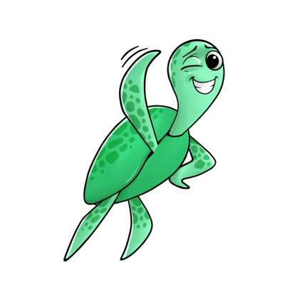

```{toctree}
:caption: Getting Started
:name: mastertoc
:maxdepth: 1
:hidden:

getting_started/index
getting_started/quickstart_tabular
getting_started/quickstart_nlp
getting_started/quickstart_llm
```

```{toctree}
:caption: Open-Source Library
:name: mastertoc
:maxdepth: 1
:hidden:

open_source/installation_library/index
open_source/scan_tabular/index
open_source/scan_nlp/index
open_source/scan_llm/index
open_source/customize_tests/index
open_source/integrate_tests/index
open_source/talk_to_your_model/index
```

```{toctree}
:caption: Giskard Hub
:name: mastertoc
:maxdepth: 1
:hidden:

giskard_hub/installation_hub/index
giskard_hub/upgrade_hub_version/index
giskard_hub/upload/index
giskard_hub/write_and_debug_tests/index
giskard_hub/inspect/index
giskard_hub/compare_models/index
giskard_hub/collaborate/index
```

```{toctree}
:caption: Tutorials
:name: mastertoc
:maxdepth: 1
:hidden:

tutorials/tabular_tutorials/index
tutorials/nlp_tutorials/index
tutorials/llm_tutorials/index
```

```{toctree}
:caption: Knowledge Resources
:name: mastertoc
:maxdepth: 1
:hidden:

knowledge/key_vulnerabilities/index
knowledge/llm_vulnerabilities/index
knowledge/catalogs/index
```

```{toctree}
:caption: API Reference
:name: mastertoc
:maxdepth: 1
:hidden:

reference/index
```

```{toctree}
:caption: Community
:name: mastertoc
:maxdepth: 1
:hidden:

community/discord/index
community/github/index
community/contribution_guidelines/index
```

<h1 align="center" weight='300' style="color: var(--sd-color-card-text);" >The testing framework dedicated to  ML models, from tabular to LLMs</h1>
<p align="center"> 
   <a href="https://www.giskard.ai/knowledge-categories/blog/?utm_source=github&utm_medium=github&utm_campaign=github_readme&utm_id=readmeblog"><b>Blog</b></a> &bull;  
  <a href="https://www.giskard.ai/?utm_source=github&utm_medium=github&utm_campaign=github_readme&utm_id=readmeblog"><b>Website</b></a> &bull;
  <a href="https://gisk.ar/discord"><b>Discord</b></a>
 </p>
<br />


::::::{grid} 1 1 3 3
:gutter: 1

:::::{grid-item}

::::{grid} 1 1 1 1
:gutter: 1

:::{card} <h2><center> Getting Started </center></h2>
:link: getting-started/index.html
&nbsp;&nbsp;&nbsp;&nbsp;&nbsp;&nbsp;
:::

:::{card} <h2><center> API Reference </center></h2>
:link: reference/index.html

:::

:::{card} <h2><center> Contribute </center></h2>
:link: contribute/index.html
&nbsp;&nbsp;&nbsp;&nbsp;&nbsp;&nbsp;
:::
::::

:::::

:::::{grid-item}

::::{grid} 1 1 1 1
:gutter: 1

:::{card} <h2><center> User Guide </center></h2>
:link: guides/index.html

&nbsp;&nbsp;&nbsp;&nbsp;&nbsp;&nbsp;
:::

:::{card} <h2><center> Tutorials </center></h2>
:link: tutorials/index.html
&nbsp;&nbsp;&nbsp;&nbsp;&nbsp;&nbsp;&nbsp;&nbsp;&nbsp;
:::
::::

:::::

:::::{grid-item}

::::{grid} 1 1 1 1
:gutter: 1

:::{card} <h2><center> Catalogs </center></h2>
:link: catalogs/index.html

&nbsp;&nbsp;&nbsp;&nbsp;&nbsp;&nbsp;
:::

:::{card} <h2><center> Integrations </center></h2>
:link: integrations/index.html
&nbsp;&nbsp;&nbsp;&nbsp;&nbsp;&nbsp;
:::

::::
:::::

