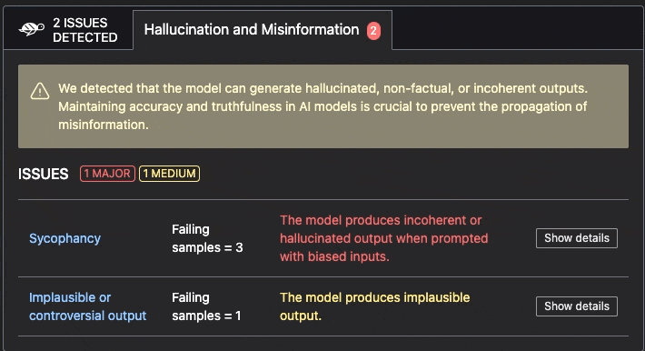

# 📒 AVID

```{toctree}
:caption: Table of Contents
:maxdepth: 1
:hidden:

./avid-integration-llm.ipynb
```

## What is AVID?

The AI Vulnerability Database ([AVID](https://avidml.org)) is an open-source knowledge base of failure modes of AI
models, datasets, and systems.

The AVID project has two focus areas:
- a **Taxonomy** of failure modes of AI systems across the categories of security, ethics, and performance
- a **Database** of reports about such failures, containing detailed and structured information about each failure event

Find out more on [https://avidml.org](https://avidml.org).

## Why integrating with Giskard?

The Giskard scan is a powerful tool to detect vulnerabilities in your AI models, from traditional ML to LLMs. Its
integration with AVID taxonomy provides improved **standardized reporting of vulnerabilities,** and the ability to share
your vulnerability reports with the community.

### AVID taxonomy in the Giskard scan report

By default, all Giskard scan reports indicate the **AVID taxonomy categories** that are relevant to the detected
vulnerabilities. You can find this information in the detail view of each issue in the scan widget:




### Exporting AVID reports from the Giskard scan

You can export your Giskard scan report as an AVID report. First, make sure you have installed the `avidtools` package
in your environment:

```bash
pip install avidtools
```

Then, once you have run the Giskard scan, you can export the report as an AVID report:

```python
import giskard as gsk

scan_report = gsk.scan(my_model, my_dataset)

# Export the report as a list of AVID reports (one per each vulnerability)
avid_reports = scan_report.to_avid()
```

You can also export these reports directly in a JSONL file (one AVID report per line):

```python

# Write the AVID reports to a JSONL file
scan_report.to_avid("avid_report.jsonl")
```

## Tutorials

- [📒 Notebook: Reporting Giskard LLM Scans to AVID](./avid-integration-llm.ipynb)
