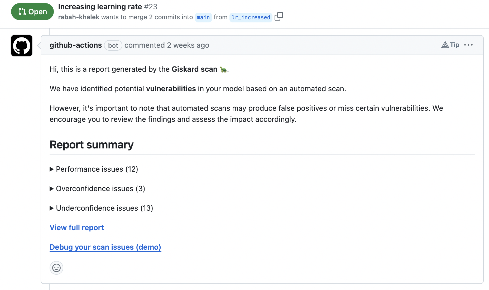
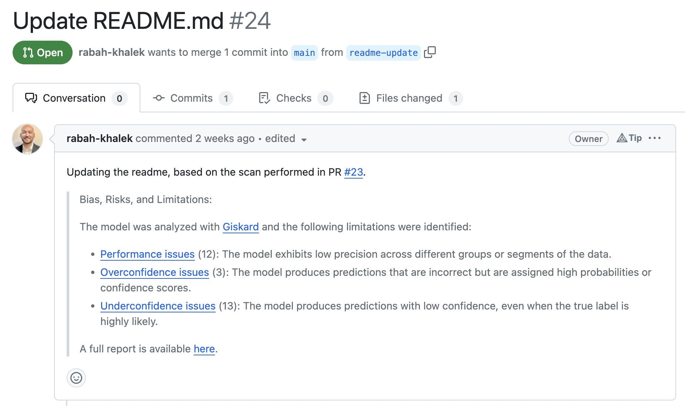

# 🐙️ GitHub
**Adding Giskard to your CI/CD pipeline will allow you to run the test or scan on every commit to your repository, ensuring
new models are not introducing new vulnerabilities.**
<br><br>
:::{warning}
First, you'll need to know how to run Giskard's scan function
see [Scan your ML Model](../../open_source/scan/index.md)
:::

With Giskard, you can easily automate scan or test execution publication in your CI/CD every time you have a new version of you model. For instance, you can:
* Publish the scan report as a **discussion** of your PR: see example of a [GitHub repo](https://github.com/rabah-khalek/Healthcare-Analytics/pull/23)
* Add a paragraph in the **Read Me** of your repo by opening a PR: see example of a [GitHub repo](https://github.com/rabah-khalek/Healthcare-Analytics/pull/24)

## Publish the scan report as a discussion of your PR
Publishing a scan report or test suite execution as a discussion of your PR is useful when you update your model (retrain your model after new data, change of hyperparameter, etc.).



You can then trigger the execution and publishing of the scan when the PR is open. To see how to do please look at the GitHub Action workflow in this [repo](https://github.com/rabah-khalek/Healthcare-Analytics/pull/23).

## Add a paragraph in the Read Me of your repo by opening a PR
You can even automatically add a paragraph in your repo Read Me about some vulnerabilities of your model. For instance, you can add a paragraph on Bias, Risk and limitations.



To automate it yourself for your own model, see an example of a Read Me PR [here](https://github.com/rabah-khalek/Healthcare-Analytics/pull/24).

## Create a script to scan your model

By referring to the [Scan your ML Model](../../open_source/scan/index.md) guide, you can create a script that will scan your model.

```python
import giskard

# Following the scan guide, you can create a wrapped model and dataset
scan_results = giskard.scan(wrapped_model, wrapped_dataset)
```

Using the results of the scan, you can then decide if your script should exit with an error code or not.

```python
if scan_results.has_vulnerabilities:
    print("Your model has vulnerabilities")
    exit(1)
else:
    print("Your model is safe")
    exit(0)
```

## Notebook examples
::::::{grid} 1 1 2 2
:gutter: 1

:::::{grid-item}
:::{card} <br><h3><center>📊 Tabular</center></h3>
:link: pipeline.ipynb
:::
:::::