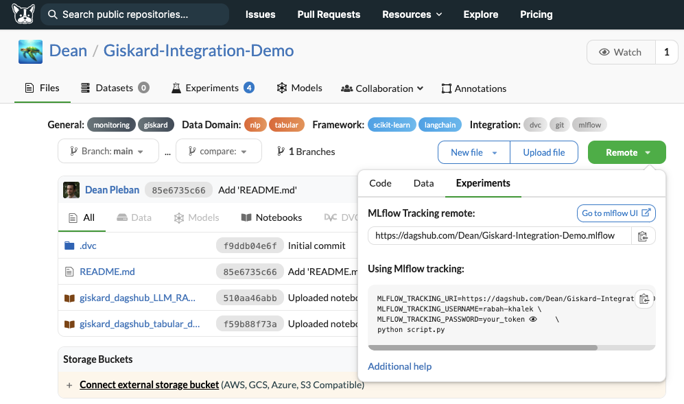

# 🐶 DagsHub
**With its multifaceted platform and free hosted MLflow server, Dagshub enhances your ML debugging experience of Giskard's vulnerability reports.**

## Why DagsHub?
DagsHub is an ML platform, purpose-built for data scientists and the open-source community, offering a unified solution to manage datasets, track experiments and register models. It enhances collaboration, reproducibility, and provides integrations with many open-source tools. Here's how DagsHub can boost your data science endeavors:

- **Effortless Collaboration:** DagsHub provides a collaborative environment where project contributors can easily comment on various project elements, take notes, and seamlessly share updates with team members or the broader community.

- **Rigorous Reproducibility:** Ensure the reproducibility of your data science projects by employing DagsHub's robust version control system. This allows you to maintain version history for your code, data, and experiments, making it easy to compare and differentiate elements such as Jupyter notebooks and data components.

- **Seamless Integrations:** DagsHub seamlessly integrates with essential open-source tools, including DVC, MLflow, Label Studio, and Jenkins, facilitating an efficient workflow and swift closure of the data loop.

- **Easily Customizable:** DagsHub is suitable for various user profiles, including those who collaborate within large data science teams, are passionate about open-source tools, require automation for rapid iteration, deal with evolving data, prefer Git for version control, or believe in the power of collaborative contributions.

In summary, DagsHub is a comprehensive solution for data science projects, promoting effective collaboration, ensuring project reproducibility, and seamlessly integrating with widely adopted open-source tools. 

## Why integrating Giskard?
Through their own integrations with MLflow, Giskard and Dagshub can be combined to offer a rich environment for ML projects visualisation, tracking and collaboration.

As discussed on this [page](https://docs.giskard.ai/en/latest/integrations/mlflow/index.html), The Giskard-MLflow integration via the evaluation API aims to provide the user with an **automated vulnerability detection** for tabular and NLP models as well as LLMs.

In conjunction, DagsHub provides a free hosted MLflow server with team-based access control for every repository. You can log experiments with MLflow to it, view the information under the experiment tab, and manage your trained models from the full-fledged MLflow UI built into your DagsHub project. See this [page](https://dagshub.com/docs/integration_guide/mlflow_tracking/) for more details.

The result of combining these two abilities, can be visualised in this [demo repository on Dagshub](https://dagshub.com/Dean/Giskard-Integration-Demo).


## The integration in a nutshell
The minimal set of packages you need for this integrations are:
```shell
pip install giskard mlflow dagshub dvc
```
DagsHub's MLflow integration supports directly logging artifacts through the tracking server, and this is enabled by a simple credentials set up (dagshub.init(...)) to enable writing access to your MLflow remote server on DagsHub.
```python
# Only DagsHub related lines you need:
import dagshub 
# This will work if you have write access to the repo below, if you cloned it, please change the repo_owner to your user name
dagshub.init(repo_name="your_repo_name", repo_owner="your_username")
```
Once this is done, you can perform the evaluation of your model via (see [page](https://docs.giskard.ai/en/latest/integrations/mlflow/index.html)):
```python
with mlflow.start_run() as run:
        mlflow.evaluate(model_uri, ...)
```
After completing these steps, you can version your notebook with the DagsHub Client following this final step:
```python
dagshub.notebook.save_notebook(repo="your_repo_name")
```
Finally, you can access to the evaluation results by clicking on `Remote > Experiments > Go to mlflow UI` (see below):
<br><br>


## Notebook examples
::::::{grid} 1 1 2 2
:gutter: 1

:::::{grid-item}
:::{card} <br><h3><center>📊 Tabular</center></h3>
:link: https://dagshub.com/Dean/Giskard-Integration-Demo/src/main/giskard_dagshub_tabular_demo.ipynb
:::
:::::

:::::{grid-item}
:::{card} <br><h3><center>📝 LLM</center></h3>
:link: https://dagshub.com/Dean/Giskard-Integration-Demo/src/main/giskard_dagshub_LLM_RAG.ipynb
:::
:::::
::::::