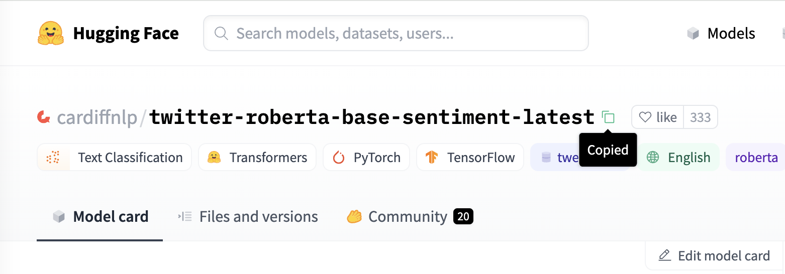
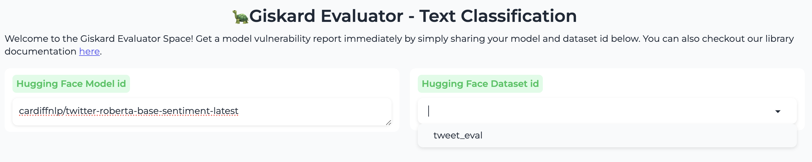
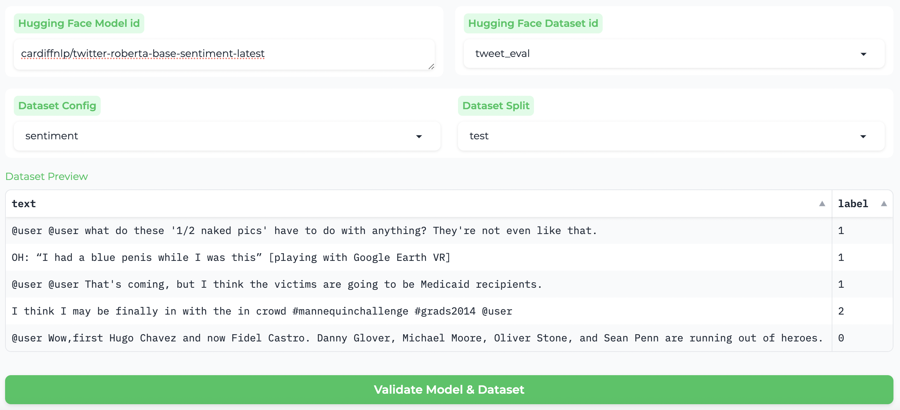
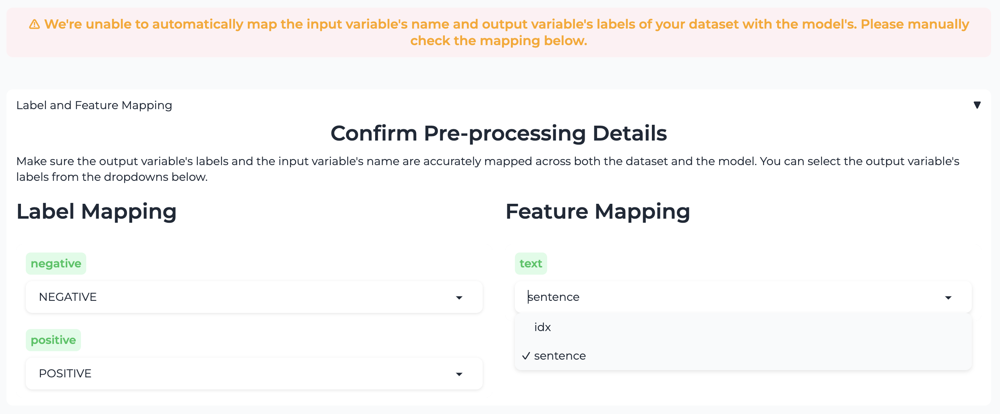
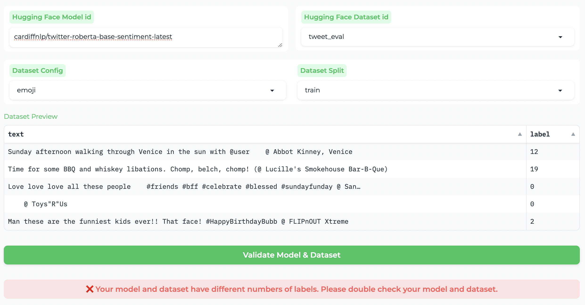
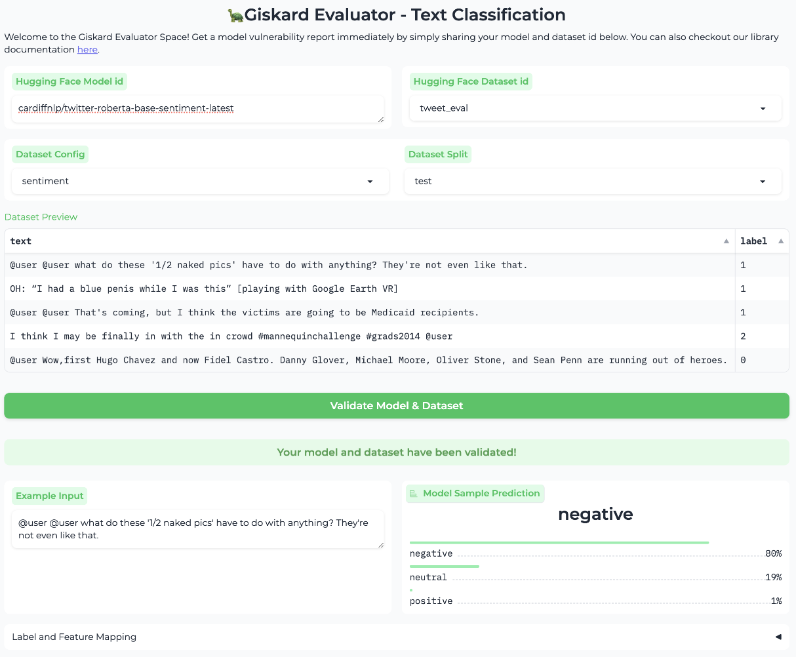
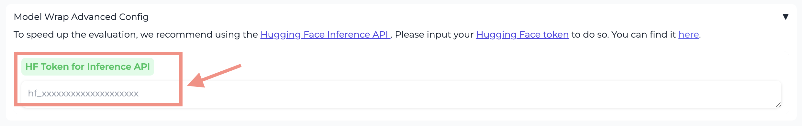
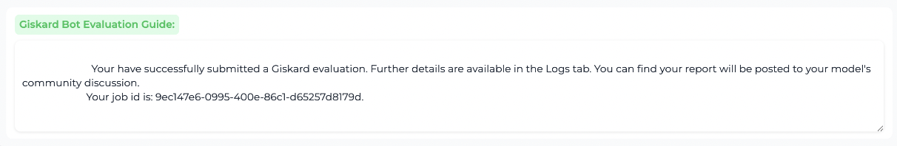
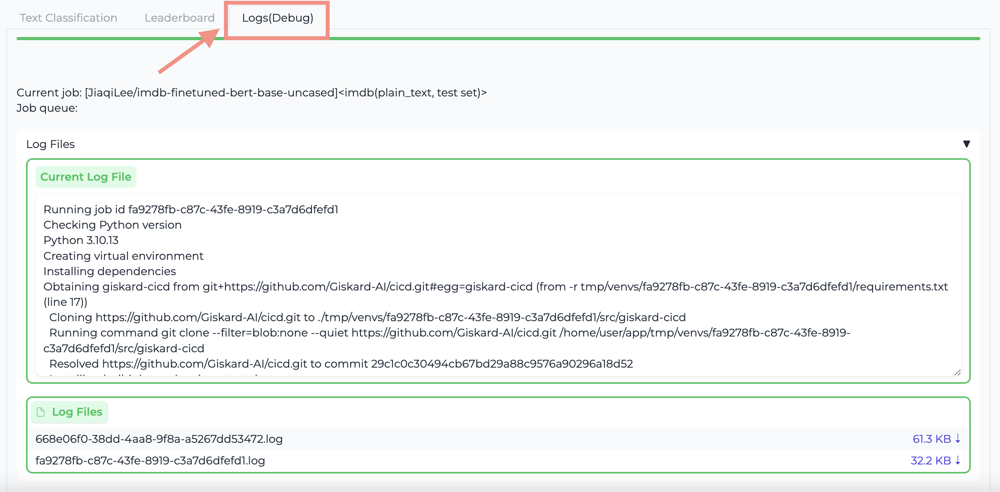
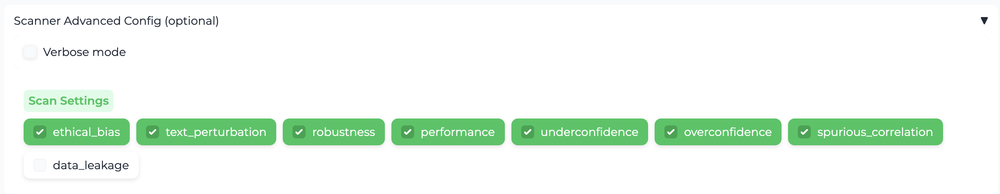

# Giskard Evaluator on 🤗 Hugging Face
**Leverage the Hugging Face (HF) Space to easily scan and evaluate your Nature Language Processing (NLP) models on HF.**

This is a guide to submit an evaluation job for a model on HF with a dataset on HF from Giskard Evaluator.

## Get the model ID and the dataset ID

First, find the model id of the model you want to evaluate. For instance, locate the model **cardiffnlp/twitter-roberta-base-sentiment-latest** [here](https://huggingface.co/cardiffnlp/twitter-roberta-base-sentiment-latest) and click on the "Copy" icon next to the title to copy the model ID:

If you need to upload your own model for the evaluation, please check [Hugging Face document here](https://huggingface.co/docs/hub/en/models-uploading).

Next, paste the model ID into the first blank space. If this model has already been submitted for scan, related datasets may appear in the suggestion list. Alternatively, you can input any dataset hosted on Hugging Face that matches the model. If your dataset is not already on Hugging Face, you can check [the document here](https://huggingface.co/docs/hub/en/datasets-adding) to upload it.

To get started, input the model ID and dataset ID. 

After that, select the configuration and dataset split – these will get filled in automatically, but you might want to specify a different pair. Please preview and double check your choices using the **Dataset Preview** section.

## Validation: label and feature matching

Once you have finished setting up the model ID and dataset with its configuration and split, just click the button below. We'll run a quick validation to make sure the model and dataset match and are compatible with the Giskard library. Easy and straightforward!

### Choose the feature

Your dataset might not perfectly match your model, and we're here to help align it for you. For instance, if your dataset has more than one feature column, you may need to manually guide us to the right one. In the example below, we could map "sentence" to "text" instead of "idx.”

This does not stop you from submission (you can still do that), but will significantly impact the accuracy of the scan.

### Match the labels

Keep in mind that even if your dataset has a subset that matches to your model, the configuration and split choices may not align correctly. For instance, if your model is sorting on sentiment data, but the configuration is set for emojis, the labels won't match up.

After changing to the correct selection, the validation should be green!

Double check everything and fill in your Hugging Face token. When the "Get Evaluation result" button lights up, you are ready to go!

## Use your HF access token for your own evaluation

Click on the "Get Evaluation Result" button, your job will be submitted and you will see the job ID of your evaluation.

## Check evaluation progress

You can always come back later and check your job progress in the "Logs" tab. If your job has finished, you will be able to find the posted report in the submitted model’s community discussion. In case of error, you can download the log file with the job ID in the Giskard Evaluator Space.

## Advanced Configurations (Optional)

You can enable the "verbose mode" to check any problems in the scanner during the evaluation of your model. The community tab of this Hugging Face Space is open to your feedbacks.

You can pick the scanners you need for your evaluation. By default, we don't check for data leakage here because it goes through each row instead of a chunk of data, which could slow down the process.
