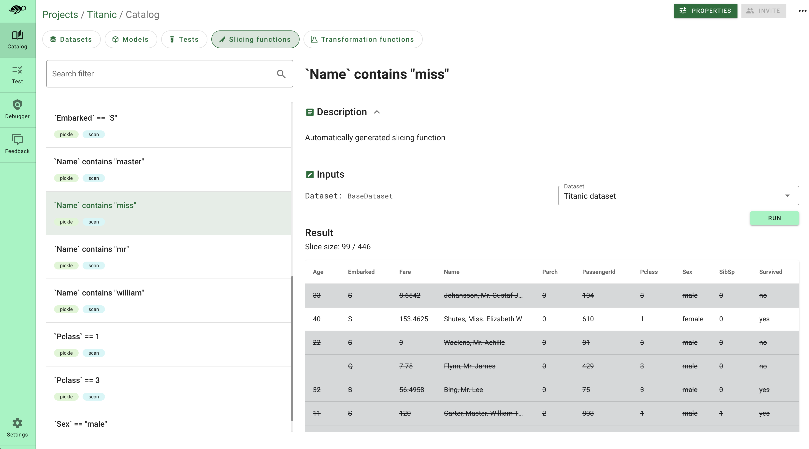

# 🔪 Create data slices

Having global quality metrics is often not enough. By analyzing subsets based on relevant factors you can identify biases, disparities, and issues specific to certain groups.

> **Warning:** Slicing functions are not sub-datasets! They are functions that can be applied to new datasets such as your production data for testing, debugging, and monitoring purposes. Saving data slices is key to integrating your **domain knowledge** to the tests.

Giskard enables you to **automatically** create slicing functions, such as *low-performing*, *underconfident*, *overconfident* or *spurious data slices*. We also propose various slicing functions in the **Giskard catalog**, such as sentiment, irony or toxicity detectors. Have a look at our [🔪 Slicing Function Catalog](../../../knowledge/catalogs/slicing-function-catalog/index.rst).

This section explains how to create your own slicing function, or customize the functions generated by the Giskard scan and how save them.

## Load slicing functions from the Giskard catalog

The [Giskard catalog](../../../knowledge/catalogs/slicing-function-catalog/index.rst) provides you with different slicing functions for NLP such as sentiment, hate, and toxicity detectors:

```python
#Load sentiment analysis model from the Giskard catalog
from giskard.functions.slicing import positive_sentiment_analysis
```

## Create your own slicing function

To create a Giskard slicing function, you just need to decorate an existing Python function with `@slicing_function()`. Depending on the argument of the decorator, you can decorate different Python functions filtered by row, dataframe, or cell level:

:::::{tab-set}

::::{tab-item} row_level=True (default)

When `row_level=True`, you can decorate a function that takes a pandas dataframe **row** as input and returns a boolean. Make sure that the first argument of your function corresponds to the row you want to filter:

```python
import pandas as pd
from giskard import slicing_function, demo, Dataset


_, df = demo.titanic()
dataset = Dataset(df=df, target="Survived", cat_columns=['Pclass', 'Sex', "SibSp", "Parch", "Embarked"])


@slicing_function(row_level=True)
def my_func2(row: pd.Series, threshold: int):
    return row['Age'] > threshold


dataset.slice(my_func2(threshold=20))
```

::::

::::{tab-item} row_level=False

When `row_level=False`, you can decorate a function that takes a full **pandas dataframe** as input and returns a filtered pandas dataframe. Make sure that the first argument of your function corresponds to the pandas dataframe you want to filter:

```python
from giskard import slicing_function, demo, Dataset
import pandas as pd


_, df = demo.titanic()
dataset = Dataset(df=df, target="Survived", cat_columns=['Pclass', 'Sex', "SibSp", "Parch", "Embarked"])


@slicing_function(row_level=False)
def my_func1(df: pd.DataFrame, threshold: int):
    df['Age'] = df['Age'] > threshold
    return df


dataset.slice(my_func1(threshold=20))
```

::::

::::{tab-item} cell_level=True

When `cell_level=True` (False by default), you can decorate a function that takes a **value** (string, numeric or text) as an argument and returns a boolean. Make sure that the first argument of your function corresponds to the value and that the second argument defines the **column name** where you want to filter the value:

```python
from giskard import slicing_function, demo, Dataset


_, df = demo.titanic()
dataset = Dataset(df=df, target="Survived", cat_columns=['Pclass', 'Sex', "SibSp", "Parch", "Embarked"])


@slicing_function(cell_level=True)
def my_func3(cell: int, threshold: int):
    return cell > threshold


dataset.slice(my_func3(threshold=20), column_name='Age')
```

::::
:::::

## AI-based slicing functions

Slicing functions can be very powerful to detect complex behaviour when they are used as fixtures inside your test suite. With the Giskard framework you can easily create complex slicing functions. For instance:

```python
import pandas as pd
from giskard import slicing_function


def _sentiment_analysis(x, column_name, threshold, model, emotion):
    from transformers import pipeline
    sentiment_pipeline = pipeline("sentiment-analysis", model=model)
    # Limit text to 512 characters
    sentences = list(map(lambda txt: txt[:512], list(x[column_name])))
    return x.iloc[list(
        map(lambda s: s['label'] == emotion and s['score'] >= threshold, sentiment_pipeline(sentences)))]


@slicing_function(name="Emotion sentiment", row_level=False, tags=["sentiment", "text"])
def emotion_sentiment_analysis(x: pd.DataFrame, column_name: str, emotion: str, threshold: float = 0.9) -> pd.DataFrame:
    """
    Filter the rows where the specified 'column_name' has an emotion matching 'emotion', as determined by a pre-trained sentiment analysis model.
    Possible emotion are: 'optimism', 'anger', 'sadness', 'joy'
    """
    return _sentiment_analysis(x, column_name, threshold, "cardiffnlp/twitter-roberta-base-emotion", emotion)
```
## Automatically generate some slicing functions through the scan

Giskard enables you to automatically generate the slicing functions that are the most insightul for your ML models. You can easily extract the results of the [scan feature](../../scan/index.md) using the following code:

```python
from giskard import Dataset, Model, scan


my_dataset = Dataset(...)
my_model = Model(...)

scan_result = scan(my_model, my_dataset)
test_suite = scan_result.generate_test_suite("My first test suite")
test_suite.run()
```

## Upload your slicing function to the Giskard hub

Saving your slicing functions to the Giskard hub will enable you to:
* Use them for testing purposes: your slices can be used as fixtures of your test suite
* Further debug the examples inside your data slices using explanation
* Apply the saved slicing functions to other datasets (new production data, etc.)

To upload your slicing function to the Giskard hub, go to [upload objects](../../../giskard_hub/upload/index.md).

<br>

  
