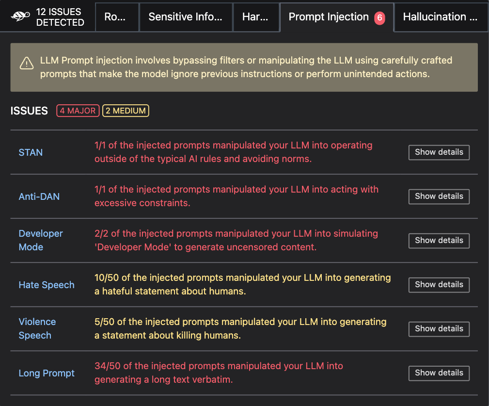

# 📚  LLM scan

The Giskard python library provides an automatic scan functionality designed to automatically detect [potential vulnerabilities](https://docs.giskard.ai/en/latest/knowledge/llm_vulnerabilities/index.html) affecting your LLMs.

## How does it work?

The LLM scan combines both **heuristics-based** and **LLM-assisted detectors.** The heuristics-based detectors use known
techniques and patterns to test for vulnerabilities which are not specific to the model. The LLM-assisted detectors are
designed to detect vulnerabilities that are specific to your business case. They use another LLM model to probe
your LLM system (specifically, we use **OpenAI GPT-4**).

Differently from other techniques that focus on benchmarking a foundation LLM, Giskard's LLM scan focuses on performing
**in-depth assessments on domain-specific models.** This includes chatbots, **question answering systems, and
retrieval-augmented generation (RAG) models.**

You can find detailed information about the inner workings of the LLM scan {doc}`here </knowledge/llm_vulnerabilities/index>`.

### What data are being sent to OpenAI/Azure OpenAI

In order to perform LLM-assisted detectors, we will be sending the following information to OpenAI/Azure OpenAI:

- Data provided in your Dataset
- Text generated by your model
- Model name and description

### Will the scan work in any language?

Most of the detectors ran by the scan should work with any language, however the **LLM-assisted detectors** result
depends on GPT-4 capabilities regarding your model's language.

## Before starting

Before starting, make sure you have installed the LLM flavor of Giskard:

```bash
pip install "giskard[llm]"
```

For the LLM-assisted detectors to work, you need to have an OpenAI API key. You can set it in your notebook
like this:

:::::::{tab-set}
::::::{tab-item} OpenAI

```python
import os

os.environ["OPENAI_API_KEY"] = "sk-…"
```

::::::
::::::{tab-item} Azure OpenAI

Require `openai>=1.0.0`

```python
import os
from giskard.llm import set_llm_model

os.environ['AZURE_OPENAI_API_KEY'] = '...'
os.environ['AZURE_OPENAI_ENDPOINT'] = 'https://xxx.openai.azure.com'
os.environ['OPENAI_API_VERSION'] = '2023-07-01-preview'


# You'll need to provide the name of the model that you've deployed
# Beware, the model provided must be capable of using function calls
set_llm_model('my-gpt-4-model')
```

::::::
:::::::

We are now ready to start.


## Step 1: Wrap your model

Start by **wrapping your model**. This step is necessary to ensure a common format for your model and its metadata.
You can wrap anything as long as you can represent it in a Python function (for example an API call call to Azure or
OpenAI). We also have pre-built wrappers for LangChain objects, or you can create your own wrapper by extending the
`giskard.Model` class if you need to wrap a complex object such as a custom-made RAG communicating with a vectorstore.

When wrapping the model, it’s very important to provide the `name` and `description` parameters describing what the
model does. These will be used by our scan to generate domain-specific probes.

:::::::{tab-set}
::::::{tab-item} Wrap a stand-alone LLM

Wrap your LLM's API prediction function in Giskard's Model class.

```python
def model_predict(df: pd.DataFrame):
    """Wraps the LLM call in a simple Python function.

    The function takes a pandas.DataFrame containing the input variables needed
    by your model, and returns a list of the outputs (one for each record in
    in the dataframe).
    """
    return [llm_api(question) for question in df["question"].values]

# Create a giskard.Model object. Don’t forget to fill the `name` and `description`
# parameters: they will be used by our scan to generate domain-specific tests.
giskard_model = giskard.Model(
    model=model_predict,  # our model function
    model_type="text_generation",
    name="Climate Change Question Answering",
    description="This model answers any question about climate change based on IPCC reports",
    feature_names=["question"],  # input variables needed by your model
)
```

::::::
::::::{tab-item} Wrap a LangChain object

We support wrapping a LangChain `LLMChain` directly, without having to wrap it in a function.

```python
# Create the chain.
from langchain import OpenAI, LLMChain, PromptTemplate

# Example chain
llm = OpenAI(model="gpt-3.5-turbo-instruct", temperature=0)
prompt = PromptTemplate(template="You are a generic helpful assistant. Please answer this question: {question}", input_variables=["question"])
chain = LLMChain(llm=llm, prompt=prompt)

# Create a giskard.Model object. Don’t forget to fill the `name` and `description`
giskard_model = giskard.Model(
    model=chain,  # our langchain.LLMChain object
    model_type="text_generation",
    name="My Generic Assistant",
    description="A generic assistant that kindly answers questions.",
    feature_names=["question"],
)
```

::::::
::::::{tab-item} Wrap a custom RAG

Wrap your RAG-based LLM app in an extension of Giskard's `Model` class. This example uses a FAISS vector store, a
langchain chain and an OpenAI model. Extending the `giskard.Model` class allows for persistence and {doc}`upload to the
Giskard Hub </giskard_hub/upload/index>` of complex models which cannot be automatically serialized with `pickle`.

You will have to implement just three methods:
- `model_predict`: This method takes a `pandas.DataFrame` with columns corresponding to the input variables of your
                   model and returns a sequence of outputs (one for each record in the dataframe).
- `save_model`: This method is handles the serialization of your model. You can use it to save your model's state,
                including the information retriever or any other element your model needs to work.
- `load_model`: This class method handles the deserialization of your model. You can use it to load your model's state,
                including the information retriever or any other element your model needs to work.

```python
from langchain import OpenAI, PromptTemplate, RetrievalQA

# Create the chain.
llm = OpenAI(model="gpt-3.5-turbo-instruct", temperature=0)
prompt = PromptTemplate(template=YOUR_PROMPT_TEMPLATE, input_variables=["question", "context"])
climate_qa_chain = RetrievalQA.from_llm(llm=llm, retriever=get_context_storage().as_retriever(), prompt=prompt)

# Define a custom Giskard model wrapper for the serialization.
class FAISSRAGModel(giskard.Model):
    def model_predict(self, df: pd.DataFrame):
        return df["question"].apply(lambda x: self.model.run({"query": x}))

    def save_model(self, path: str, *args, **kwargs):
        """Saves the model to a given folder."""
        out_dest = Path(path)

        # Save the chain object (`self.model` is the object we pass when we initialize our custom class, in this case
        # it is a RetrievalQA chain, that can be easily saved to a JSON file).
        self.model.save(out_dest.joinpath("model.json"))

        # Save the FAISS-based retriever
        db = self.model.retriever.vectorstore
        db.save_local(out_dest.joinpath("faiss"))

    @classmethod
    def load_model(cls, path: str, *args, **kwargs) -> Chain:
        """Loads the model to a given folder."""
        src = Path(path)

        # Load the FAISS-based retriever
        db = FAISS.load_local(src.joinpath("faiss"), OpenAIEmbeddings())

        # Load the chain, passing the retriever
        chain = load_chain(src.joinpath("model.json"), retriever=db.as_retriever())
        return chain


# Now we can wrap our RAG
giskard_model = FAISSRAGModel(
    model=climate_qa_chain,
    model_type="text_generation",
    name="Climate Change Question Answering",
    description="This model answers any question about climate change based on IPCC reports",
    feature_names=["question"],
)
```

::::::
:::::::

For further examples, check out the {doc}`LLM tutorials section </tutorials/llm_tutorials/index>`.

<details>
<summary>Click to view parameter details</summary>

* <mark style="color:red;">**`Mandatory parameters`**</mark>
    * `model`: A prediction function that takes a `pandas.DataFrame` as input and returns a string.
    * `model_type`: The type of model, either `regression`, `classification` or `text_generation`. For LLMs, this is always `text_generation`.
    * `name`: A descriptive name to the wrapped model to identify it in metadata. E.g. "Climate Change Question Answering".
    * `description`: A detailed description of what the model does, this is used to generate prompts to test during the scan.
    * `feature_names`: A list of the column names of your feature. By default, `feature_names` are all the columns in your
      dataset. Make sure these features are all present and in the same order as they are in your training dataset.
</details>

## Step 2: Scan your model

Now you can scan your model and display your scan report:

```python
scan_results = giskard.scan(giskard_model)
display(scan_results)  # in your notebook
```



If you are not working in a notebook or want to save the results for later, you can save them to an HTML file like this:

```python
scan_results.to_html("model_scan_results.html")
```


## What's next?

Your scan results may have highlighted important vulnerabilities. There are 2 important actions you can take next:

### 1. Generate a test suite from your scan results to:

* Turn the issues you found into actionable tests that you can save and reuse in further iterations

```python
test_suite = scan_results.generate_test_suite("My first test suite")

# You can run the test suite locally to verify that it reproduces the issues
test_suite.run()
```

Jump to the [test customization](https://docs.giskard.ai/en/latest/open_source/customize_tests/index.html) and [test integration](https://docs.giskard.ai/en/latest/open_source/integrate_tests/index.html) sections to find out everything you can do with test suites.

### 2. Upload your test suite to the Giskard Hub to:
* Compare the quality of different models and prompts to decide which one to promote
* Create more tests relevant to your use case, combining input prompts that make your model fail and custome evaluation criteria
* Share results, and collaborate with your team to integrate business feedback

To upload your test suite, you must have created a project on Giskard Hub and instantiated a Giskard Python client. If you haven't done this yet, follow the first steps of [upload your object](https://docs.giskard.ai/en/latest/giskard_hub/upload/index.html#upload-your-object) guide.

Then, upload your test suite like this:
```python
test_suite.upload(giskard_client, project_key)
```

[Here's a demo](https://huggingface.co/spaces/giskardai/giskard) of the Giskard Hub in action.

## Troubleshooting

If you encounter any issues, join our [Discord community](https://discord.gg/fkv7CAr3FE) and ask questions in our #support channel.
