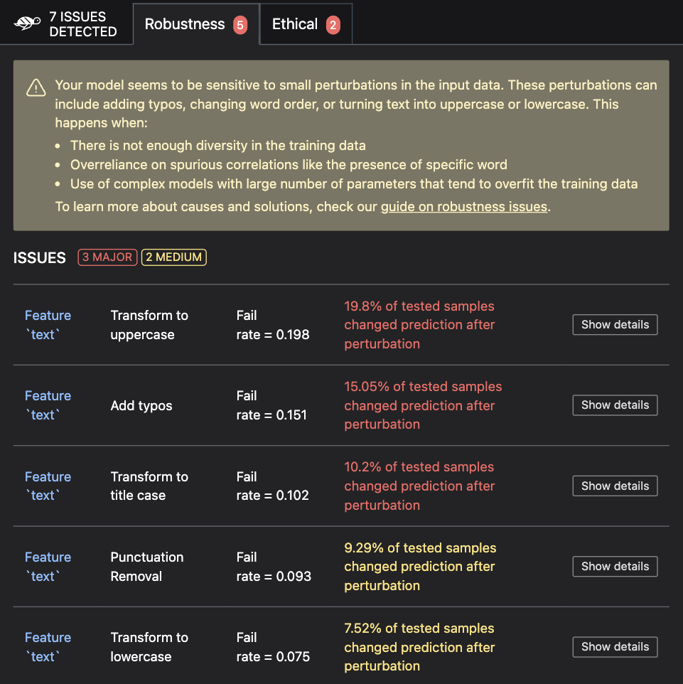

# 🗣️ NLP model scan

The Giskard python library provides an automatic scan functionality designed to automatically detect [potential vulnerabilities](https://docs.giskard.ai/en/latest/knowledge/key_vulnerabilities/index.html) affecting your ML model. It enables you to proactively identify and address key issues to ensure the reliability, fairness, and robustness of your Machine Learning models.

## Step 1: Wrap your dataset

To scan your model, start by **wrapping your dataset**. This should be a validation or test set in Pandas format. 

> ### ⚠️ Warning
> It's highly recommended that you wrap your data **before preprocessing** so that you can easily interpret 
> the scan results. If you're unable to (because your prediction function can't integrate your data 
> preprocessing steps), we recommend you **add columns that are not features** of your model as metadata 
> to your dataset. This provides better scan results.


```python
# Wrap your Pandas DataFrame with Giskard.Dataset (validation or test set)
giskard_dataset = giskard.Dataset(
    df=df,  # A pandas.DataFrame containing raw data (before pre-processing) and including ground truth variable.
    target="label",  # Ground truth variable
    name="Tweets with sentiment", # Optional: Give a name to your dataset
)
```

For further examples, check out the [tutorials section](https://docs.giskard.ai/en/latest/tutorials/tabular_tutorials/index.html).

<details>
<summary>Click to view parameter details</summary>

* <mark style="color:red;">**`Mandatory parameters`**</mark>
    * `df`: A `pandas.DataFrame` containing raw data (before pre-processing) and including ground truth variable. Extra columns not included as features of the model can remain in `df`.

* <mark style="color:red;">**`Optional parameters`**</mark>
    * `target`: The column name in `df` corresponding to the ground truth variable.
    * `name`: Give a name to your dataset.
    * `cat_columns`: List of strings representing names of categorical columns.Can be binary,
      numerical, or textual with a few unique values. If not provided, column types will be inferred automatically.
    * `column_types`: Dictionary of column names and their types (numeric, category or text) for all columns of `df`.
      If not provided, column types will be inferred automatically.
</details>

## Step 2: Wrap your model

Next, **wrap your model**. You can wrap either the prediction function (recommended) or model object, as shown here:

:::::::{tab-set}
::::::{tab-item} Wrap a prediction function

Wrapping your model through the prediction function is the preferred method. The prediction function is any Python function that takes as input a <b>raw</b> Pandas dataframe, pre-processes your data and returns the predictions.

<b>Some important conditions:</b>

1. `prediction_function` encapsulates all the <b>data pre-processing steps</b> (categorical encoding, numerical scaling,
   etc.).
2. `prediction_function(df[feature_names])` <b>does not return an error message</b>.

:::::{tab-set}
::::{tab-item} Text Classification

```python
def prediction_function(df):
    preprocessed_df = demo_data_processing_function(df) # The pre-processor can be a pipeline of one-hot encoding, imputer, scaler, etc.
    return demo_classification_model.predict_proba(preprocessed_df)

giskard_model = giskard.Model(
    model=prediction_function,
    model_type="classification",
    classification_labels=demo_classification_model.classes_,  # The order MUST be identical to the prediction_function's output order
    feature_names=[TEXT_COLUMN],  # Default: all columns of your dataset
    name="Tweets sentiment classification", # Optional: give it a name to identify it in metadata
    # classification_threshold=0.5, # Optional: Default: 0.5
)
```
For further examples, check out the [tutorials section](https://docs.giskard.ai/en/latest/tutorials/tabular_tutorials/index.html).

<details>
<summary>Click to view parameter details</summary>

* <mark style="color:red;">**`Mandatory parameters`**</mark>
    * `model`: A prediction function that takes a `pandas.DataFrame` as input and returns an array ($n\times m$) of
      probabilities corresponding to $n$ data entries (rows of `pandas.DataFrame`) and $m$ `classification_labels`. In the case of binary classification, an array ($n\times 1$) of probabilities is also accepted.
    * `model_type`: The type of model, either `regression`, `classification` or `text_generation`.
    * `classification_labels`: The list of unique categories for your dataset's target variable.
      If `classification_labels` is a list of $m$ elements, make sure that: `prediction_function` is returning a ($n\times m$) array of probabilities and `classification_labels` have the same order as the output of `prediction_function`.

* <mark style="color:red;">**`Optional parameters`**</mark>
    * `name`: Give a name to the wrapped model to identify it in metadata.
    * `feature_names`: An optional list of the column names of your feature. By default, `feature_names` are all the columns in your
      dataset. Make sure these features are all present and in the same order as they are in your training dataset.
    * `classification_threshold`: Model threshold for binary classification problems.

</details>

::::
:::::
::::::
::::::{tab-item} Wrap a model object
Wrapping a model object allows Giskard to automatically infer the ML library of your `model`
object and provide a suitable serialization method (provided by `save_model` and `load_model` methods).

<b>Some important conditions:</b>

1. There will be an override of the `model_predict` method which should take as input the <b>raw</b> pandas dataframe
  and return the <b>probabilities</b> for each classification labels (classification).
2. The pre-defined serialization and prediction methods cover the `sklearn`, `catboost`, `pytorch`,
  `tensorflow`, `huggingface` and `langchain` libraries. If none of these libraries are detected, `cloudpickle`
  is used as the default for serialization. If this fails, we will ask you to also override the `save_model` and `load_model`
  methods where you provide your own serialization of the `model` object.

:::::{tab-set}
::::{tab-item} Text Classification

```python
class MyCustomModel(giskard.Model):
    def model_predict(self, df):
        preprocessed_df = demo_data_processing_function(df)
        return self.model.predict_proba(preprocessed_df)

giskard_model = MyCustomModel(
    model=demo_classification_model,
    model_type="classification",
    classification_labels=demo_classification_model.classes_,  # Their order MUST be identical to the prediction_function's output order
    feature_names=[TEXT_COLUMN],  # Default: all columns of your dataset
    name="Tweets sentiment classification", # Optional: give it a name to identify it in metadata
    # classification_threshold=0.5, # Optional: Default: 0.5
    # model_postprocessing_function=None, # Optional
    # **kwargs # Additional model-specific arguments
)
```
For further examples, check out the [tutorials section](https://docs.giskard.ai/en/latest/tutorials/tabular_tutorials/index.html).

<details>
<summary>Click to view parameter details</summary>

* <mark style="color:red;">**`Mandatory parameters`**</mark>
    * `model`: Any model from `sklearn`, `catboost`, `pytorch`, `tensorflow`, `huggingface` (check
      the [tutorials](https://docs.giskard.ai/en/latest/tutorials/tabular_tutorials/index.html)). If none of these libraries apply to you, we try to serialize your model with `cloudpickle`. If that also does not work, we ask you to provide us with your own serialization method.
    * `model_type`: The type of model, either `regression`, `classification` or `text_generation`.
    * `classification_labels`: The list of unique categories for your dataset's target variable. If `classification_labels`
      is a list of $m$ elements, make sure that `prediction_function` is returning a ($n\times m$) array of probabilities and `classification_labels` have the same order as the output of the prediction function.

* <mark style="color:red;">**`Optional parameters`**</mark>
    * `name`: Give a name to the wrapped model to identify it in metadata.
    * `feature_names`: An optional list of the column names of your feature. By default, `feature_names` are all the columns in your
      dataset.
    * `classification_threshold`: Model threshold for binary classification problems.
    * `data_preprocessing_function`: A function that takes a `pandas.DataFrame` as raw input, applies pre-processing and
      returns any object that could be directly fed to `model`.
    * `model_postprocessing_function`: A function that takes a `model` output as input, applies post-processing and returns
      an object of the same type and shape as the `model` output.
    * `**kwargs`: Additional model-specific arguments (See [Models](https://docs.giskard.ai/en/latest/reference/index.html)).

</details>

::::
:::::
::::::
:::::::

## Step 3: Scan your model

Now you can scan your model and display your scan report:

```python
scan_results = giskard.scan(giskard_model, giskard_dataset)
display(scan_results)  # in your notebook
```



If you are not working in a notebook or want to save the results for later, you can save them to an HTML file like this:

```python
scan_results.to_html("model_scan_results.html")
```

## What's next? 

Your scan results may have highlighted important vulnerabilities. There are 2 important actions you can take next:

### 1. Generate a test suite from your scan results to:

* Turn the issues you found into actionable tests that you can directly integrate in your CI/CD pipeline

```python
test_suite = scan_results.generate_test_suite("My first test suite")

# You can run the test suite locally to verify that it reproduces the issues
test_suite.run()
```

Jump to the [test customization](https://docs.giskard.ai/en/latest/open_source/customize_tests/index.html) and [test integration](https://docs.giskard.ai/en/latest/open_source/integrate_tests/index.html) sections to find out everything you can do with test suites.

### 2. Upload your test suite to the Giskard Hub to:
* Debug your tests to diagnose the identified issues
* Compare the quality of different models to decide which one to promote
* Create more domain-specific tests relevant to your use case
* Share results, and collaborate with your team to integrate business feedback

To upload your test suite, you must have created a project on Giskard Hub and instantiated a Giskard Python client. If you haven't done this yet, follow the first steps of [upload your object](https://docs.giskard.ai/en/latest/giskard_hub/upload/index.html#upload-your-object) guide.

Then, upload your test suite like this:
```python
test_suite.upload(giskard_client, project_key)
```

[Here's a demo](https://huggingface.co/spaces/giskardai/giskard) of the Giskard Hub in action.

## Troubleshooting

If you encounter any issues, join our [Discord community](https://discord.gg/fkv7CAr3FE) and ask questions in our #support channel.
