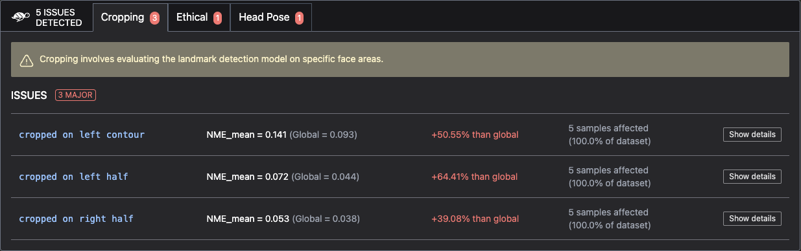

# 📸 Vision model scan

The Giskard python library provides an automatic scan functionality designed to automatically
detect [potential vulnerabilities](https://docs.giskard.ai/en/stable/knowledge/key_vulnerabilities/index.html) affecting
your ML model. It enables you to proactively identify and address key issues to ensure the reliability, fairness, and
robustness of your Machine Learning models.

## Before starting

Before starting, make sure you have installed both the base and vision libraries of Giskard:

```bash
pip install giskard giskard-vision
```

## Step 1: Wrap your dataset

To scan your model, start by **wrapping your dataset**, as shown below

:::::::{tab-set}
::::::{tab-item} Image classification

To scan your model, start by **wrapping your dataset** with `DataIteratorBase`. Your class should override:

- `idx_sampler` (property) that returns the array of indices to iterate over
- `get_image` that loads the image corresponding to the right index as a `np.ndarray` (h, w, c)
- `get_label` that returns the label of the image with corresponding index, as a string
- (Optional) `get_meta` that returns a `MetaData` object containing the metadata of the image with the corresponding index. This object should contain the metadata in the form of a `dict`, for instance `{'meta1': 'value1'}`, the list of categorical metadata, and the type of Issue related to the metadata in the form of a `dict`, for instance `{'meta1': PerformanceIssueMeta}`. Issue types can be found in `giskard_vision.core.issues`.

> ### ⚠️ Warning
>
> It's highly recommended that you wrap your data **before preprocessing** so that you can easily interpret
> the scan results.
>
> For now, the image classification scan only supports one label per image
>

```python
from giskard_vision.core.dataloaders.base import DataIteratorBase
from giskard_vision.core.dataloaders.meta import MetaData
from giskard_vision.core.issues import EthicalIssueMeta, PerformanceIssueMeta


class DataLoaderClassification(DataIteratorBase):

    @property
    def idx_sampler(self) -> np.ndarray:
        return list(range(len(self.image_paths)))

    @classmethod
    def get_image(self, idx: int) -> np.ndarray:
        return cv2.imread(str(self.image_paths[idx]))

    @classmethod
    def get_label(self, idx: int) -> Optional[np.ndarray]:
        return 'label'
    
    @classmethod
    def get_meta(self, idx: int) -> Optional[MetaData]:
        default_meta = super().get_meta() # To load default metadata
        return MetaData(
            data={
                **default_meta.data,
                'meta1': 'value1',
                'meta2': 'value2',
                'categorical_meta1': 'cat_value1',
                'categorical_meta2': 'cat_value2'
            },
            categories=default_meta.categories+['categorical_meta1', 'categorical_meta2'],
            issue_groups={
                **default_meta.issue_groups,
                'meta1': PerformanceIssueMeta,
                'meta2': EthicalIssueMeta,
                'categorical_meta1': PerformanceIssueMeta,
                'categorical_meta2': EthicalIssueMeta,
            }
        )


giskard_dataset = DataLoaderClassification()
```
::::::
::::::{tab-item} Object detection

To scan your model, start by **wrapping your dataset** with `DataIteratorBase`. Your class should override:

- `idx_sampler` (property) that returns the array of indices to iterate over
- `get_image` that loads the image corresponding to the right index as a `np.ndarray` (h, w, c)
- `get_label` that returns a dict containing boxes (np.array) and labels (string) as keys, with format {"boxes": [x1_min, y1_min, x1_max, y1_max], "labels": "value"}
- (Optional) `get_meta` that returns a `MetaData` object containing the metadata of the image with the corresponding index. This object should contain the metadata in the form of a `dict`, for instance `{'meta1': 'value1'}`, the list of categorical metadata, and the type of Issue related to the metadata in the form of a `dict`, for instance `{'meta1': PerformanceIssueMeta}`. Issue types can be found in `giskard_vision.core.issues`.

> ### ⚠️ Warning
>
> It's highly recommended that you wrap your data **before preprocessing** so that you can easily interpret
> the scan results.
>
> For now, the object detection scan only supports one box and label per image
>

```python
from giskard_vision.core.dataloaders.base import DataIteratorBase
from giskard_vision.core.dataloaders.meta import MetaData
from giskard_vision.core.issues import EthicalIssueMeta, PerformanceIssueMeta


class DataLoaderObjectDetection(DataIteratorBase):

    @property
    def idx_sampler(self) -> np.ndarray:
        return list(range(len(self.image_paths)))

    @classmethod
    def get_image(self, idx: int) -> np.ndarray:
        return cv2.imread(str(self.image_paths[idx]))

    @classmethod
    def get_label(self, idx: int) -> Optional[np.ndarray]:
        return {"boxes": np.array(...), "labels": "label1"}
    
    @classmethod
    def get_meta(self, idx: int) -> Optional[MetaData]:
        default_meta = super().get_meta() # To load default metadata
        return MetaData(
            data={
                **default_meta.data,
                'meta1': 'value1',
                'meta2': 'value2',
                'categorical_meta1': 'cat_value1',
                'categorical_meta2': 'cat_value2'
            },
            categories=default_meta.categories+['categorical_meta1', 'categorical_meta2'],
            issue_groups={
                **default_meta.issue_groups,
                'meta1': PerformanceIssueMeta,
                'meta2': EthicalIssueMeta,
                'categorical_meta1': PerformanceIssueMeta,
                'categorical_meta2': EthicalIssueMeta,
            }
        )


giskard_dataset = DataLoaderObjectDetection()
```

::::::
::::::{tab-item} Landmark detection

To scan your model, start by **wrapping your dataset** with `DataIteratorBase`. Your class should override:

- `idx_sampler` (property) that returns the array of indices to iterate over
- `get_image` that loads the image corresponding to the right index as a `np.ndarray` (h, w, c)
- `get_label` that returns the landmarks of the image with corresponding index, as a `np.ndarray` (num. marks, 2)
- (Optional) `get_meta` that returns a `MetaData` object containing the metadata of the image with the corresponding index. This object should contain the metadata in the form of a `dict`, for instance `{'meta1': 'value1'}`, the list of categorical metadata, and the type of Issue related to the metadata in the form of a `dict`, for instance `{'meta1': PerformanceIssueMeta}`. Issue types can be found in `giskard_vision.core.issues`.

> ### ⚠️ Warning
>
> It's highly recommended that you wrap your data **before preprocessing** so that you can easily interpret
> the scan results.
>
> For now, the face landmark detection scan only supports one landmark per image
>

```python
from giskard_vision.core.dataloaders.base import DataIteratorBase
from giskard_vision.core.dataloaders.meta import MetaData
from giskard_vision.core.issues import EthicalIssueMeta, PerformanceIssueMeta


class DataLoaderFaceLandmarkDetection(DataIteratorBase):

    @property
    def idx_sampler(self) -> np.ndarray:
        return list(range(len(self.image_paths)))

    @classmethod
    def get_image(self, idx: int) -> np.ndarray:
        return cv2.imread(str(self.image_paths[idx]))

    @classmethod
    def get_label(self, idx: int) -> Optional[np.ndarray]:
        return np.array(..., dtype=float)
    
    @classmethod
    def get_meta(self, idx: int) -> Optional[MetaData]:
        default_meta = super().get_meta() # To load default metadata
        return MetaData(
            data={
                **default_meta.data,
                'meta1': 'value1',
                'meta2': 'value2',
                'categorical_meta1': 'cat_value1',
                'categorical_meta2': 'cat_value2'
            },
            categories=default_meta.categories+['categorical_meta1', 'categorical_meta2'],
            issue_groups={
                **default_meta.issue_groups,
                'meta1': PerformanceIssueMeta,
                'meta2': EthicalIssueMeta,
                'categorical_meta1': PerformanceIssueMeta,
                'categorical_meta2': EthicalIssueMeta,
            }
        )


giskard_dataset = DataLoaderFaceLandmarkDetection()
```

::::::
:::::::

## Step 2: Wrap your model

Next, **wrap your model** by using `ModelBase`. Your class should override:

- `predict_rgb_image` which returns the predicted label corresponding to a single image in rgb format given as argument. The prediction format should correspond to the one returned by the `get_label` methods from the Dataset.
- (Optional) `predict_gray_image` if the model supports prediction from images in grayscale. The prediction format should correspond to the one returned by the `get_label` methods from the Dataset.
    

```python
from giskard_vision.core.models.base import ModelBase


class ModelMyTask(ModelBase):
    def __init__(self, model):
        super().__init__()
        self.model = model

    def predict_rgb_image(self, image: np.ndarray) -> np.ndarray:
        return self.model.predict_rgb_image(image)
    
    def predict_gray_image(self, image: np.ndarray) -> np.ndarray:
        return self.model.predict_gray_image(image)

mymodel = ...
giskard_model = ModelMyTask(model=mymodel)
```

## Step 3: Scan your model

You can now scan your model. For this guide, we'll use a demo dataloader and an OpenCV model. After completing steps 1 and 2, you can replace them with your own dataloader and model wrapper.

```python
from giskard_vision.image_classification.models.wrappers import SkinCancerHFModel
from giskard_vision.image_classification.dataloaders.loaders import DataLoaderSkinCancer
from giskard_vision.core.scanner import scan

dataset = DataLoaderSkinCancer()
model = SkinCancerHFModel()

scan_results = scan(model, dataset, num_images=5)
display(scan_results)  # in your notebook
```



If you are not working in a notebook or want to save the results for later, you can save them to an HTML file like this:

```python
scan_results.to_html("model_scan_results.html")
```

