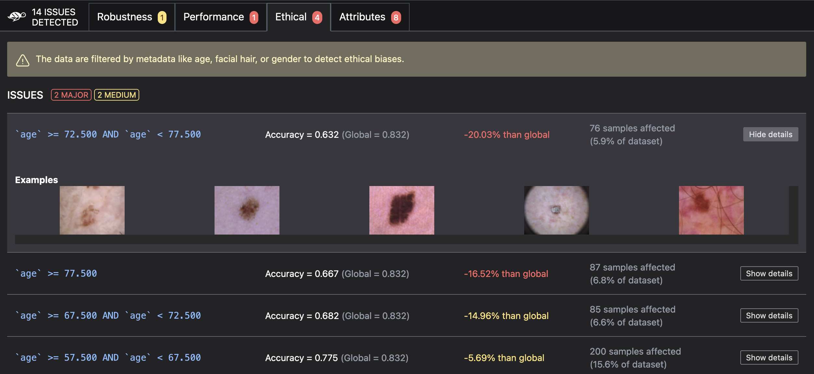

# 📸 Vision model scan

**The giskard-vision library is under development. For now, only landmark detection models are available.**

The Giskard python library provides an automatic scan functionality designed to automatically
detect [potential vulnerabilities](https://docs.giskard.ai/en/stable/knowledge/key_vulnerabilities/index.html) affecting
your ML model. It enables you to proactively identify and address key issues to ensure the reliability, fairness, and
robustness of your Machine Learning models.

## Before starting

Before starting, make sure you have installed both the base and vision libraries of Giskard:

```bash
pip install giskard giskard-vision
```

## Step 1: Wrap your dataset

To scan your model, start by **wrapping your dataset** with `DataLoaderBase`. Your class should override:

- `load_image_from_file` that loads an image as a `np.ndarray`
- `load_marks_from_file` that returns landmark coordinates from a file.

> ### ⚠️ Warning
>
> It's highly recommended that you wrap your data **before preprocessing** so that you can easily interpret
> the scan results.

```python
from giskard_vision.landmark_detection.dataloaders.base


class DataLoaderLandmarkDetection(DataLoaderBase):

    @classmethod
    def load_image_from_file(cls, image_file: Path) -> np.ndarray:
        # use image_file to read the image into a numpy array
        return cv2.imread(str(image_file))

    @classmethod
    def load_marks_from_file(cls, mark_file: Path):
        # use mark_file path to populate the numpy array
        return np.array(..., dtype=float)


giskard_dataset = DataLoaderLandmarkDetection(images_dir_path=..., landmarks_dir_path=...)
```

## Step 2: Wrap your model

Next, **wrap your model** with `FaceLandmarksModelBase`. It should contain a method `predict_image` that returns landmarks as `np.ndarray`, as shown here:

```python
from giskard_vision.landmark_detection.models.base import FaceLandmarksModelBase


class ModelLandmarkDetection(FaceLandmarksModelBase):
    def __init__(self, model):
        super().__init__(n_landmarks=68, n_dimensions=2, name="MyModel")
        self.model = model

    def predict_image(self, image: np.ndarray) -> np.ndarray:
        return self.model.predict_image(image)

mymodel = ...
giskard_model = ModelLandmarkDetection(model = mymodel)
```

## Step 3: Scan your model

You can now scan your model. For this guide, we'll use a demo dataloader and an OpenCV model. After completing steps 1 and 2, you can replace them with your own dataloader and model wrapper.

```python
from giskard_vision.landmark_detection.models.wrappers import OpenCVWrapper
from giskard_vision.landmark_detection.demo import get_300W

giskard_model = OpenCVWrapper()
giskard_dataset = get_300W()

scan_results = giskard_vision.scan(giskard_model, giskard_dataset)
display(scan_results)  # in your notebook
```



If you are not working in a notebook or want to save the results for later, you can save them to an HTML file like this:

```python
scan_results.to_html("model_scan_results.html")
```
