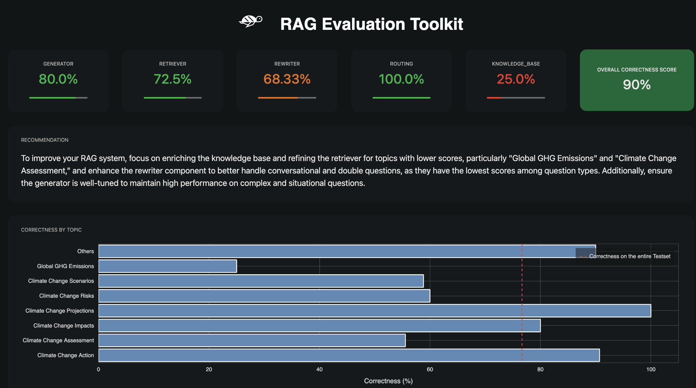
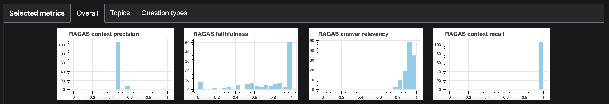

# 🥇 RAGET Evaluation

After automatically generating a test set for your RAG agent using RAGET, you can then evaluate the **correctness 
of the agent's answers** compared to the reference answers (using a LLM-as-a-judge approach). The main purpose
of this evaluation is to help you **identify the weakest components in your RAG agent**.

> ℹ️ You can find a [tutorial](../../../reference/notebooks/RAGET.ipynb) where we demonstrate the capabilities of RAGET with a simple RAG agent build with LlamaIndex
> on the IPCC report.  

## Correctness Evaluation on the Generated Test Set

First, you need to wrap your RAG agent in a function that takes a question as input and returns an answer. For
conversational agents, we will also pass a `history` parameter which will contain a list of dictionaries in OpenAI chat
format (e.g. `{"role": "user", "content": "What is the capital of France?"}`).

Then, you can evaluate your RAG agent using the `giskard.rag.evaluate` function. This function will compare the answers
of your RAG agent with the reference answers in the test set.

```python
from giskard.rag import evaluate

# Wrap your RAG model
def get_answer_fn(question: str, history=None) -> str:
    """A function representing your RAG agent."""
    # Format appropriately the history for your RAG agent
    messages = history if history else []
    messages.append({"role": "user", "content": question})

    # Get the answer
    answer = get_answer_from_agent(messages)  # could be langchain, llama_index, etc.

    return answer


# Run the evaluation and get a report
report = evaluate(get_answer_fn, testset=testset, knowledge_base=knowledge_base)
```

The evaluation generates a {class}`~giskard.rag.RAGReport` object. Once you get your report, you can display it in a
notebook or save it as an HTML file.

```python
display(report)  # if you are working in a notebook

# or save the report as an HTML file
report.to_html("rag_eval_report.html")
```

This report is what you'll obtain:



### RAG Components Scores

RAGET computes scores for each component of the RAG agent. The scores are computed by aggregating the correctness 
of the agent's answers on different question types (see question type to component mapping [here](q_types)). 
Each score grades a component on a scale from 0 to 100, 100 being a perfect score. **Low scores can help you identify 
weaknesses of your RAG agent and which components need improvement.**

Here is the list of components evaluated with RAGET:
- **`Generator`**: the LLM used inside the RAG to generate the answers
- **`Retriever`**: fetch relevant documents from the knowledge base according to a user query
- **`Rewriter`** (optional): rewrite the user query to make it more relevant to the knowledge base or to account for chat history
- **`Router`** (optional): filter the query of the user based on his intentions (intentions detection)
- **`Knowledge Base`**: the set of documents given to the RAG to generate the answers


### Analyze Correctness and Failures

You can access the correctness of the agent aggregated in various ways or analyze only it failures: 

```python
# Correctness on each topic of the Knowledge Base
report.correctness_by_topic()

# Correctness on each type of question
report.correctness_by_question_type()

# get all the failed questions
report.failures

# get the failed questions filtered by topic and question type
report.get_failures(topic="Topic from your knowledge base", question_type="simple")
```

You can also export the report to a pandas DataFrame to analyze the results programmatically:

```python
results = report.to_pandas()
```

### RAGAS Metrics

**You can pass additional evaluation metrics to the `evaluate` function**. They will be computed during the evaluation. 
We currently provide [RAGAS metrics](https://docs.ragas.io/en/latest/concepts/metrics/index.html) as additional metrics.

The results of your metrics will be displayed in the report object as histograms and will be available inside the report main `DataFrame`. 


To include RAGAS metrics in evaluation, make sure to have installed the `ragas>=0.1.5` library. Some of the RAGAS metrics need access to the contexts retrieved by the RAG agent for each question. These can be returned by the `get_answer_fn` function along with the answer to the question: 

```python
def get_answer_fn(question: str, history=None) -> str:
    """A function representing your RAG agent."""
    # Format appropriately the history for your RAG agent
    messages = history if history else []
    messages.append({"role": "user", "content": question})

    # Get the answer and the documents
    agent_output = get_answer_from_agent(messages)

    # Following llama_index syntax, you can get the answer and the retrieved documents
    answer = agent_output.text
    documents = agent_output.source_nodes
    return answer, documents
```

Then, you can include the RAGAS metrics in the evaluation:

```python
from giskard.rag.metrics.ragas_metrics import ragas_context_recall, ragas_faithfulness

report = evaluate(
    get_answer_fn,
    testset=testset,
    knowledge_base=knowledge_base,
    metrics=[ragas_context_recall, ragas_faithfulness]
)
```

Built-in metrics include `ragas_context_precision`, `ragas_faithfulness`, `ragas_answer_relevancy`,
`ragas_context_recall`. Note that including these metrics can significantly increase the evaluation time and LLM usage.

Alternatively, you can directly pass a list of answers instead of `get_answer_fn` to the `evaluate` function, you can then pass the retrieved documents as an optional argument `retrieved_documents` to compute the RAGAS metrics.


## Going Further: Giskard's Visual Interface 

The tests generated by RAGET integrate directly with the **Giskard Hub** to allow for collaboration on the curation, 
review and execution of tests.

### Step 1: Convert the test set into a test suite
Let's convert our test set into an actionable test suite ({class}`giskard.Suite`) that we can save and reuse in further iterations.

```python
test_suite = testset.to_test_suite("My first test suite")

test_suite.run(model=giskard_model)
```

Note that you can split the test suite on the question metadata values, for instance on each question type. 

```python
test_suite_by_question_types = testset.to_test_suite("Split test suite", slicing_metadata=["question_type"])
```

Jump to the [test customization](https://docs.giskard.ai/en/stable/open_source/customize_tests/index.html)
and [test integration](https://docs.giskard.ai/en/stable/open_source/integrate_tests/index.html) sections to find out
everything you can do with test suites.

### Step 2: Wrap your model
Before evaluating your model with a test suite, you must wrap it as a `giskard.Model`. This step is necessary to ensure a common format for your model and its metadata. You can wrap anything as long as you can represent it in a Python function (for example an API call to Azure, OpenAI, Mistral, Ollama etc...). We also have pre-built wrappers for LangChain objects, or you can create your own wrapper by extending the `giskard.Model` class if you need to wrap a complex object such as a custom-made RAG communicating with a vectorstore.

To do so, you can follow the instructions from the [LLM Scan feature](../scan/scan_llm/index.md#step-1-wrap-your-model). Make sure that you pass `feature_names = "question"` when wrapping your model, so that it matches the question column of the test set.

Detailed examples can also be found on our {doc}`LLM tutorials section </tutorials/llm_tutorials/index>`.

Once you have wrapped your model, we can proceed with evaluation.

```python
test_suite.run(model=giskard_model)
```

### Step 3: upload your test suite to the Giskard Hub

Uploading a test suite to the hub allows you to:
* Compare the quality of different models and prompts to decide which one to promote
* Create more tests relevant to your use case, combining input prompts that make your model fail and custome evaluation criteria
* Share results, and collaborate with your team to integrate business feedback

To upload your test suite, you must have created a project on Giskard Hub and instantiated a Giskard Python client.

Then, upload your test suite and model like this:
```python
test_suite.upload(giskard_client, project_id)  # project_id should be the id of the Giskard project in which you want to upload your suite
giskard_model.upload(giskard_client, project_id)
```

> ⚠️ To upload your model to the hub, it must be pickleable. If your model is not, you must extend the `giskard.Model` class and override the `save_model` and `load_model` methods to properly save and load the non-pickleable parts of your model (e.g. the vector store). You can find an [example here](../scan/scan_llm/index.md#step-1-wrap-your-model) inside the "Wrap a custom RAG" tab.

[Here's a demo](https://huggingface.co/spaces/giskardai/giskard) of the Giskard Hub in action.


## Troubleshooting
If you encounter any issues, join our [Discord community](https://discord.gg/fkv7CAr3FE) and ask questions in our #support channel.
