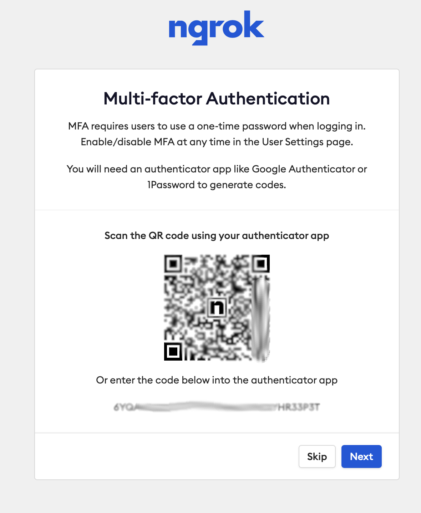
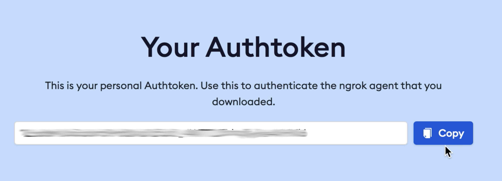

Setup a :code:`ngrok` account
======================

In order to expose the Giskard Server to the internet, you would need to perform the following steps

1. Sign up `here <https://dashboard.ngrok.com/signup>`_
^^^^^^^^^^^^^^^^^^^^^^^
You will be prompted by the following:

You would need to have either :code:`Google Authenticator` or :code:`1Password` on your phone to generate codes.

2. Generate an API key `here <https://dashboard.ngrok.com/get-started/your-authtoken>`_
^^^^^^^^^^^^^^^^^^^^^^^
Copy the following key:

3. Expose the giskard server
^^^^^^^^^^^^^^^^^^^^^^^
Now you can run :code:`giskard server expose --token <ngrok_API_key>` which should prompt you with the following instructions:::

    Exposing Giskard Server to the internet...
    Giskard Server is now exposed to the internet.
    You can now upload objects to the Giskard Server using the following client:

    token=...
    client = giskard.GiskardClient("<ngrok_external_server_link>", token)

    # To run your model with the Giskard Server, execute these three lines on Google Colab:

    %env GSK_EXTERNAL_ML_WORKER_HOST=<host>
    %env GSK_EXTERNAL_ML_WORKER_PORT=<port>
    %env GSK_API_KEY=...
    !giskard worker start -d -u <ngrok_external_server_link>
