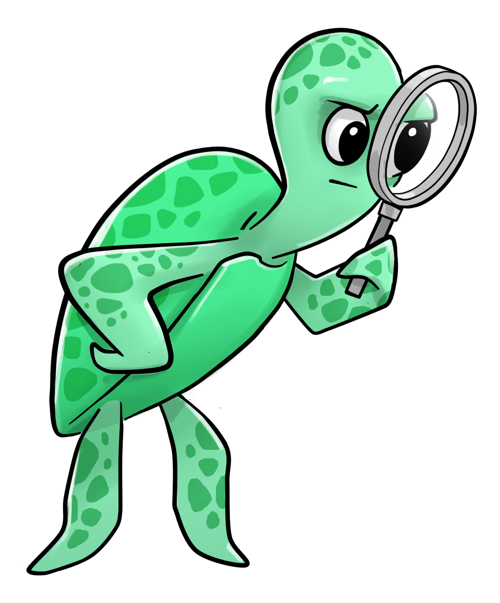
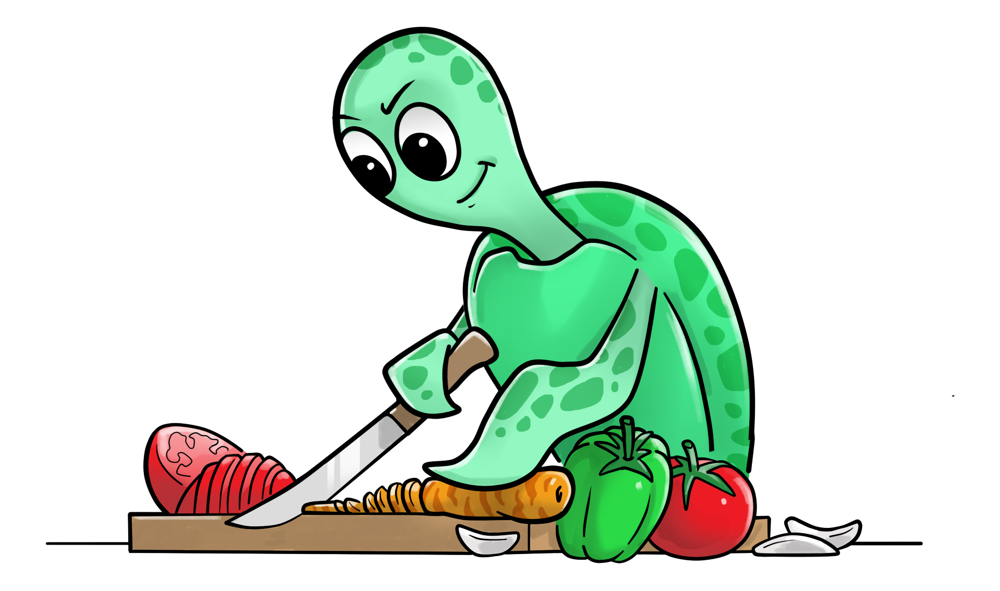
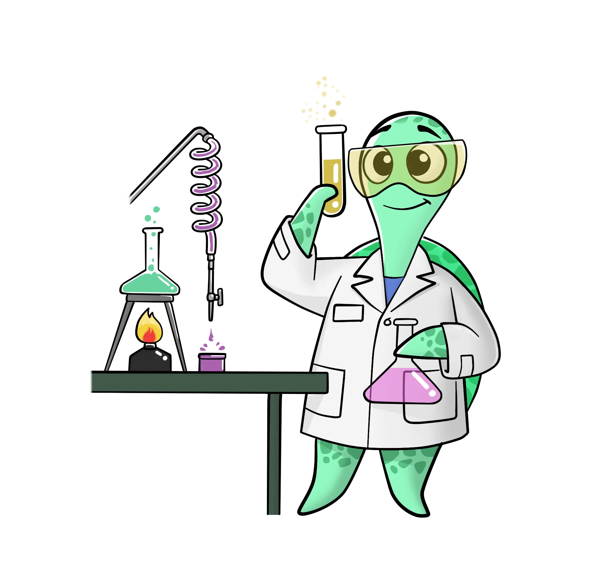

# Getting Started


```{toctree}
:maxdepth: 2
:hidden:

scan/index
test-suite/index
slicing-and-transformation-functions/index
```

::::::{grid} 1 1 2 2
:gutter: 1

:::::{grid-item}

::::{grid} 1 1 1 1
:gutter: 1

(cards-clickable)=
:::{card} <h3><center> Scan your ML model </center></h3>
:link: scan/index.html
&nbsp;&nbsp;&nbsp;&nbsp;&nbsp;&nbsp;&nbsp;&nbsp;
:::

(cards-clickable)=
:::{card} <h3><center> Slicing and transformation functions </center></h3>
:link: slicing-and-transformation-functions/index.html

&nbsp;&nbsp;&nbsp;&nbsp;&nbsp;&nbsp;
:::

:::::

:::::{grid-item}

::::{grid} 1 1 1 1
:gutter: 1

(cards-clickable)=
:::{card} <h3><center> Create a test suite </center></h3>
:link: test-suite/index.html

::::


:::::

::::::