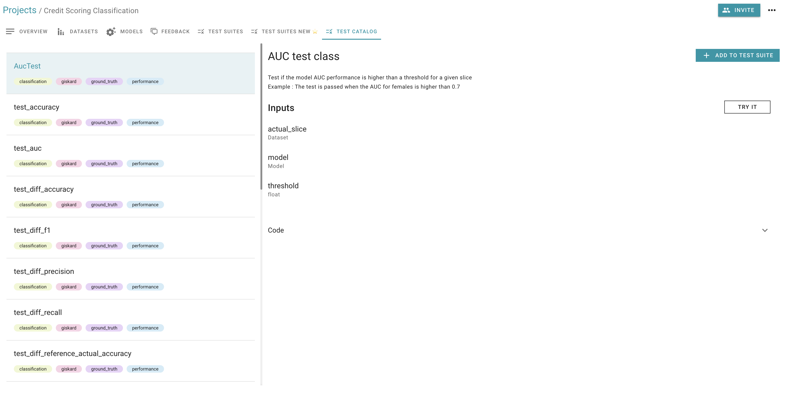

# Create your custom test

:::{warning}
This feature is under development and only available in the branch \`poc/ai-test-v2-merged\`
:::

## How to start Giskard with this feature

```
# Clone giskard
git clone https://github.com/Giskard-AI/giskard.git
# Go to giskard directory
cd giskard
# Checkout the preview branch
git checkout poc/ai-test-v2-merged
# Build the docker
docker compose build --parallel
# Start the docker
docker compose up 
# Access the application at http://localhost:19000/
```

## Access the Jupyter notebook to get our examples

```
# Clone giskard-examples
git clone https://github.com/Giskard-AI/giskard-examples.git
# Go to giskard-examples directory
cd giskard-examples
# Checkout the preview branch
git checkout poc/function-storage
# Open the `AI test v2 preview` notebook project with your favorite tool
```

:::{hint}
You can generate an API token in the Admin page of Giskard
:::

### Follow the AI test v2 preview

If you want a quick introduction, you can follow the \`AI test v2 preview\` notebook. All the feature displayed in this
notebook will be shown below.

### Design your tests

#### 1. Import libraries

We will start with importing Giskard libraries, which enables you to display the result of your tests on the Giskard
application&#x20;

#### 2. Create your custom test&#x20;

Currently their is two way to define a custom test. You can either define a function that will execute the test, or you
can define a class that extends `GiskardTest` allowing you to further customize your test.

#### 3. Return the results using a bool value or a TestResult

You can simply return a `bool` value. `True` if the test passed or `False` if the test failed.

Alternatively, you can return `TestResult` enables you to return more information to the frontend.

We have two main output variables:&#x20;

* `passed`: boolean value of the results. Example: True if the test passed False if the test failed&#x20;
* `metrics`: metrics value of your test&#x20;

```python
# 1. Import libraries
from giskard.ml_worker.core.test_result import TestResult
from giskard.ml_worker.testing.registry.giskard_test import GiskardTest
from giskard.core.model impfrom

giskard.ml_worker.core.dataset
import Dataset

ort
Model


# 2. Create your custom test function
# The parametters of the test function can be a Model, a Dataset or a primitive type
def custom_test(model: Model, dataset: Dataset, threshold: float = 0.5) -> TestResult:
    metric = comput_metric(model, dataset)
    return TestResult(passed=metric >= threshold, metric=metric)


# 2. Create your custom test 
class CustomTest(GiskardTest):
    actual_dataset: Dataset
    model: Model
    threshold: float

    # The parametters of the test class must be set inside the __init__ method
    # They can be a Model, a Dataset or a primitive type
    # If their is no default value, you should set None as default
    # This is for autocomplete purpose
    def __init__(self, actual_dataset: Dataset = None, model: Model = None, threshold: float = 0.5):
        self.actual_dataset = actual_dataset
        self.model = model
        self.threshold = threshold
        super().__init__()

    def execute(self):
        metric = comput_metric(self.model, self.dataset)
        return TestResult(passed=metric >= self.threshold, metric=metric)


```

#### 4. Execute your test

You can try and execute your test manually, to do so you will need to wrap your Model and Dataset into Giskard one:

```
# Wrap your clf with SKLearnModel from Giskard
wrapped_model = SKLearnModel(clf=clf, model_type="classification")

# Wrap your dataset with Dataset from Giskard
my_test_dataset = Dataset(test_data, name="test dataset", target="Target", feature_types=column_types)
```

### Test Suite Execution

Individual testing is good but it's not enough. A test suite is a collection of tests that you can run everything at
once and reuse to run with different models/datasets.

#### 4. Create and execute a test suite

For this example we will be using tests that are inside Giskard test
catalog [#accessing-the-giskard-catalog](create-your-custom-test-wip-v2.md#accessing-the-giskard-catalog "mention"):

```
is_pass, results = Suite()
        .add_test(test_auc(actual_dataset=german_credit_data_a, threshold=0.3))
        .add_test(test_f1, actual_dataset=german_credit_data_b, threshold=0.2)
        .run(model=german_credit_model)
```

In this example we can see that the way that we are adding test inside the suite is different wherever we are dealing
with a test function or a test class.

* For a test class, we instantiate the test and we set some params inside the \`\_\_init\_\_\` method.
* For a test method we pass the reference and set the params as kwargs of the \`add\_test\` method. The test method is
  faster to implement and use, however it brings some limitation such as no autocomplete being available when adding
  tests.

Finally we call the run method. We can provide aditional parametters using the kwargs argument. Those parameters will be
set in the tests that require it and don't have them. Note that the run method will fail if any test hasn't been
provided enough required arguments. (A required argument is an argument that does not provide any default value.

The result of the run method is a tuple containing a global status. That is true if all of the test passed. And a
dictionary of all test with the result provided by them.

:::{hint}
By default the key of a result is \`module.func\_or\_class\_name\`

It's possible to specify a custom key:

```
my_test_result = Suite().add_test(my_test, 'custom_key').run()[1]['custom_key']
```

:::

#### 5. Saving the test suite inside Giskard

The goal of a test Suite is to be reused, that's why we provided a way to save a Suite inside Giskard in order to be
executed from the UI.

```
url = "http://localhost:19000" # If Giskard is installed locally (for installation, see: https://docs.giskard.ai/start/guides/installation)
token = "" # you can generate your API token in the Admin tab of the Giskard application (for installation, see: https://docs.giskard.ai/start/guides/installation)

client = GiskardClient(url, token)

Suite()
  .add_test(test_auc(actual_dataset=german_credit_data_a, threshold=0.3))
  .add_test(test_f1, actual_dataset=german_credit_data_b, threshold=0.2)
  .upload(client, "test_project_key")
```

:::{hint}
Note that this time we did not provide the dataset. The dataset will be treated as an input of the suite and will be
asked each time that we execute the suite.
:::

### Examples

#### 1. Custom test integrating with Great Expectations to validate column values are unique

```python
from giskard.ml_worker.core.test_result import TestResult
from giskard.ml_worker.testing.registry.giskard_test import GiskardTest
import great_expectations as ge


class UniquenessTest(GiskardTest):

    def __init__(self, dataset: Dataset = None, column_name: str = None):
        self.dataset = dataset
        self.column_name = column_name
        super().__init__()

    def execute(self) -> TestResult:
        dataframe = ge.from_pandas(self.dataset.df)
        uniqueness = dataframe.expect_column_values_to_be_unique(column=self.column_name)
        passed = uniqueness["success"]
        metric = uniqueness["result"]["element_count"]
        return TestResult(passed=passed, metric=metric)
```

#### 2. Custom test for validating the frequency of a category is lower than the threshold

We have created a function "test\_category\_frequency" under the Class  `DataQuality` to check if the ratio of the
Category in a column is less than a threshold

```python
from giskard.ml_worker.core.test_result import TestResult


class DataQuality(GiskardTest):

    def __init__(self,
                 dataset: Dataset = None,
                 threshold: float = 0.5,
                 column_name: str = None,
                 category: str = None):
        self.dataset = dataset
        self.threshold = threshold
        self.column_name = column_name
        self.category = category
        super().__init__()

    def execute(self) -> TestResult:
        freq_of_cat = self.dataset.df[self.column_name].value_counts()[self.category] / (len(self.dataset.df))
        passed = False and freq_of_cat < self.threshold

        return TestResult(passed=passed, metric=freq_of_cat)


passed, result = Suite()
.add_test(UniquenessTest(dataset=wrapped_dataset, column_name='sex'), 'quality')
.run(category='male')

print(f"result: {passed} with a metric of {result['quality'].metric}")
```

## Accessing the Giskard catalog

he catalog is visible inside the \`Test Catalog\` tab of any project, note that the catalog is shared across all
projects:



You can use any test in your catalog by importing them as following:

```
from giskard.ml_worker.testing import tests

# Then use your test:
Suite().add_test(tests.performance.test_f1).add_test(tests.heuristic.test_right_label)
```

:::{warning}
The catalog will be uploaded after starting the external ML Worker
:::

