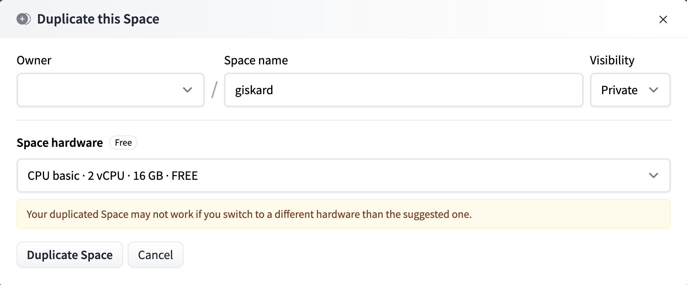
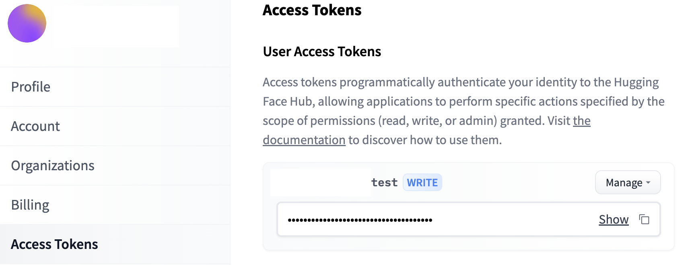
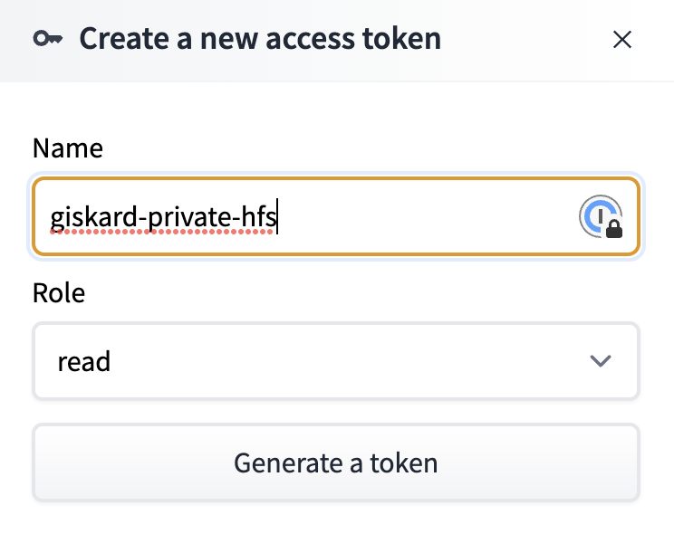
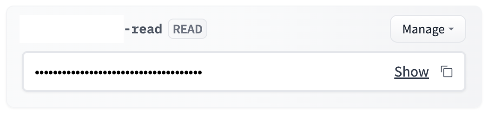
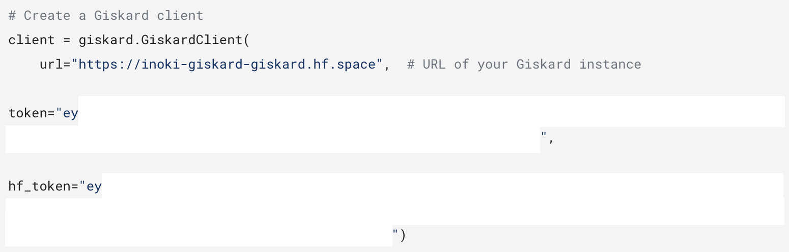
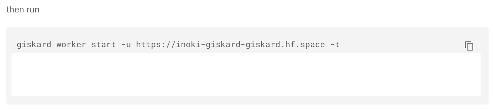

# Installation in Hugging Face Spaces

Hugging Face Spaces could be a good start and the easiest approach to explore the functionnalities of Giskard.

## Demo Space

We have a [demo Giskard Space](https://huggingface.co/spaces/giskardai/giskard) at Hugging Face Spaces.
You can discover the Giskard server through our demo projects in the demo Giskard Space.

:::{warning}
**The demo Giskard Space is accessible by anyone.**

**Please do not upload your private models, datasets and projects in the demo Giskard Space.**

We will also clean the demo Space regularly. However, it is recommended to create your own Space for your private projects.
:::

## Create your own Space

If you want to upload and debug your private models, datasets and projects, you may need your own Giskard instance in Hugging Face Spaces.

To do so, you can directly duplicate our demo Space:

In the popup, you can change the **owner**, the **visibility** and the **hardware**:

:::{hint}
**Owner and visibility**:
- You can change the visibility of the Space to public, which makes it **accessible for everyone**.
This is nice for demonstrating the performance of your models using Giskard.
- You can also keep the Space **private** and set the owner to **your organization**, which can only be accessed by you and the people under your organization.
This is ideal for team collaboration, and without the risk of leakage of your datasets and models.
:::

:::{hint}
**Hardware**:

We recommend to use a paid hardware to have better performance. You can also attach a [persistent storage](https://huggingface.co/docs/hub/spaces-storage) to store your data across Space rebooting.

However, a free hardware can also be chosen, thanks to the support to the community from Hugging Face.
:::

:::{warning}
On a free hardware without persistent storage, after 48 hours of inactivity the space will be shutdown and you will lose all the data in the Giskard Space.
:::

Make sure that you are all set up, and clicked on `Duplicate Space`.
The public Giskard instance hosted on Hugging Face Spaces can be used by following [Upload an object to the Giskard server](../../../guides/upload/index.md).

However, to use a private Space, there are some extra steps for your security and privacy.

## Special notices on Private Space

To connect your Giskard Client or ML worker to your private Space in Hugging Face Spaces, you need a **Giskard Space Token**.
The token is generated directly in your private Space, with validation of 24 hours.
The token can be acquired from instructions for ML worker connection in Giskard Settings, or the instructions to upload a demo test suite from demo projects.

On your first access, Giskard needs a Hugging Face access token to generate the Giskard Space Token from Hugging Face Spaces.
The Hugging Face access token is valid until you manually expire it.
It will only be stored in your local browser.

You can create and manage them at [Hugging Face settings](https://huggingface.co/settings/tokens).

Please click on `New token` button to create a Hugging Face access token, if you do not have one.

Giskard does not modify any contents or read any contents from your Hugging Face account. Set the role to `read` is fine.

Copy it and paste into the input field, and click on `Fetch`.

Giskard will generate the instructions with the generated token in Giskard Client connection:

and in ML worker connection:

You can find the instructions and information to create a Giskard client in Settings tab of Giskard server.

Except the Giskard Space Token, you can refer [Upload an object to the Giskard server](../../../guides/upload/index.md) to upload your objects to the Giskard instance hosted on Hugging Face Spaces.
