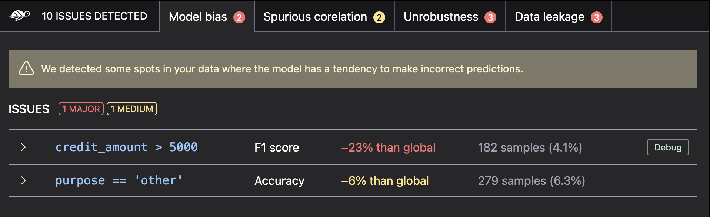

🔍 Scan your ML model
===============

Before 
How to scan your Machine Learning model for vulnerabilities with Giskard?

Prerequisites
^^^^^^^^^

To scan your ML model for vulnerabilities, you need:

- A **Giskard dataframe** composed of the examples you want to scan. To wrap your dataset, see `here <../wrap_dataset/index>`_.
- A **model**. For example, a model from *scikit-learn*, *Tensorflow*, *HuggingFace*, *catboost*, *PyTorch*, ... or even
  any set of *Python* functions. To wrap your model, see `here <../wrap_model/index>`_.

Scan your model to detect vulnerabilities
^^^^^^^^^

After having wrapped your `model <../wrap_model/index>`_ & `dataset <../wrap_dataset/index>`_, ou can scan your model for vulnerabilities using:

.. code-block:: python

    from giskard import demo, Model, Dataset, scan

    model, df = demo.titanic()

    wrapped_model = Model(model=model, model_type="classification")
    wrapped_dataset = Dataset(df=df, target="Survived", cat_columns=['Pclass', 'Sex', "SibSp", "Parch", "Embarked"])

    scan_results = scan(wrapped_model, wrapped_dataset)

    display(scan_results)  # in your notebook

In the notebook, this will produce a widget that allows you to explore the detected issues:

You can also get a table of the scan results as a `pandas.DataFrame`. This is useful if you want to save the results of
the scan to a CSV or HTML file.

.. code-block:: python

    results_df = scan_results.to_dataframe()
    results_df.to_csv("scan_results_my_model.csv")

Automatically generate a test suite based on the scan results
^^^^^^^^^

If the automatic scan with `giskard.scan` found some issues with your model, you can automatically generate a set of
tests (a test suite) that will reproduce those issues.
You can then interactively debug the problems by uploading the generate test suite to Giskard UI.

.. code-block:: python

    test_suite = scan_results.generate_test_suite("My first test suite")

    # You can run the test suite locally to verify that it reproduces the issues
    test_suite.run()

Learn more about vulnerabilities
^^^^^^^^^
.. toctree::
   :maxdepth: 1

   performance_bias/index
   robustness/index
   overconfidence/index
   underconfidence/index
   ethics/index
   data_leakage/index
   stochasticity/index

Troubleshooting
^^^^^^^^^

If you encounter any issues, join our `Discord <https://discord.gg/fkv7CAr3FE>`_ on our #support channel. Our community
will help!

