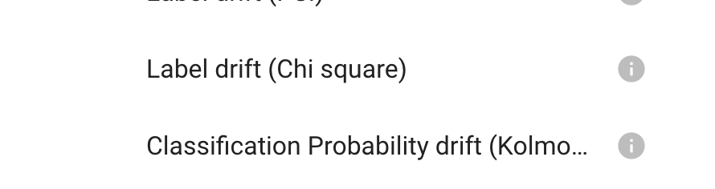

# 🧪 Create a test suite

:::{warning}
First you'll need to create a Model and a dataset (And scan your model),
see [🔬 Scan your ML model](../scan/index.md)
:::

## 1. Install the Giskard library

In order to test your model, you'll need to install the `giskard` library with `pip`:

::::{tab-set}
:::{tab-item} Windows

```sh
pip install "git+https://github.com/Giskard-AI/giskard.git@feature/ai-test-v2-merged#subdirectory=python-client" --user
```

:::

:::{tab-item} Mac and Linux

```sh
pip install "git+https://github.com/Giskard-AI/giskard.git@feature/ai-test-v2-merged#subdirectory=python-client"
```

:::
::::

## 2. Access the Jupyter notebook to get our examples

```sh
# Clone giskard-examples
git clone https://github.com/Giskard-AI/giskard-examples.git
# Go to giskard-examples directory
cd giskard-examples
# Checkout the preview branch
git checkout poc/function-storage
# Open the `AI test v2 preview` notebook project with your favorite tool
```

:::{hint}
You can generate an API token in the Admin page of Giskard
:::

### Follow the AI test v2 preview

If you want a quick introduction, you can follow the \`AI test v2 preview\` notebook. All the feature displayed in this
notebook will be shown below.

## 3. Execute a Giskard test

::::{tab-set}
:::{tab-item} Drift tests

```python
from giskard import wrap_model, wrap_dataset, test_drift_prediction_ks

my_model = wrap_model(...)
train_df = wrap_dataset(...)
test_df = wrap_dataset(...)

result = test_drift_prediction_ks(reference_slice=train_df,
                                  actual_slice=test_df,
                                  model=my_model,
                                  classification_label='CALIFORNIA CRISIS',
                                  threshold=0.5)

print("Result for 'Classification Probability drift (Kolmogorov-Smirnov):")
print(f"Passed: {result.passed}")
print(f"Metric: {result.metric}")
```

**Description:**

&#x20;In order to execute the test provided by Giskard. You first need to wrap your dataset and model into Giskard's
one. Then you simply need to call the test, it will return a **TestResult**.

:::

:::{tab-item} Performance tests

```python
from giskard import wrap_model, wrap_dataset, test_f1

my_model = wrap_model(...)
dataset = wrap_dataset(...)

result = test_f1(actual_slice=dataset, model=my_model)
print(f"result: {result.passed} with metric {result.metric}")
```

:::

:::{tab-item} Metamorphic tets

```python
# TODO migrate metamorphic v1 to v2
```

:::

:::{tab-item} Statistic tests

```
# TODO migrate statistics v1 to v2
```

:::
::::

## 4. Create a custom test

::::{tab-set}
:::{tab-item} Using function

```python
@test(name="Custom Test Example", tags=["quality", "custom"])
def uniqueness_test_function(dataset: Dataset,
                             column_name: str = None,
                             category: str = None,
                             threshold: float = 0.5):
    freq_of_cat = self.dataset.df[column_name].value_counts()[category] / (len(dataset.df))
    passed = freq_of_cat < threshold

    return TestResult(passed=passed, metric=freq_of_cat)
```

#### Description

In order to define a custom test function, you just need to declare a method with its parameters and return a result.
It's pretty simple, however, it does not allow autocompletion during the test suite creation, contrary to the
class-based method.

#### Usage \[Reference]

* <mark style="color:red;">**`parameters`**</mark> : **Your parameters need to have a type defined.** Here is the type
  allowed as your test parameters:
    * `Dataset` A Giskard
      dataset, [#2.-create-a-giskard-dataset](upload-your-model/#2.-create-a-giskard-dataset "mention")
    * `Model` A Giskard model, [#3.-create-a-giskard-model](upload-your-model/#3.-create-a-giskard-model "mention")
    * `int/float/bool/str`  Any primitive type can be used
* <mark style="color:red;">**`return`**</mark> The result of your test must be either a bool or a TestResult:
    * `bool` Either `True` if the test passed or `False` if it failed
    * `TestResult` An object containing more details:

        * `passed` A required bool to know if the test passed
        * `metric` A float value with the score of the test

#### Set metadata to your test

In order to **set metadata** to your test, you need to use the `@test` decorator before your method or your class

* <mark style="color:red;">**`name`**</mark> : A custom name that will be visible in the application
* <mark style="color:red;">**`tags`**</mark> : A list of tags that allow you to quickly identify your tests
  :::

:::{tab-item} Using test class

```python
class DataQuality(GiskardTest):

    def __init__(self,
                 dataset: Dataset = None,
                 threshold: float = 0.5,
                 column_name: str = None,
                 category: str = None):
        self.dataset = dataset
        self.threshold = threshold
        self.column_name = column_name
        self.category = category
        super().__init__()

    def execute(self) -> TestResult:
        freq_of_cat = self.dataset.df[self.column_name].value_counts()[self.category] / (len(self.dataset.df))
        passed = freq_of_cat < self.threshold

        return TestResult(passed=passed, metric=freq_of_cat)
```

#### Description

In order to define a custom test class, you need to extends `GiskardTest` and implement the `execute` method

#### Main methods \[Reference]

* <mark style="color:red;">**`__init__`**</mark> : The initialisation method must be implemented in order to specify the
  required parameters of your test. **It is also required to call the parent initialization method**
  calling `super().__init__()`. **Your parameters need to have a type and default value specified.** You can should use
  **None** as a default value if you require a parameter to be specified. Here is the type allowed in the init method:
    * `Dataset` A giskard
      dataset, [#2.-create-a-giskard-dataset](upload-your-model/#2.-create-a-giskard-dataset "mention")
    * `Model` A giskard model, [#3.-create-a-giskard-model](upload-your-model/#3.-create-a-giskard-model "mention")
    * `int/float/bool/str`  Any primitive type can be used
* <mark style="color:red;">**`execute`**</mark> The execute method will be called to perform the test, you will be able
  to access all the parameters set by the initialization method. Your method can return two type of results:
    * `bool` Either `True` if the test passed or `False` if it failed
    * `TestResult` An object containing more details:
        * `passed` A required bool to know if the test passed
        * `metric` A float value with the score of the test

:::
::::

## 5. Execute a test suite

::::{tab-set}

:::{tab-item} Model as input
Example using a performance test and the DataQuality test created previously

```python
from giskard import wrap_model, wrap_dataset, test_f1, Suite

# Define our Giskard Model
my_dataset = wrap_dataset(...)

# Create a suite and add a F1 test and a DataQuality test
# Note that all the parameters are specified excect dataset
# Which means that we will need to specify dataset everytime we run the suite
suite = Suite()
    .add_test(test_f1, "f1", actual_slice=my_dataset)
    .add_test(DataQuality(dataset=my_dataset, column_name='Month', category='August'), "quality")

# Create our first model
my_first_model = wrap_model(...)

# Run the suite by specifying our model and display the results
passed, results = suite.run(model=my_first_model)
print(f"Result: {passed}")
print(f"F1: {results['f1'].passed} {results['f1'].metric}")
print(f"DataQuality: {results['quality'].passed} {results['quality'].metric}")

# Create an improved version of our model
my_improved_model = wrap_model(...)

# Run the suite with our new version and check if the results improved
passed, results = suite.run(model=my_improved_model)
print(f"Result of the improved model: {passed}")
print(f"F1: {results['f1'].passed} {results['f1'].metric}")
print(f"DataQuality: {results['quality'].passed} {results['quality'].metric}")
```

#### Description

In this example we create a Suite with two tests, `test_f1` and `DataQuality`. We specified all the parameters expect
the dataset to "expose" it as a run input. We can see that the way to set parameters differ whenever we are dealing with
a test class or a test function.

:::

:::{tab-item} Dataset as input
1 metamorphic + 1 disparate impact (fairness)
:::

:::{tab-item} Shared test input

:::
::::

## 6. Save a test suite

::::{tab-set}
:::{tab-item} Test suite saving

```python
from giskard import test_f1, Suite, GiskardClient

url = "http://localhost:19000"  # If Giskard is installed locally (for installation, see: https://docs.giskard.ai/start/guides/installation)
# url = "http://app.giskard.ai" # If you want to upload on giskard URL
token = "API_TOKEN"  # you can generate your API token in the Admin tab of the Giskard application (for installation, see: https://docs.giskard.ai/start/guides/installation)
project_name = "enron"

# Create a giskard client to communicate with Giskard
client = GiskardClient(url, token)

# Create a project
client.create_project(project_name, "Email Classification", "Email Classification")

suite = Suite()
.add_test(test_f1, actual_slice=my_dataset)
.add_test(DataQuality(dataset=my_dataset, column_name='Month', category='August'))
.save(client, project_name)
```

#### Description

In this example we create a Suite with two tests, `test_f1` and `DataQuality`. We specified all the parameters expect
the dataset to "expose" it as a run input. We then save it to the 'enron' project created previously


```{eval-rst}
.. autoclass:: giskard.Suite
   :members:
```

:::
::::
