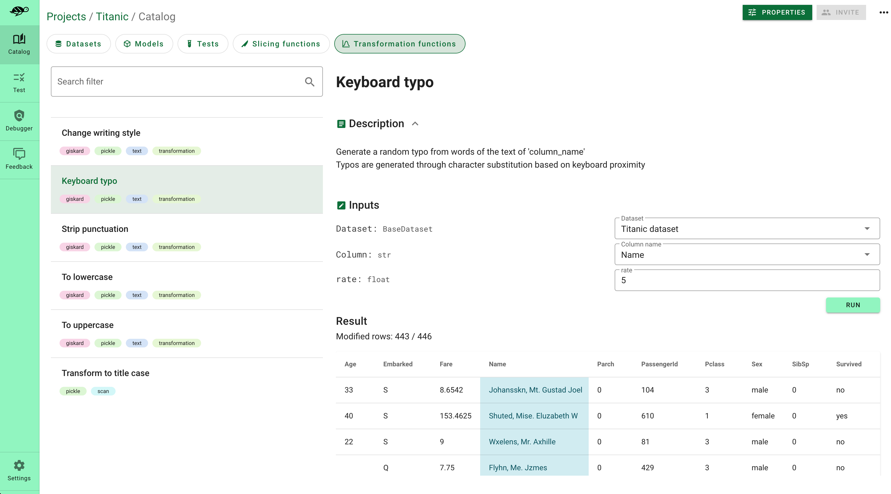

# 🔄 Define data transformations

Transformation, such as adding typos, switching words or paraphrasing, help create more diverse and realistic training datases. This can enhance the model's resilience to noise and improve its performance on unseen examples.

Giskard enables you to **automatically** generate the transformation functions that make your model having unrobust behaviour (see the [scan feature](docs/guides/scan/index)). We also propose various transformation functions in the **Giskard catalog**, such as *typo addings* or *punctuation
stripping*. Have a look at our [Transformation Function Catalog](docs/catalogs/transformation-function-catalog/index.rst).

This section explains you how to create your own transformation function or customize the ones generated by the Giskard scan and save it.

## Generate automatically some transformation functions through the scan

Giskard enables you to automatically generate the slicing functions that are the most insightul for your ML models. You can easily extract the results of the [scan feature](docs/guides/scan/index) using the following code:

```
from giskard import Dataset, Model

my_dataset = Dataset(...)
my_model = Model(...)

scan_result = giskard.scan(my_model, my_dataset)

my_slicing_functions = scan_result["ROBUS"].transformation_function
```

## Load transformation functions from the Giskard catalog

The [Giskard catalog](docs/catalogs/slicing-function-catalog) provides you different transformation functions for NLP, such as *typo addings* or *punctuation stripping*.

```
#Import keyboard typo transformations
from giskard.ml_worker.testing.functions.transformation import keyboard_typo_transformation
```

## Create your own transformation function

To create a Giskard slicing function, you just need to decorate an existing Python functions with `@slicing_function()`. Depending on the argument of the decorator, you can decorate different Python functions: filtered by row level, dataframe level or at cell level:

:::::{tab-set}

::::{tab-item} row_level=True (default)

When `row_level=True`, you can decorate a function that takes a pandas dataframe **row** as input and returns a boolean. Make sure that the first argument of your function corresponds to the row you want to filter:

```
from giskard import transformation_function, demo
import pandas as pd

_, my_df = demo.titanic()
dataset = Dataset(df=my_df, target="Survived", cat_columns=['Pclass', 'Sex', "SibSp", "Parch", "Embarked"])

@transformation_function(row_level=True)
def my_func2(row: pd.Series, offset: int):
    row['Age'] = row['Age'] + offset
    return row

transformed_dataset = dataset.transform(my_func2(offset=20))
```

::::

::::{tab-item} row_level=False

When `row_level=False`, you can decorate a function that takes a full **pandas dataframe** as input and returns a filtered pandas dataframe. Make sure that the first argument of your function corresponds to the pandas dataframe you want to filter:

```
from giskard import slicing_function, demo
import pandas as pd

_, df = demo.titanic()
dataset = Dataset(df=df, target="Survived", cat_columns=['Pclass', 'Sex', "SibSp", "Parch", "Embarked"])

@transformation_function(row_level=False)
def my_func1(df: pd.DataFrame, offset: int):
    df['Age'] = df['Age'] + offset
    return df

transformed_dataset = dataset.transform(my_func1(offset=20))
```

::::

::::{tab-item} cell_level=True

When `cell_level=True` (False by default), you can decorate a function that takes as argument a **value** (string, numeric or text) and returns a boolean. Make sure that the first argument of your function corresponds to the value and that the second argument defines the **column name** where you wants to filter the value:

```
from giskard import slicing_function, demo
import pandas as pd

_, df = demo.titanic()
dataset = Dataset(df=df, target="Survived", cat_columns=['Pclass', 'Sex', "SibSp", "Parch", "Embarked"])

@transformation_function(cell_level=True)
def my_func3(cell: int, offset: int):
    return cell + offset

transformed_dataset = dataset.transform(my_func3(offset=20), column_name='Age')
```

::::
:::::

## AI-based tranformation function

Transformation functions can be very powerful to detect complex behaviour when they are used as fixtures inside your test suite. With the Giskard framework you can easily, create complex transformation functions. For instance:

```
@transformation_function(name="Change writing style", row_level=False, tags=['text'])
def change_writing_style(x: pd.DataFrame, index: int, column_name: str, style: str,
                         OPENAI_API_KEY: str) -> pd.DataFrame:
    os.environ["OPENAI_API_KEY"] = OPENAI_API_KEY
    rewrite_prompt_template = """
    As a text rewriting robot, your task is to rewrite a given text using a specified rewriting style. You will receive a prompt with the following format:
    ```
    "TEXT"
    ===
    "REWRITING STYLE"
    ```
    Your goal is to rewrite the provided text according to the specified style. The purpose of this task is to evaluate how the rewritten text will affect our machine learning models.

    Your response should be in the following format:
    ```
    REWRITTEN TEXT
    ```
    Please ensure that your rewritten text is grammatically correct and retains the meaning of the original text as much as possible. Good luck!
    ```
    "TEXT": {text}
    ===
    "REWRITING STYLE": {style}
    ```
    """

    from langchain import PromptTemplate
    from langchain import LLMChain
    from langchain import OpenAI

    rewrite_prompt = PromptTemplate(input_variables=['text', 'style'], template=rewrite_prompt_template)
    chain_rewrite = LLMChain(llm=OpenAI(), prompt=rewrite_prompt)

    x.at[index, column_name] = chain_rewrite.run({'text': x.at[index, column_name], 'style': style})
    return x
```

## Save your transformation function

Saving your transformation function in the Giskard server will enable you to:

* Use your transformations for testing purposes: your transformations can be used as *fixtures* of your test suite
* Use the saved transformations to debug your dataset
* Use the saved transformations to augment your dataset

To upload your transformation function to the Giskard server, go to [Upload objects](docs/guide/upload/index.md) to the Giskard server.

<br>

  
