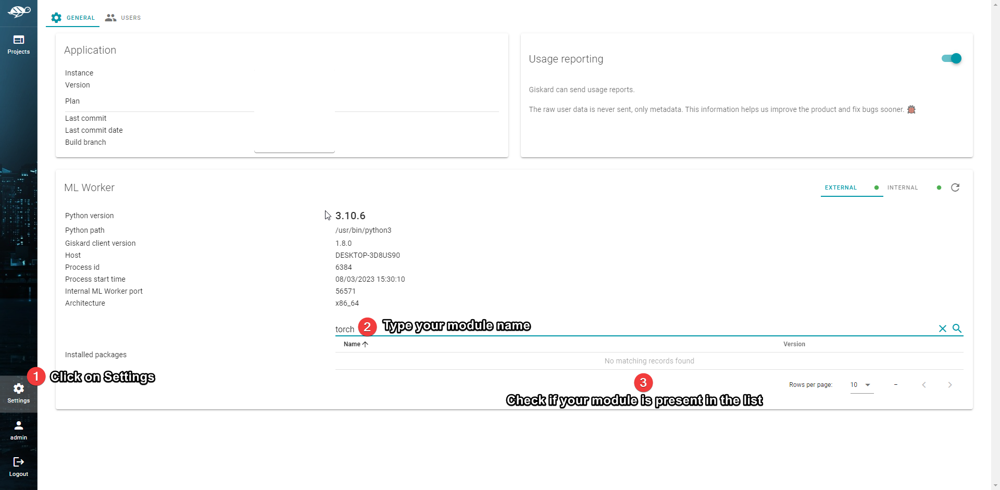

# Failed to import \<module>

When testing or inspecting a model, Giskard uses its [ML Worker component](../installation/ml-worker.md#what-is-ml-worker). When running a model on a different ML Worker, we can sometimes get the following error:

:::{danger}
Failed to import '\<module>'. Make sure it's installed in the ML Worker environment
:::

#### Why does this happen ?

When [uploading ](../upload-your-model/)a ML model to Giskard, the dependencies that this model relies on are not packaged with it. Therefore, the ML Worker that will run the inspection/test for that model must also contain the dependencies it uses in its environment.

:::{hint}
In environments like Google Colab, restarts may cause the modules that you previously installed to no longer be present. Reinstalling them fixes the issue.
:::

:::{warning}
You might have started your ML Worker on a different Python virtual environment than the one with which you uploaded the model. Make sure you use the same environment for both.
:::

#### How to fix this issue ?

The fix for this issue is usually relatively simple. In the same environment that your external ML Worker is running from, you need to install the missing module. It varies from module to module but in most cases, running the following command is enough:

```sh
pip install <module>
```

Once the module is installed, you must restart the ML Worker for Giskard to detect it. To check if the module was successfully installed, you can go into the Settings page in Giskard:



&#x20;