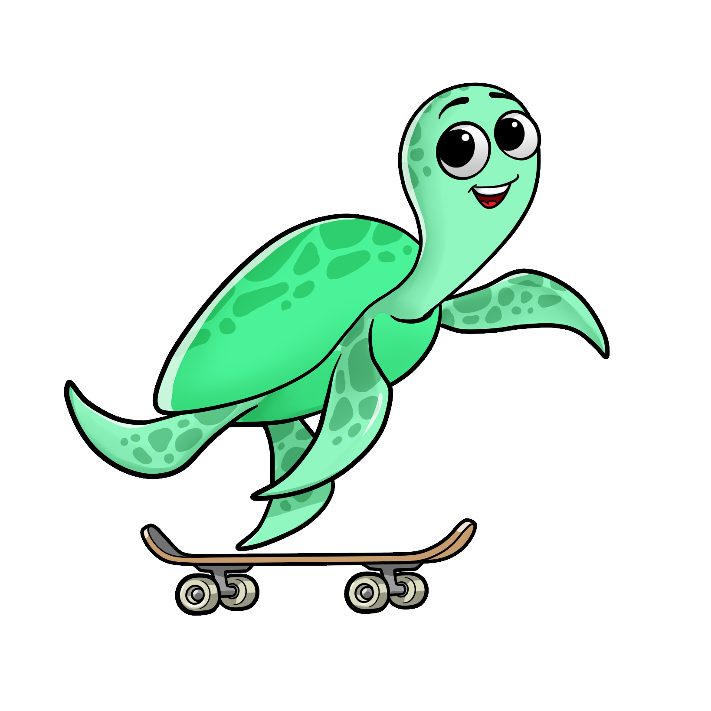

```{toctree}
:caption: Table of Contents
:name: mastertoc
:maxdepth: 2
:hidden:

getting-started/index
guides/index
reference/index
tutorials/index
catalogs/index
contribute/index
```

# Giskard Documentation

::::::{grid} 1 1 3 3
:gutter: 1

:::::{grid-item}

::::{grid} 1 1 1 1
:gutter: 1

:::{card} <h2><center> Getting Started </center></h2>
:link: getting-started/index.html
&nbsp;&nbsp;&nbsp;&nbsp;&nbsp;&nbsp;
:::

:::{card} <h2><center> API Reference </center></h2>
:link: reference/index.html

::::

:::::

:::::{grid-item}

::::{grid} 1 1 1 1
:gutter: 1


:::{card} <h2><center> User Guide </center></h2>
:link: guides/index.html

&nbsp;&nbsp;&nbsp;&nbsp;&nbsp;&nbsp;
:::

:::{card} <h2><center> Tutorials </center></h2>
:link: tutorials/index.html
&nbsp;&nbsp;&nbsp;&nbsp;&nbsp;&nbsp;&nbsp;&nbsp;&nbsp;
::::

:::::

:::::{grid-item}

::::{grid} 1 1 1 1
:gutter: 1


:::{card} <h2><center> Catalogs </center></h2>
:link: catalogs/index.html

&nbsp;&nbsp;&nbsp;&nbsp;&nbsp;&nbsp;
:::

:::{card} <h2><center> Contribute </center></h2>
:link: contribute/index.html
&nbsp;&nbsp;&nbsp;&nbsp;&nbsp;&nbsp;&nbsp;&nbsp;&nbsp;
::::

:::::

::::::