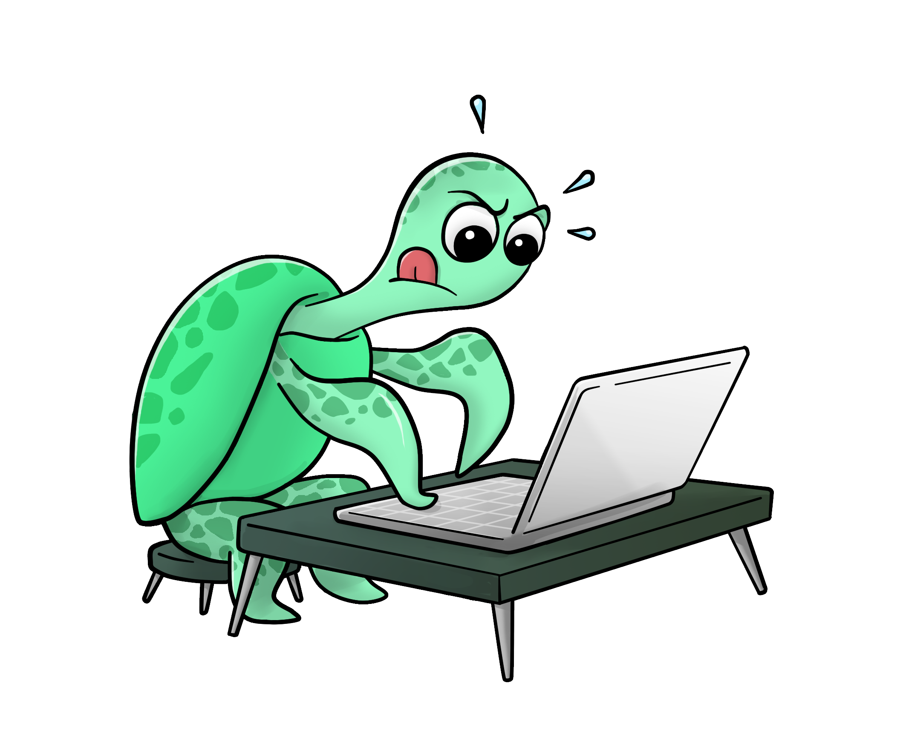

```{toctree}
:caption: Table of Contents
:name: mastertoc
:maxdepth: 2
:hidden:

getting-started/index
guides/index
reference/index
```

# Giskard Documentation

<b>Giskard creates interfaces for humans to inspect & test AI models. It is open-source and self-hosted.</b>

Giskard lets you instantly see your model's prediction for a given set of feature values. You can set the values directly in Giskard and see the prediction change.

Saw anything strange? Leave feedback directly within Giskard, so that your team can explore the query that generated the faulty result. 

Designed for both tech and business users, Giskard is super intuitive to use!

Want to ensure your model is right? Giskard enables you to turn your business feedback into actionable tests. Create in a few clicks automatic tests and execute them in your CI/CD pipeline each time, you create a new version of your model.
And of course, Giskard works with any model, any environment and integrates seemlessly with your favorite tools.

::::::{grid} 1 1 2 2
:gutter: 1

:::::{grid-item}

::::{grid} 1 1 1 1
:gutter: 1

(cards-clickable)=
:::{card} <h2><center> Getting Started </center></h2>
:link: getting-started/index.html

:::

(cards-clickable)=
:::{card} <h2><center> API Reference </center></h2>
:link: reference/index.html

::::

:::::

:::::{grid-item}

::::{grid} 1 1 1 1
:gutter: 1

(cards-clickable)=
:::{card} <h2><center> User Guide </center></h2>
:link: guides/index.html

&nbsp;&nbsp;&nbsp;&nbsp;&nbsp;&nbsp;
:::

(cards-clickable)=
:::{card} <h2><center> Contributor's Guide </center></h2>
:link: contribute/index.html
&nbsp;&nbsp;&nbsp;&nbsp;&nbsp;&nbsp;&nbsp;&nbsp;&nbsp;
::::

:::::

::::::