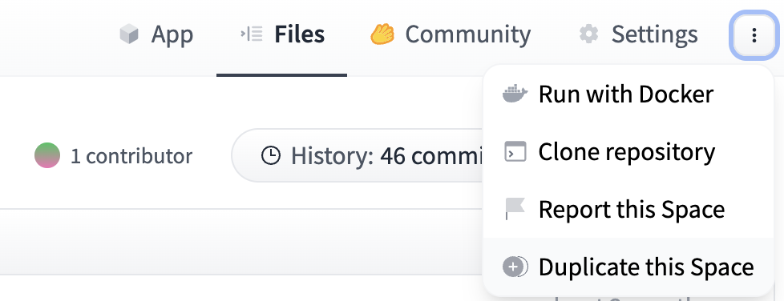
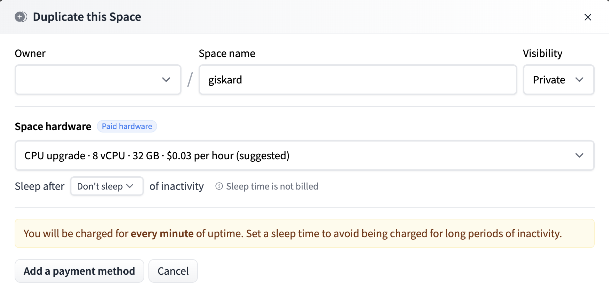
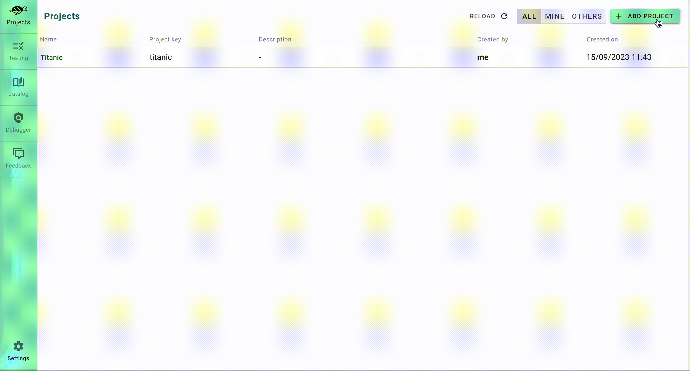
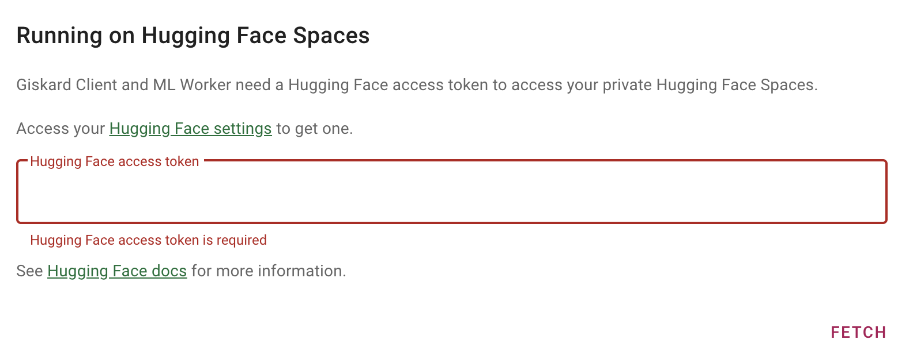

# Giskard on HF Spaces

**Giskard** is an open-source testing framework dedicated for AI models, from tabular to LLMs. Giskard is composed of 
1. An open-source Python library containing a **vulnerability scan**, **testing** and **CI/CD** framework for ML models
2. The **Giskard Hub**, a server application, containing a collaborative ML Testing dashboard for model **debugging** (root-cause analysis), model **comparison** & human **feedback** collection for ML.

The Giskard Hub is a **self-contained application completely hosted on Hugging Face Spaces using Docker**. Visit the [Giskard documentation](https://docs.giskard.ai) to learn about its features.

On this page, you'll learn to deploy your own Giskard Hub and use it for testing and debugging your ML models. 

<div class="flex justify-center">

</div>

## Try the Giskard Hub on demo models in 1 click

If you want to try the Giskard Hub on some demo ML projects (not on your own ML models), navigate to our public demo Space:

<a  href="https://huggingface.co/spaces/giskardai/giskard">
    
</a>

:::{hint}
The demo Giskard Space is read-only. To upload your own models, datasets and projects in the Giskard Space, we recommend that you duplicate the Space. More on this in the following sections. 
:::

## Test & debug your own ML model in the Giskard Hub using HF Spaces

Leverage the Hugging Face (HF) Space to easily test & debug your own ML models. This implies that you deploy a private HF space containing the Giskard Hub and upload your Python objects (such as ML models, test suites, datasets, slicing functions, or transformation functions) to your HF Space. To do so, follow these steps:

### 1. Duplicate the demo Space from Giskard
Begin by visiting the [Giskard HF space](https://huggingface.co/spaces/giskardai/giskard) and duplicate the space (as depicted below).



During duplication, you're presented with options to modify the **owner**, the **visibility** and the **hardware**:



:::{hint}
**Owner and visibility**:
If you don't want to publicly share your model, set your Space to **private** and assign the owner as **your organization**
**Hardware**:
We recommend to use paid hardware to get the best out of Giskard's HF Space. You can also incorporate [persistent storage](https://huggingface.co/docs/hub/spaces-storage) to retain your data even after the Space reboots. With free hardware that lacks persistent storage, any inactivity beyond 48 hours will result in the space being shut down. This will lead to a loss of all data within your Giskard Space.
:::

Once you're ready, click on Duplicate Space. The building process will take several minutes.

### 2. Create a new Giskard project



### 3. Enter your HF Access token

On your first access on a private HF Space, Giskard needs a HF access token to generate the Giskard Space Token. To do so, follow the instructions in the pop-up that you encounter when creating your first project.



Alternatively, provide your HF access token through the Giskard Settings.

### 4. Wrap your model and scan it in your Python environment

For detailed guidance on this step, refer to [our documentation](https://docs.giskard.ai/en/latest/guides/scan/index.html).

### 5. Upload your test suite by creating a Giskard Client for your HF Space

You can then upload the test suite generated by the Giskard scan from your Python notebook to your HF Space. Achieve this by initializing a Giskard Client: simply copy the "Create a Giskard Client" snippet from the Giskard Hub settings and run it within your Python notebook.

You are now ready to debug the tests which you've just uploaded in the test tab of the Giskard Hub.

Here a comprehensive example of the upload of a test suite to the Giskard Hub in HF Spaces:

```python
from giskard import GiskardClient

url = "<URL of your Giskard hub Space>"
api_token = "<Your Giskard API key>"
hf_token = "<Your Giskard Space token>"

# Create a giskard client to communicate with Giskard
client = GiskardClient(url, api_token, hf_token)

client.upload(...)
```

## Feedback and support

If you have suggestions or need specialized support, please join us on the [Giskard Discord community](https://discord.gg/ABvfpbu69R) or reach out on [Giskard's GitHub repository](https://github.com/Giskard-AI/giskard).
